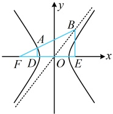
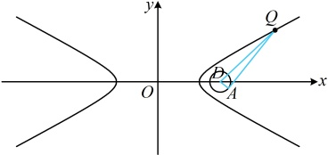

作  $ AD \perp x $ 轴于点  $ D $， $ BE \perp x $ 轴于点  $ E $，则  $ \triangle FAD \sim \triangle FBE $，且  $ E\left(\frac{c}{3}, 0\right) $， $ |FE| = \frac{4c}{3} $， $ |BE| = \frac{bc}{3a} $

因为  $ |FB| = 3|FA| $，所以  $ \frac{|FD|}{|FE|} = \frac{|AD|}{|BE|} = \frac{|FA|}{|FB|} = \frac{1}{3} $，故  $ |FD| = \frac{1}{3}|FE| = \frac{4c}{9} $，

 $ |OD| = |OF| - |FD| = \frac{5c}{9} $， $ |AD| = \frac{1}{3}|BE| = \frac{bc}{9a} $，所以  $ A\left(-\frac{5c}{9}, \frac{bc}{9a}\right) $，

代入  $ \frac{x^2}{a^2} - \frac{y^2}{b^2} = 1 $ 得  $ \frac{25c^2}{81a^2} - \frac{b^2c^2}{81a^2b^2} = 1 \Rightarrow \frac{c^2}{a^2} = \frac{27}{8} $，所以  $ 27a^2 = 8c^2 = 8(a^2 + b^2) $，

化简得： $ \frac{b}{a} = \frac{\sqrt{38}}{4} $，故双曲线的渐近线方程是  $ y = \pm \frac{\sqrt{38}}{4}x $。

答案： $ x = \pm \sqrt{38}x $

答案： $ y = \pm \frac{\sqrt{38}}{4} x $

## 类型IV：基于双曲线方程的最值问题

【例 14】点 Q 是双曲线  $ C: \frac{x^2}{16} - \frac{y^2}{4} = 1 $ 上一动点，过 Q 作圆  $ D: (x-6)^2 + y^2 = 1 $ 的一条切线，切点为  $ A $，则  $ |QA| $ 的最小值为___。

解析：如图， $ |QA| $ 是圆的切线长，考虑到  $ \triangle QAD $ 中用勾股定理，转化为  $ |QD| $ 来算，

由题意，圆  $ D $ 的圆心  $ D(6,0) $，半径  $ r=1 $，则  $ |QA|=\sqrt{|QD|^2-r^2}=\sqrt{|QD|^2-1} $ ①，

故只需求  $ |QD| $ 的最小值， $ D $ 是定点，只要设  $ Q $ 的坐标，就能表示  $ |QD| $，并分析最小值，

设  $ Q(x_0,y_0) $， $ \left|x_0\right|\geq4 $，则  $ |QD|=\sqrt{(x_0-6)^2+(y_0-0)^2}=\sqrt{(x_0-6)^2+y_0^2} $ ②，

有  $ x_0 $ 和  $ y_0 $ 两个变量，不易直接分析最值，考虑消元，怎么消？消谁？点  $ Q $ 在双曲线上，可利用双曲线方程来消元。且由干式②中  $ v $。只有平方项，故消  $ v $。

由点  $ Q $ 在双曲线  $ C $ 上得  $ \frac{x_0^2}{16}-\frac{y_0^2}{4}=1\Rightarrow y_0^2=\frac{x_0^2}{4}-4 $，

代入②得  $ |QD|=\sqrt{(x_0-6)^2+\frac{x_0^2}{4}-4}=\sqrt{\frac{5}{4}x_0^2-12x_0+32} $

 $ =\sqrt{\frac{5}{4}\left(x_0-\frac{24}{5}\right)^2+\frac{16}{5}}\geq\sqrt{\frac{16}{5}}=\frac{4\sqrt{5}}{5} $，取等条件是  $ x_0=\frac{24}{5} $

满足  $ |x_0|\geq4 $，结合①得  $ |QA|_{\min}=\sqrt{\left(\frac{4\sqrt{5}}{5}\right)^2-1}=\frac{\sqrt{55}}{5} $。

答案： $ \frac{\sqrt{55}}{5} $

【反思】对于双曲线上的动点，可考虑将其坐标设为 $ (x_{0},y_{0}) $，并用该坐标表示求最值的目标量，再利用双曲线的方程消元化单变量表达式分析最值，我们再来看一个变式.

【变式】直线 $l$ 过圆 $M:(x-4)^2+y^2=1$ 的圆心，且与圆相交于 $A$, $B$ 两点，$P$ 为双曲线 $\frac{x^2}{9}-\frac{y^2}{7}=1$ 右支上一个动点，则 $\overrightarrow{PA} \cdot \overrightarrow{PB}$ 的最小值为（ ）

A. $-2$          B. $1$          C. $2$          D. $0$

解析：如图1， $ \overrightarrow{PA} $ 与  $ \overrightarrow{PB} $ 共起点，底边长  $ |AB| $ 又已知，故可考虑利用极化恒等式算  $ \overrightarrow{PA} \cdot \overrightarrow{PB} $