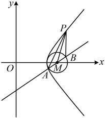
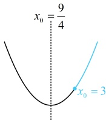

由题意，AB 中点为  $ M(4,0) $，且  $ |MA|=|MB|=r=1 $，由极化恒等式， $ \overrightarrow{PA}\cdot\overrightarrow{PB}=|\overrightarrow{PM}|^2-|\overrightarrow{MA}|^2=|\overrightarrow{PM}|^2-1 $ ①，故只需求  $ |PM| $ 的最小值，问题又回到了例 14 的情况，可设点  $ P $ 坐标，表示  $ |PM| $，结合双曲线的方程消元，设  $ P(x_0,y_0) $，则  $ |PM|=\sqrt{(x_0-4)^2+y_0^2} $ ②，因为点  $ P $ 在  $ \frac{x^2}{9}-\frac{y^2}{7}=1 $ 的右支，所以  $ \frac{x_0^2}{9}-\frac{y_0^2}{7}=1 $，故  $ y_0^2=\frac{7x_0^2}{9}-7(x_0\geq3) $，代入②得  $ |PM|=\sqrt{(x_0-4)^2+\frac{7x_0^2}{9}-7}=\sqrt{\frac{16x_0^2}{9}-8x_0+9} $，如图 2，二次函数  $ y=\frac{16x_0^2}{9}-8x_0+9 $ 开口向上，对称轴为  $ x_0=\frac{9}{4} $，因为  $ x_0\geq3>\frac{9}{4} $，所以当  $ x_0=3 $ 时， $ y=\frac{16x_0^2}{9}-8x_0+9 $ 有最小值，且最小值为  $ \frac{16\times3^2}{9}-8\times3+9=1 $，故  $ |PM|_{\min}=1 $，结合①得  $ (\overrightarrow{PA}\cdot\overrightarrow{PB})_{\min}=1^2-1=0 $。

图1

图2

答案：D

## 补充、拓展

关于直线与双曲线的位置关系，可以衍生出各种各样的解答题，本节先给大家拓展一些难度适中的与弦长有关的解答题，其它更复杂的类型，我们放到本章最后的微专题中来系统地归纳。类型V：直线与双曲线的位置关系综合题

【例 15】已知双曲线  $ C: \frac{x^{2}}{a^{2}} - \frac{y^{2}}{b^{2}} = 1 (a > 0, b > 0) $ 过点  $ \left(3, \frac{5}{2}\right) $ 和点  $ (4, \sqrt{15}) $.

（1）求双曲线 C 的方程；

（2）过  $ M(0,1) $ 的直线与双曲线交于  $ P, Q $ 两点，过双曲线的右焦点  $ F $ 且与  $ PQ $ 平行的直线交双曲线于  $ A, B $ 两点，求  $ \frac{|MP| \cdot |MQ|}{|AB|} $.

解：（1）将 $ \left(3,\frac{5}{2}\right) $和 $ (4,\sqrt{15}) $代入双曲线方程可得 $ \left\{\begin{aligned}&\frac{9}{a^{2}}-\frac{25}{4b^{2}}=1\\&\frac{16}{a^{2}}-\frac{15}{b^{2}}=1\end{aligned}\right. $，解得： $ \left\{\begin{aligned}&a=2\\&b=\sqrt{5}\end{aligned}\right. $，所以 C 的方程为  $ \frac{x^{2}}{4}-\frac{y^{2}}{5}=1 $。

（2）（ $ \left|MP\right|,\left|MQ\right| $， $ \left|AB\right| $都可由弦长公式 $ \sqrt{1+k^{2}}\cdot\left|x_{1}-x_{2}\right| $来算，故先设斜率和有关点的坐标）如图，过M的直线要与双曲线交于P，Q两点，其斜率必定存在，设为k，设 $ P(x_{1},y_{1}) $， $ Q(x_{2},y_{2}) $， $ A(x_{3},y_{3}) $， $ B(x_{4},y_{4}) $，

由弦长公式， $ |MP| = \sqrt{1 + k^2} \cdot |0 - x_1| = \sqrt{1 + k^2} \cdot |x_1| $， $ |MQ| = \sqrt{1 + k^2} \cdot |0 - x_2| = \sqrt{1 + k^2} \cdot |x_2| $，由题意， $ AB \parallel PQ $，所以直线  $ AB $ 的斜率也为  $ k $，故  $ |AB| = \sqrt{1 + k^2} \cdot |x_3 - x_4| $，