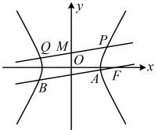

所以 $ \frac{|MP|\cdot|MQ|}{|AB|}=\frac{\sqrt{1+k^2}\cdot|x_1|\cdot\sqrt{1+k^2}\cdot|x_2|}{\sqrt{1+k^2}\cdot|x_3-x_4|}=\frac{\sqrt{1+k^2}\cdot|x_1x_2|}{|x_3-x_4|} $ ①，

（有  $ x_1x_2 $， $ |x_3-x_4| $，故想到联立直线  $ PQ $， $ AB $ 与双曲线的方程，结合韦达定理及其推论来计算它们）

直线  $ PQ $ 的方程为  $ y=kx+1 $，代入  $ \frac{x^2}{4}-\frac{y^2}{5}=1 $ 整理得： $ (5-4k^2)x^2-8kx-24=0 $，

因为直线  $ PQ $ 与双曲线有 2 个交点，所以  $ \begin{cases}5-4k^2\neq0\\\Delta=64k^2-4(5-4k^2)\cdot(-24)>0\end{cases} $，解得： $ -\frac{\sqrt{6}}{2}<k<\frac{\sqrt{6}}{2} $ 且  $ k\neq\pm\frac{\sqrt{5}}{2} $，

由韦达定理， $ x_1x_2=-\frac{24}{5-4k^2} $ ②，双曲线的右焦点为  $ F(3,0) $，所以直线  $ AB $ 的方程为  $ y=k(x-3) $，

代入  $ \frac{x^2}{4}-\frac{y^2}{5}=1 $ 整理得： $ (5-4k^2)x^2+24k^2x-36k^2-20=0 $，因为直线  $ AB $ 与双曲线有 2 个交点，

所以  $ \begin{cases}5-4k^2\neq0\\\Delta=(24k^2)^2-4(5-4k^2)(-36k^2-20)=400(k^2+1)>0\end{cases} $，故  $ k\neq\pm\frac{\sqrt{5}}{2} $，

由韦达定理推论， $ |x_3-x_4|=\frac{\sqrt{\Delta'}}{|5-4k^2|}=\frac{20\sqrt{k^2+1}}{|5-4k^2|} $ ③，

将②③代入①可得  $ \frac{|MP|\cdot|MQ|}{|AB|}=\frac{\sqrt{1+k^2}\cdot|x_1x_2|}{|x_3-x_4|}=\frac{\sqrt{1+k^2}\cdot\left|-\frac{24}{5-4k^2}\right|}{\frac{20\sqrt{k^2+1}}{}}\=6 $。

【反思】可以看到，本题的一大核心是用弦长公式计算  $ |MP| $， $ |MQ| $， $ |AB| $，弦长计算是诸多综合题中的一个常见步骤。题干不仅可以直接涉及弦长，也可以间接涉及。例如在某些面积问题中，也可能需要弦长，所以弦长的计算务必熟悉。但需注意，不是一看到弦长，就要用弦长公式计算，比如下面的例 16。

【例 16】已知双曲线  $ C: \frac{x^2}{a^2} - \frac{y^2}{b^2} = 1 (a > 0, b > 0) $ 的左焦点  $ F $ 到其渐近线的距离为  $ \sqrt{3} $，点  $ A(1,0) $ 在  $ C $ 上.

（1）求 C 的标准方程；

（2）若直线  $ l $ 与  $ C $ 交于  $ M $， $ N $（不与点  $ A $ 重合）两点，记直线  $ AM $， $ AN $， $ l $ 的斜率分别为  $ k_1 $， $ k_2 $， $ k $，且  $ k k_1 + k k_2 = -6 $，是否存在  $ k $ 值，使得  $ |FM| = |FN| $？若存在，求出  $ k $ 的值和直线  $ l $ 的方程；若不存在，请说明理由。

解：（1）设双曲线的左焦点为  $ F(-c,0) $，双曲线的渐近线为  $ y = \pm \frac{b}{a}x $，即  $ bx \pm ay = 0 $，所以点  $ F $ 到渐近线的距离为  $ \frac{|-bc|}{\sqrt{b^2 + (\pm a)^2}} = \frac{bc}{c} = b $，由题意， $ b = \sqrt{3} $，又  $ A(1,0) $ 在双曲线  $ C $ 上，所以  $ a = 1 $，故  $ C $ 的标准方程为  $ x^2 - \frac{y^2}{3} = 1 $。

（2）（条件 $ kk_{1}+kk_{2}=-6 $涉及 $ k_{1} $和 $ k_{2} $，计算它们需要点M，N的坐标，故先设坐标）

设  $ M(x_1, y_1) $， $ N(x_2, y_2) $，则  $ kk_1 + kk_2 = k \cdot \frac{y_1}{x_1 - 1} + k \cdot \frac{y_2}{x_2 - 1} = k \cdot \frac{y_1(x_2 - 1) + y_2(x_1 - 1)}{(x_1 - 1)(x_2 - 1)} = k \cdot \frac{x_1 y_2 + x_2 y_1 - (y_1 + y_2)}{x_1 x_2 - (x_1 + x_2) + 1} $ ①.

（观察上式的结构可知，接下来应设直线 $l$ 的方程，并代入双曲线的方程，结合韦达定理来计算）由题意，可设直线 $l$ 的方程为 $y = kx + m$，因为直线 $l$ 不过点 $A$，所以 $k + m \ne 0$，