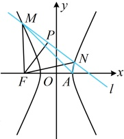

将  $ y = kx + m $ 代入  $ x^{2} - \frac{y^{2}}{3} = 1 $ 消去 y 整理得： $ (3 - k^{2})x^{2} - 2kmx - m^{2} - 3 = 0 $，

3

因为直线 $l$ 与双曲线有 2 个交点，所以 $\left\{\begin{aligned}&3-k^{2}\neq0\\ &\Delta=4k^{2}m^{2}+4(3-k^{2})(m^{2}+3)=12m^{2}-12k^{2}+36>0\end{aligned}\right.$，故 $\left\{\begin{aligned}&k^{2}\neq3\\ &m^{2}>k^{2}-3\end{aligned}\right.$ ②，由韦达定理，$x_{1}+x_{2}=\frac{2km}{3-k^{2}}$，$x_{1}x_{2}=-\frac{m^{2}+3}{3-k^{2}}$，所以 $y_{1}+y_{2}=kx_{1}+m+kx_{2}+m=k(x_{1}+x_{2})+2m=\frac{6m}{3-k^{2}}$，$x_{1}y_{2}+x_{2}y_{1}=x_{1}(kx_{2}+m)+x_{2}(kx_{1}+m)=2kx_{1}x_{2}+m(x_{1}+x_{2})=-\frac{6k}{3-k^{2}}$，代入①得 $kk_{1}+kk_{2}=k\cdot\frac{x_{1}y_{2}+x_{2}y_{1}-(y_{1}+y_{2})}{x_{1}x_{2}-(x_{1}+x_{2})+1}=k\cdot\frac{-\frac{6k}{3-k^{2}}-\frac{6m}{3-k^{2}}}{-\frac{m^{2}+3}{3-k^{2}}-\frac{2km}{3-k^{2}}+1}=\frac{6k}{k+m}$，

由题意， $ kk_{1}+kk_{2}=-6 $，所以 $ \frac{6k}{k+m}=-6 $，化简得： $ 2k+m=0 $ ③，

（求 $k$ 和 $m$ 还差一个方程，还剩条件 $|FM|=|FN|$ 没有用，如何翻译？可以想象，直接计算 $|FM|$ 和 $|FN|$ 比较麻烦，注意到 $|FM|=|FN|$ 意味着 $\triangle FM$ 是等腰三角形，故可按中线垂直于底边来翻译）

因为 $\frac{x_1 + x_2}{2} = \frac{km}{3 - k^2}$，$\frac{y_1 + y_2}{2} = \frac{3m}{3 - k^2}$，所以线段 $MN$ 的中点为 $P\left(\frac{km}{3 - k^2}, \frac{3m}{3 - k^2}\right)$，由（1）可得 $F(-2,0)$，

$|FM|=|FN|$ 等价于 $PF \perp MN$，即 $\frac{\frac{3m}{3 - k^2} - 0}{\frac{km}{3 - k^2} + 2} \cdot k = -1$，化简得：$k^2 - 2km - 3 = 0$，

结合③解得： $ k=\frac{\sqrt{15}}{5} $， $ m=-\frac{2\sqrt{15}}{5} $或 $ k=-\frac{\sqrt{15}}{5} $， $ m=\frac{2\sqrt{15}}{5} $，经检验，都满足②，

所以存在 $ k=\pm\frac{\sqrt{15}}{5} $，使得 $ |FM|=|FN| $，

此时直线 $l$ 的方程为 $y = \frac{\sqrt{15}}{5}x - \frac{2\sqrt{15}}{5}$ 或 $y = -\frac{\sqrt{15}}{5}x + \frac{2\sqrt{15}}{5}$。

【反思】在翻译条件时，不同的翻译方法对应着不同的计算量，要根据实际情况选择合适的翻译方法。例如本题翻译 $|FM| = |FN|$ 时，就没有去计算 $|FM|$ 和 $|FN|$，而是转化成了 $FP \perp MN$ 来翻译，回避了复杂的计算。

## A 组 夯实基础

## 强化训练

双曲线  $ \frac{x^{2}}{3t}-\frac{y^{2}}{t}=1(t>0) $ 的离心率为（）

A.  $ \frac{\sqrt{2}}{2} $ B.  $ \frac{2\sqrt{3}}{3} $ C.  $ \sqrt{2} $ D.  $ 2\sqrt{3} $