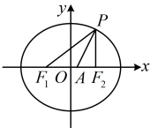

如图，因为 $O$，$B$ 分别是 $F_1F_2$，$AF_2$ 的中点，所以 $OB$ 是 $\triangle AF_1F_2$ 的中位线，

故 $|OB| = \frac{1}{2}|AF_1|$ 且 $OB \parallel AF_1$，因为 $AF_1 \perp AF_2$，所以 $OB \perp AF_2$，

又因为 $AD$ 平分 $\angle F_1AF_2$，所以 $\angle DAB = 45^\circ$，故 $\triangle ABD$ 为等腰直角三角形，

怎样求 $a$？由于 $|AF_1| + |AF_2| = 2a$，故求 $a$ 就是分析有关线段的长度，可考虑设一段长，再用它表示其它线段的长，结合图形的几何性质建立方程求解未知数，

设 $|AB| = |BD| = x$，则 $|BF_2| = x$，$|OB| = |OD| + |BD| = \sqrt{3} + x$，$|AF_1| = 2|OB| = 2\sqrt{3} + 2x$，$|AF_2| = 2x$，

由椭圆的定义，$|AF_1| + |AF_2| = 2a$，即 $2\sqrt{3} + 2x + 2x = 2a$，所以 $x = \frac{a - \sqrt{3}}{2}$ ①，

有了关于 $a$ 和 $x$ 的一个方程，若能再找一个方程，就能求出 $a$ 和 $x$，怎么找？有 $AF_1 \perp AF_2$，当然想到在 $\triangle AF_1F_2$ 中由勾股定理建立方程，由所给椭圆的方程可知 $|F_1F_2| = 2\sqrt{a^2 - 3}$，在 $\mathrm{Rt}\triangle AF_1F_2$ 中，$|AF_1|^2 + |AF_2|^2 = |F_1F_2|^2$，所以 $(2\sqrt{3} + 2x)^2 + (2x)^2 = (2\sqrt{a^2 - 3})^2$，化简得：$2x^2 + 2\sqrt{3}x - a^2 + 6 = 0$ ②，

将①代入②得 $2\left(\frac{a - \sqrt{3}}{2}\right)^2 + 2\sqrt{3} \cdot \frac{a - \sqrt{3}}{2} - a^2 + 6 = 0$，解得：$a = 3$，所以椭圆 $C$ 的标准方程为 $\frac{x^2}{9} + \frac{y^2}{3} = 1$。

答案：$\frac{x^2}{9} + \frac{y^2}{3} = 1$

【变式 4】设椭圆  $ C: \frac{x^2}{4} + \frac{y^2}{3} = 1 $ 的左、右焦点分别为  $ F_1, F_2 $，点  $ P $ 在椭圆上，且点  $ P $ 在第一象限， $ \cos \angle F_1PF_2 = \frac{3}{5} $， $ \angle F_1PF_2 $ 的平分线与  $ x $ 轴交于点  $ A $，则  $ |PA| = $（ ）

A.  $ \sqrt{3} $  B.  $ 2\sqrt{3} $  C.  $ \frac{3\sqrt{10}}{4} $  D.  $ \frac{3\sqrt{5}}{4} $

解法1：如图，条件给出了$\cos\angle F_1PF_2$，考虑在$\triangle PF_1F_2$中用余弦定理建立边长的关系，结合椭圆定义求边长，由所给椭圆的方程可知$a^2=4$，$b^2=3$，所以$c^2=a^2-b^2=4-3=1$，结合$a>0$，$c>0$可得$a=2$，$c=1$，由椭圆的定义，$|PF_1|+|PF_2|=2a=4$，$|F_1F_2|=2c=2$，设$|PF_1|=m$，则$|PF_2|=4-m$，在$\triangle PF_1F_2$中，由余弦定理，$|F_1F_2|^2=|PF_1|^2+|PF_2|^2-2|PF_1||PF_2|\cdot\cos\angle F_1PF_2$，即$2^2=m^2+(4-m)^2-2m(4-m)\cdot\frac{3}{5}$，解得：$m=\frac{5}{2}$或$\frac{3}{2}$，由$P$在第一象限得$|PF_1|>|PF_2|\Rightarrow m>4-m\Rightarrow m>2$，所以$|PF_1|=\frac{5}{2}$，$|PF_2|=4-|PF_1|=\frac{3}{2}$，怎样求$|PA|$？$PA$是$\angle F_1PF_2$的角平分线，又有了$|PF_1|$和$|PF_2|$，想到先用角平分线性质定理求$|F_1A|$和$|F_2A|$，因为$PA$平分$\angle F_1PF_2$，所以由角平分线定理，$\frac{|F_1A|}{|F_2A|}=\frac{|PF_1|}{|PF_2|}=\frac{\frac{5}{2}}{\frac{3}{2}}=\frac{5}{3}$，所以$|F_1A|=\frac{5}{8}$，$|F_1F_2|=\frac{5}{8}\times2=\frac{5}{4}$，$|F_2A|=\frac{3}{8}$，$|F_1F_2|=\frac{3}{8}\times2=\frac{3}{4}$，

此时可发现，图中除 $PA$ 外，所有线段的长都有了，可用“双余弦法”建立方程求 $|PA|$，在 $\triangle PAF_1$ 中，由余弦定理推论，$\cos \angle PAF_1 = \frac{|PA|^2 + |F_1A|^2 - |PF_1|^2}{2|PA| \cdot |F_1A|} = \frac{|PA|^2 + \left(\frac{5}{4}\right)^2 - \left(\frac{5}{2}\right)^2}{2|PA|} \cdot \frac{5}{4} = \frac{16|PA|^2 - 75}{40|PA|}$。

