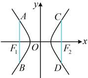
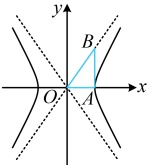
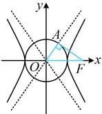

# 微专题4：双曲线常用二级结论

习题：P1

## 内容提要

双曲线有很多的二级结论，但其中很大一部分的应用频率较低，用得少，就难以记住，这部分结论本节不会涉及，我们只筛选出了一些在高考中比较常用的双曲线二级结论供大家学习，记住这些结论可适当缩短解题时间。另外，下面的结论都是焦点在x轴上的情形，对于焦点在y轴的情形，可自行尝试推导。

1. 通径公式：过双曲线的焦点且垂直于实轴的弦叫做双曲线的通径（如图1中的两条蓝色线段），其长度为 $ \frac{2b^{2}}{a} $.

证明：将x=-c代入 $ \frac{x^2}{a^2}-\frac{y^2}{b^2}=1 $可得 $ \frac{c^2}{a^2}-\frac{y^2}{b^2}=1 $，所以 $ y^2=b^2\left(\frac{c^2}{a^2}-1\right) $

图1

$$=b^{2}\cdot\frac{c^{2}-a^{2}}{a^{2}}=b^{2}\cdot\frac{b^{2}}{a^{2}}=\frac{b^{4}}{a^{2}},$$ 从而 $y=\pm\frac{b^{2}}{a}$，故 $\left|AB\right|=\left|\frac{b^{2}}{a}-\left(-\frac{b^{2}}{a}\right)\right|=\frac{2b^{2}}{a}$，由对称性，$\left|CD\right|=\frac{2b^{2}}{a}$

2. 双曲线的两类特征三角形：

①如图2， $ A $为双曲线的右顶点，过 $ A $作 $ x $轴的垂线交一条渐近线于点 $ B $，则在 $ \triangle AOB $中， $ \left|OA\right|=a $， $ \left|AB\right|=b $， $ \left|OB\right|=c $，这个三角形有双曲线的全部特征参数，所以把 $ \triangle AOB $称为双曲线的“特征三角形”，由对称性，这样的特征三角形有4个，且图2中点 $ B $的坐标为 $ (a,b) $。

图2

图3

②如上面图3，设 $F$ 为双曲线 $\frac{x^2}{a^2} - \frac{y^2}{b^2} = 1 (a > 0, b > 0)$ 的右焦点，过 $F$ 作渐近线 $bx - ay = 0$ 的垂线，垂足为 $A$，则在 $\triangle AOF$ 中，点 $F$ 到渐近线 $bx - ay = 0$ 的距离 $|AF| = \frac{|bc|}{\sqrt{b^2 + (-a)^2}} = \frac{bc}{c} = b$，所以 $|OA| = \sqrt{|OF|^2 - |AF|^2} = \sqrt{c^2 - b^2} = a$，$|OF| = c$，这个三角形也有双曲线的全部特征参数，所以把 $\triangle AOF$ 称为双曲线的“特征三角形”。由对称性，这样的特征三角形有4个。由于点 $A$ 满足 $|OA| = a$，所以 $A$ 在圆 $x^2 + y^2 = a^2$ 上，由 $OA \perp AF$ 得 $AF$ 是该圆的切线，$A$ 又在渐近线 $y = \frac{b}{a}x$ 上，故若要求