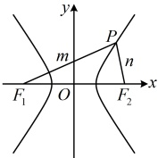

点A的坐标，可联立 $ \left\{\begin{aligned}&y=\frac{b}{a}x\\ &x^{2}+y^{2}=a^{2}\end{aligned}\right. $求得 $ \left\{\begin{aligned}x^{2}&=\frac{a^{4}}{c^{2}}\\ y^{2}&=\frac{a^{2}b^{2}}{c^{2}}\end{aligned}\right. $，于是图3中点A的坐标为 $ \left(\frac{a^{2}}{c},\frac{ab}{c}\right) $.

3. 焦半径公式：设双曲线 $ \frac{x^2}{a^2} - \frac{y^2}{b^2} = 1 (a > 0, b > 0) $的左、右焦点分别为 $ F_1 $， $ F_2 $， $ P(x_0, y_0) $为双曲线上任意一点，则左焦半径 $ \left|PF_1\right| = \left|ex_0 + a\right| $，右焦半径 $ \left|PF_2\right| = \left|ex_0 - a\right| $，其中 $ e $为双曲线的离心率证明：设 $ F_1(-c, 0) $，则 $ c^2 = a^2 + b^2 $， $ \left|PF_1\right| = \sqrt{(x_0 + c)^2 + y_0^2} $ ①，因为点 $ P $在双曲线上，所以 $ \frac{x_0^2}{a^2} - \frac{y_0^2}{b^2} = 1 $，故 $ y_0^2 = \frac{b^2}{a^2} x_0^2 - b^2 $，代入①得 $ \left|PF_1\right| = \sqrt{x_0^2 + 2cx_0 + c^2 + \frac{b^2}{a^2} x_0^2 - b^2} = \sqrt{\left(1 + \frac{b^2}{a^2}\right) x_0^2 + 2cx_0 + c^2 - b^2} = \sqrt{\frac{a^2 + b^2}{a^2} x_0^2 + 2cx_0 + a^2} = \sqrt{\frac{c^2}{a^2} x_0^2 + 2cx_0 + a^2} = \sqrt{\left(\frac{c}{a} x_0 + a\right)^2} = \left|\frac{c}{a} x_0 + a\right| = \left|ex_0 + a\right| $，同理可得 $ \left|PF_2\right| = \left|ex_0 - a\right| $。

4. 焦点三角形面积公式：如图4，设 $ P $是双曲线 $ \frac{x^2}{a^2} - \frac{y^2}{b^2} = 1 (a > 0, b > 0) $上一点， $ F_1(-c, 0) $， $ F_2(c, 0) $分别是双曲线的左、右焦点， $ \angle F_1 PF_2 = \theta $，则 $ S_{\triangle PF_1 F_2} = c \left|y_P\right| = \frac{b^2}{\tan \frac{\theta}{-\theta}} $。

证明：一方面，$\triangle PF_1F_2$ 的边 $F_1F_2$ 上的高 $h = |y_P|$，

所以 $S_{\triangle PF_1F_2} = \frac{1}{2}|F_1F_2| \cdot h = \frac{1}{2} \times 2c \times |y_P| = c|y_P|$；

另一方面，记 $|PF_1| = m$，$|PF_2| = n$，则由双曲线定义，$|m - n| = 2a$ ①，

图4

在$\triangle PF_1F_2$中，由余弦定理，$|F_1F_2|^2 = |PF_1|^2 + |PF_2|^2 - 2|PF_1|\cdot|PF_2|\cdot\cos \angle F_1PF_2$，

所以$4c^2 = m^2 + n^2 - 2mn\cos\theta = (m-n)^2 + 2mn - 2mn\cos\theta = (m-n)^2 + 2mn(1-\cos\theta)$ ②

将式①代入式②可得$4c^2 = 4a^2 + 2mn(1-\cos\theta)$，所以$mn = \frac{4c^2 - 4a^2}{2(1-\cos\theta)} = \frac{2b^2}{1-\cos\theta}$，

故$S_{\triangle PF_1F_2} = \frac{1}{2}mn\sin\theta = \frac{1}{2}\cdot \frac{2b^2}{1-\cos\theta}\cdot\sin\theta = b^2\cdot \frac{\sin\theta}{1-\cos\theta} = b^2\cdot \frac{2\sin\frac{\theta}{2}\cos\frac{\theta}{2}}{2\sin^2\frac{\theta}{2}} = \frac{b^2}{\tan\frac{\theta}{2}}$。