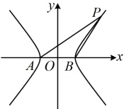
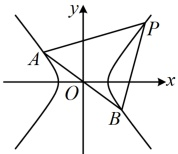
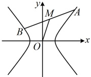
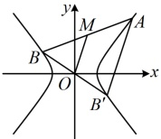

5. 双曲线的斜率积结论

（1）第三定义的斜率积结论：如图5，设A，B分别是双曲线 $ \frac{x^2}{a^2}-\frac{y^2}{b^2}=1(a>0,b>0) $的左、右顶点，P是双曲线上不与A，B重合的任意一点，则 $ k_{PA}\cdot k_{PB}=\frac{b^2}{a^2} $。

注：上述结论中 $A$，$B$ 是双曲线的左、右顶点，可将其推广为双曲线上关于原点对称的任意两点，如图 6，只要直线 $PA$，$PB$ 的斜率都存在，就仍满足 $k_{PA} \cdot k_{PB} = \frac{b^2}{a^2}$。

证明：设  $ A(x_1,y_1) $， $ P(x_2,y_2) $，则  $ B(-x_1,-y_1) $，所以  $ k_{PA} \cdot k_{PB} = \frac{y_2 - y_1}{x_2 - x_1} \cdot \frac{y_2 + y_1}{x_2 + x_1} = \frac{y_2^2 - y_1^2}{x_2^2 - x_1^2} $ ①，

因为点  $ A $ 在双曲线上，所以  $ \frac{x_1^2}{a^2} - \frac{y_1^2}{b^2} = 1 $，

故  $ y_1^2 = b^2 \left( \frac{x_1^2}{a^2} - 1 \right) = \frac{b^2}{a^2} (x_1^2 - a^2) $，同理， $ y_2^2 = \frac{b^2}{a^2} (x_2^2 - a^2) $，

所以  $ y_2^2 - y_1^2 = \frac{b^2}{a^2} (x_2^2 - a^2 - x_1^2 + a^2) = \frac{b^2}{a^2} (x_2^2 - x_1^2) $，代入①得  $ k_{PA} \cdot k_{PB} = \frac{b^2}{a^2} $；

在上述条件中令  $ A(-a,0) $， $ B(a,0) $，即得图5对应的结论.

（2）中点弦斜率积结论：如图7，AB是双曲线 $ \frac{x^2}{a^2} - \frac{y^2}{b^2} = 1 (a > 0, b > 0) $的一条不与坐标轴垂直且不过原点的弦，M为AB中点，则 $ k_{AB} \cdot k_{OM} = \frac{b^2}{a^2} $，此结论可用下面的点差法来证明。

图5

图6

图7

图8

证明：设  $ A(x_1,y_1) $， $ B(x_2,y_2) $， $ x_1 \ne x_2 $， $ y_1 \ne y_2 $，由  $ A $， $ B $ 都在双曲线上可得  $ \begin{cases} \frac{x_1^2}{a^2} - \frac{y_1^2}{b^2} = 1 \\ \frac{x_2^2}{a^2} - \frac{y_2^2}{b^2} = 1 \end{cases} $，两式作差得： $ \frac{x_1^2 - x_2^2}{a^2} - \frac{y_1^2 - y_2^2}{b^2} = 0 $，整理得： $ \frac{y_1 - y_2}{x_1 - x_2} \cdot \frac{y_1 + y_2}{x_1 + x_2} = \frac{b^2}{a^2} $ ①，

注意到  $ \frac{y_1 - y_2}{x_1 - x_2} = k_{AB} $， $ \frac{y_1 + y_2}{x_1 + x_2} = \frac{2y_M}{2x_M} = \frac{y_M}{x_M} = k_{OM} $，所以式①即为  $ k_{AB} \cdot k_{OM} = \frac{b^2}{a^2} $。