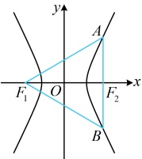
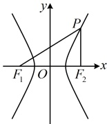

注：中点弦结论和上面的第三定义斜率积结论的结果都是 $ \frac{b^2}{a^2} $，这是巧合吗？不是，两者之间有必然的联系。如上面图8，设 $ B' $为 $ B $关于原点的对称点，则 $ B' $也在该双曲线上，且 $ O $为 $ BB' $中点，结合 $ M $为 $ AB $中点可得 $ OM\parallel AB' $，所以 $ k_{AB'} \cdot k_{OM} = k_{AB'} \cdot k_{AB'} $，于是又回到了双曲线上的点 $ A $与双曲线上关于原点对称的 $ B $和 $ B' $的连线的斜率积。

## 典型例题

## 类型 I：双曲线通径公式的应用

【例 1】设双曲线  $ C: \frac{x^2}{a^2} - \frac{y^2}{b^2} = 1 (a > 0, b > 0) $ 的左、右焦点分别为  $ F_1, F_2 $，过  $ F_2 $ 作  $ x $ 轴的垂线交双曲线  $ C $ 于  $ A, B $ 两点，若  $ \triangle ABF_1 $ 是正三角形，则  $ C $ 的离心率为（ ）

A.  $ \sqrt{2} $ \quad B.  $ \sqrt{3} $ \quad C.  $ \sqrt{6} $ \quad D.  $ 2\sqrt{2} $

解法1：条件涉及过焦点且垂直于实轴的直线与双曲线的两个交点，想到通径公式，故可考虑先求$|AB|$，再作分析，如图，由通径公式，$|AB|=\frac{2b^2}{a}$，$|AF_2|=\frac{b^2}{a}$，因为$\triangle ABF_1$是正三角形，所以$|AF_1|=|AB|=\frac{2b^2}{a}$，

有了$|AF_1|$和$|AF_2|$，可用双曲线定义建立方程求离心率，由双曲线定义，$|AF_1|-|AF_2|=2a$，所以$\frac{2b^2}{a}-\frac{b^2}{a}=2a$，

化简得：$2a^2=b^2$，所以$2a^2=c^2-a^2$，从而$c^2=3a^2$，故$C$的离心率$e=\frac{c}{a}=\sqrt{3}$。

解法2：由$\triangle ABF_1$为正三角形容易研究焦点三角形$AF_1F_2$的三边比值，而$e=\frac{c}{a}=\frac{2c}{2a}$

$=\frac{|F_1F_2|}{|AF_1|-|AF_2|}$，此式能由$\triangle AF_1F_2$的三边比值求得，故也可按此处理，直接求离心率，

设$|AB|=2m$，因为$\triangle ABF_1$是正三角形，所以$|AF_1|=2m$，$|AF_2|=m$，$|F_1F_2|=\sqrt{3}m$，

故$C$的离心率$e=\frac{|F_1F_2|}{|AF_1|-|AF_2|}=\frac{\sqrt{3}m}{2m-m}=\sqrt{3}$。

答案：B

【反思】①当双曲线的焦点三角形 $AF_1F_2$ 的三边比值容易获得时，可按 $e=\frac{|F_1F_2|}{\|AF_1\|-|AF_2\|}$ 求双曲线的离心率；

②在双曲线中，遇到过焦点且垂直于实轴的弦，可考虑用通径公式计算该弦的长度，再结合其它条件分析问题。

有时也会遇到图中只有一半通径的情况，此时也可用此公式计算，比如下面的变式。

【变式】已知双曲线 $C:\frac{x^2}{a^2}-\frac{y^2}{b^2}=1 (a>0, b>0)$ 的左、右焦点分别为 $F_1, F_2$，$P$ 为 $C$ 上一点，满足 $PF_2\perp x$ 轴，且 $|PF_1|+|PF_2|=2|F_1F_2|$，则 $C$ 的离心率为（ ）

A. $\sqrt{2}$  B. $\sqrt{3}$  C. $2$  D. $3$  \ $y\uparrow$  $p/$

解析：如图，条件给出 $PF_2\perp x$ 轴，则 $|PF_2|$ 是通径长度的一半，可用通径公式计算，求出后，结合双曲线定义又能求得 $|PF_1|$，代入 $|PF_1|+|PF_2|=2|F_1F_2|$ 即可建立方程求离心率，

由通径公式，$|PF_2|=\frac{b^2}{a}$，又 $|PF_1|-|PF_2|=2a$，所以 $|PF_1|=2a+|PF_2|=2a+\frac{b^2}{a}$，

