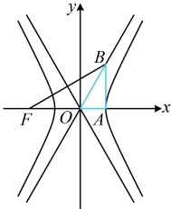
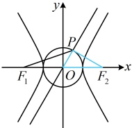

代入 $ \left|PF_{1}\right|+\left|PF_{2}\right|=2\left|F_{1}F_{2}\right| $得 $ 2a+\frac{b^{2}}{a}+\frac{b^{2}}{a}=4c $，化简得： $ a^{2}+b^{2}=2ac $，所以 $ c^{2}=2ac $，故C的离心率 $ e=\frac{c}{a}=2 $。答案：C

## 类型Ⅱ：双曲线的特征三角形的应用

【例 2】已知双曲线  $ C: \frac{x^2}{a^2} - \frac{y^2}{b^2} = 1 (a > 0, b > 0) $ 的左焦点为  $ F $，右顶点为  $ A $，过  $ A $ 作  $ x $ 轴的垂线交  $ C $ 的一条渐近线于点  $ B $，若直线  $ BF $ 与  $ C $ 的另一条渐近线垂直，则  $ C $ 的离心率为___。

解析：条件给出  $ BF $ 与一条渐近线垂直，翻译此垂直关系需要  $ B $ 的坐标，如图， $ \triangle AOB $ 是双曲线的一个特征三角形，故可直接得到点  $ B $ 的坐标，

由内容提要第 2 点图 2 的结论， $ B(a,b) $，又  $ F(-c,0) $，且  $ BF $ 与渐近线  $ y = -\frac{b}{a}x $ 垂直，

所以  $ \frac{0 - b}{-c - a} \cdot \left(-\frac{b}{a}\right) = -1 $，化简得： $ b^2 = (c + a)a $，

又  $ b^2 = c^2 - a^2 = (c + a)(c - a) $，所以  $ (c + a)(c - a) = (c + a)a $，

从而  $ c - a = a $，故  $ c = 2a $，所以  $ C $ 的离心率  $ e = \frac{c}{a} = 2 $。

答案：2

【变式】已知双曲线  $ E:\frac{x^2}{a^2}-\frac{y^2}{b^2}=1 (a>0, b>0) $ 的离心率为 2，左、右焦点分别为  $ F_1 $， $ F_2 $，圆  $ O: x^2+y^2=a^2 $ 与  $ E $ 的渐近线在第一象限的交点为  $ P $，则  $ \frac{|PF_1|}{|PF_2|}= $ ___.

解法1：有离心率，可用它研究 $a$，$b$，$c$ 的比值，从而将 $a$，$b$，$c$ 统一起来，

$E$ 的离心率为 $2 \Rightarrow \frac{c}{a} = 2 \Rightarrow c = 2a$，所以 $b = \sqrt{c^2 - a^2} = \sqrt{3}a$，怎样求 $\left| \frac{PF_1}{|PF_2|} \right|$？如图，$\triangle POF_2$ 是双曲线的一个特征

三角形，于是 $|PF_2|$ 容易获得，$|F_1F_2|$ 又已知，故要求 $|PF_1|$，只需求 $\cos \angle PF_2F_1$，可到 $\triangle POF_2$ 中来算，

在 $\triangle POF_2$ 中，$OP \perp PF_2$，$|PF_2| = b = \sqrt{3}a$，$|OF_2| = c = 2a$，

所以 $\cos \angle PF_2F_1 = \cos \angle PF_2O = \frac{|PF_2|}{|OF_2|} = \frac{\sqrt{3}a}{2a} = \frac{\sqrt{3}}{2}$，

在$\triangle PF_1F_2$中，由余弦定理，$|PF_1|^2 = |PF_2|^2 + |F_1F_2|^2 - 2|PF_2| \cdot |F_1F_2| \cdot \cos \angle PF_2F_1$ $= (\sqrt{3}a)^2 + (4a)^2 - 2 \times \sqrt{3}a \times 4a \times \frac{\sqrt{3}}{2} = 7a^2$，所以$|PF_1| = \sqrt{7}a$，故$\frac{|PF_1|}{|PF_2|} = \frac{\sqrt{21}}{3}$。

 $$ \begin{aligned}\mathcal{F}\left|PF_{1}\right|\end{aligned} $$ 

 $$ F_{1} $$ 

由特征三角形的性质（见内容提要第2点的②），点P的坐标为 $ \left(\frac{a^{2}}{c},\frac{ab}{c}\right) $，

又 $ F_{1}(-c,0) $，所以 $ \left|PF_{1}\right|=\sqrt{\left(-c-\frac{a^{2}}{c}\right)^{2}+\left(0-\frac{ab}{c}\right)^{2}}=\sqrt{\left(-2a-\frac{a^{2}}{2a}\right)^{2}+\frac{a^{2}(\sqrt{3}a)^{2}}{(2a)^{2}}}=\sqrt{7}a $，故 $ \frac{\left|PF_{1}\right|}{\left|PF_{2}\right|}=\frac{\sqrt{21}}{3} $

答案： $ \frac{\sqrt{21}}{3} $

【反思】在双曲线有关问题中，若画出图形后，发现图中有内容提要第2点所提及的两类特征三角形，则可利用有关结论解决问题.