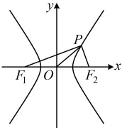
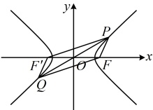

【反思】设 $P$ 为双曲线 $\frac{x^2}{a^2} - \frac{y^2}{b^2} = 1 (a > 0, b > 0)$ 上一点，则常用公式 $S = c |y_P| = \frac{b^2}{\tan \frac{\theta}{2}}$ 计算焦点 $\triangle PF_1F_2$ 的面积，具体如何选择，要看给的是 $P$ 的坐标，还是 $\angle F_1PF_2$。有时 $P$ 的坐标或 $\angle F_1PF_2$ 没直接给，但结合已知条件能求出，比如下面的变式 1；也有的三角形不是焦点三角形，但能转化为焦点三角形来求面积，比如后面的变式 2。

【变式1】（2020·新课标Ⅰ卷）设 $ F_{1} $， $ F_{2} $是双曲线 $ C:x^{2}-\frac{y^{2}}{3}=1 $的两个焦点，O为原点，点P在C上且 $ \left|OP\right|=2 $，则 $ \triangle PF_{1}F_{2} $的面积为（ ）

A. 7 B. 3 C.  $ \frac{5}{2} $ D. 2

解法 1：所求为焦点三角形的面积，可考虑代公式  $ S = \frac{b^2}{\tan \frac{\theta}{2}} $ 或  $ S = c |y_P| $，先看前者，本题  $ \theta $（即  $ \angle F_1PF_2 $）未给，故先尝试求它，如图，双曲线  $ C $ 的半焦距  $ c = \sqrt{1+3} = 2 \Rightarrow |F_1F_2| = 4 $，因为  $ |OP| = 2 $，所以  $ |OP| = \frac{1}{2}|F_1F_2| $，从而  $ \angle F_1PF_2 = 90^\circ $，故  $ S_{\triangle PF_1F_2} = \frac{b^2}{\tan \frac{\theta}{2}} = \frac{3}{\tan 45^\circ} = 3 $。

解法2：也可考虑代公式  $ S = c | y_p |  $ 求  $ \triangle PF_1F_2 $ 的面积，需要  $ y_p $，故考虑用坐标翻译已知条件  $ |OP| = 2 $，与双曲线方程联立求  $ y_p $，

因为  $ |OP| = 2 $，所以  $ \sqrt{x_p^2 + y_p^2} = 2 $ ①，又点  $ P $ 在双曲线  $ C $ 上，所以  $ x_p^2 - \frac{y_p^2}{3} = 1 $ ②，

联立①②解得： $ y_p = \pm \frac{3}{2} $，因为双曲线  $ C $ 的半焦距  $ c = \sqrt{1 + 3} = 2 $，所以  $ S_{\triangle PF_1F_2} = c | y_p | = 3 $。

答案：B

【变式 2】过双曲线  $ C: \frac{x^2}{2} - y^2 = 1 $ 的中心作直线  $ l $ 与双曲线  $ C $ 交于  $ P $， $ Q $ 两点，设双曲线  $ C $ 的右焦点为  $ F $，已知  $ \angle PFQ = \frac{2\pi}{3} $，则  $ \triangle PFQ $ 的面积为（ ）

A.  $ \frac{\sqrt{3}}{3} $          B. 1          C.  $ \sqrt{2} $          D.  $ \sqrt{3} $

解析：$\triangle PFQ$ 不是焦点三角形，能用焦点三角形面积公式吗？涉及右焦点，常联系左焦点来看，如图，$\triangle PFQ$ 与 $\triangle PFF'$ 同底等高，它们的面积相等，故可将 $S_{\triangle PFO}$ 转化为 $S_{\triangle PFF}$ 来算，这样就能代焦点三角形面积公式了，设双曲线 $C$ 的左焦点为 $F'$，由对称性，$PQ$ 中点为原点，又 $FF'$ 的中点也是原点，所以 $PQ$ 与 $FF'$ 互相平分 $\Rightarrow$ 四边形 $PFQF'$ 是平行四边形 $\Rightarrow S_{\triangle PFQ} = S_{\triangle PFF'}$ ①，

所以 $PQ$ 与 $FF'$ 互相平分 $\Rightarrow$ 四边形 $PFQF'$ 是平行四边形 $\Rightarrow S_{\triangle PFQ} = S_{\triangle PFF'}$ ①，

因为 $\angle PFQ = \frac{2\pi}{3}$，所以 $\angle PFF' = \pi - \angle PFQ = \frac{\pi}{3}$，故 $S_{\triangle PFF'} = \frac{b^2}{\tan \frac{\theta}{2}} = \frac{1}{\tan \frac{\pi}{6}} = \sqrt{3}$，

结合①得 $S_{\triangle PFQ} = \sqrt{3}$，即 $\triangle PFQ$ 的面积为 $\sqrt{3}$。

答案：D