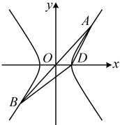
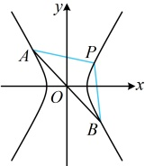

类型 V：双曲线的第三定义斜率积结论的应用

【例 5】过原点 O 的直线 l 与双曲线  $ C: \frac{x^2}{a^2} - \frac{y^2}{b^2} = 1 (a > 0, b > 0) $ 交于 A, B 两点，D 为 C 的右顶点，

直线 DA 与直线 DB 的斜率之积为 3，则 C 的渐近线方程为

解析：如图，A, B 关于原点对称，D 在双曲线上，联想到第三定义斜率积结论，

由双曲线第三定义斜率积结论， $ k_{DA} k_{DB} = \frac{b^2}{a^2} $，又由题意， $ k_{DA} k_{DB} = 3 $，所以  $ \frac{b^2}{a^2} = 3 $，

从而  $ \frac{b}{a} = \sqrt{3} $，故双曲线 C 的渐近线方程为  $ y = \pm \sqrt{3} x $。

答案： $ y = \pm\sqrt{3}x $

【反思】涉及双曲线上一点与双曲线上关于原点对称的两点的连线斜率，常联系第三定义斜率积结论处理。本题题干明确给出了斜率积，有时即使题干没说斜率积，只要涉及了这样的两个斜率，都可考虑使用该结论，比如下面的变式1；也有时需要稍作转化，才能产生第三定义斜率积结论的使用场景，比如后面的变式2。

【变式 1】已知 $A$, $B$, $P$ 为双曲线 $x^2 - \frac{y^2}{4} = 1$ 上不同的三点，且满足 $\overrightarrow{PA} + \overrightarrow{PB} = 2\overrightarrow{PO}$（$O$ 为坐标原点），直线 $PA$, $PB$ 的斜率记为 $m$, $n$，则 $m^2 + \frac{n^2}{9}$ 的最小值为___。

解析：如图，因为$\overrightarrow{PA} + \overrightarrow{PB} = 2\overrightarrow{PO}$，所以$O$为$AB$中点，故$A$，$B$关于原点$O$对称，要求$m^2 + \frac{n^2}{9}$的最小值，需先找$m$，$n$的关系，由$A$，$B$关于原点$O$对称想到可用双曲线第三定义斜率积结论来建立$m$，$n$的关系，由双曲线第三定义斜率积结论，直线$PA$，$PB$的斜率之积$mn = \frac{b^2}{a^2} = 4$，

所以  $ m^2 + \frac{n^2}{9} \geq 2\sqrt{m^2 \cdot \frac{n^2}{9}} = 2\sqrt{\frac{16}{9}} = \frac{8}{3} $，当且仅当  $ m^2 = \frac{n^2}{9} $ 时取等号，

结合  $ mn = 4 $ 可得此时  $ m = \frac{2\sqrt{3}}{3} $， $ n = 2\sqrt{3} $ 或  $ m = -\frac{2\sqrt{3}}{3} $， $ n = -2\sqrt{3} $，故  $ \left(m^2 + \frac{n^2}{9}\right)_{\min} = \frac{8}{3} $

答案： $ \frac{8}{3} $

【变式 2】双曲线  $ C: \frac{x^2}{a^2} - \frac{y^2}{b^2} = 1 (a > 0, b > 0) $ 的左顶点为  $ A $，点  $ P $， $ Q $ 均在  $ C $ 上，且关于  $ y $ 轴对称，若直线  $ AP $， $ AQ $ 的斜率之积为  $ -\frac{1}{4} $，则  $ C $ 的离心率为___。

解法1：条件涉及斜率积与对称，联想到第三定义斜率积结论。如图，P，Q关于y轴对称，而不是关于原点对称，不能直接用结论，怎么办呢？观察发现作P或Q关于x轴的对称点，就可构造出关于原点对称的两点，设点Q关于x轴的对称点为Q′，则P，Q′关于原点对称，且 $ k_{AQ'} = -k_{AQ} $ ①，由双曲线第三定义斜率积结论， $ k_{AP}k_{AQ'} = \frac{b^2}{a^2} $，结合①得 $ k_{AP}k_{AQ} = -\frac{b^2}{a^2} $，又 $ k_{AP}k_{AQ} = -\frac{1}{4} $，所以 $ -\frac{b^2}{a^2} = -\frac{1}{4} $，故 $ a^2 = 4b^2 = 4c^2 - 4a^2 $，进一步可求得C的离心率 $ e = \frac{c}{a} = \frac{\sqrt{5}}{2} $。解法2：若没想到上述构造Q′的方法，也可直接设P，Q的坐标来翻译已知条件

解法2：若没想到上述构造 $ Q' $的方法，也可直接设P，Q的坐标来翻译已知条件，