# 第1节 空间向量及其运算：按课程循环学习路径

> 状态：`VERIFIED`  
> 共 10 个学习循环；教学例题 16 道、直接变式 8 道、A/B/C 习题 14 道。  
> 这是一张完整路线图。实际学习时一次只执行“当前循环”的一个动作，本批未通过不得进入下一批。
> `任务 01` 起为整节连续学习序号；例题、变式和 A/B/C 标签保留教材原编号，教材例号跳跃不代表漏题。

## 执行规则

1. 用户报出要学的小节后，先给当前循环需要看的视频，不一次性倾倒整节任务。
2. 视频看完，立即学习本批知识点和右侧例题；例题教学阶段允许看完整解法。
3. 随后独立完成本批直属变式和对应 A/B/C 习题，作答阶段隐藏答案。
4. 只检查第一处断点并给最小提示；蒙对、提示后答对或看答案不算本批独立通过。
5. 本批例题、直属变式、配套题和独立复测证据齐全后，才进入下一循环。

---

## 循环 1/10：空间向量概念与线性运算

### 当前动作 1：看本批视频

- `3.1.1.1` 3.1.1.1 空间向量的运算
  - 文件：`C:\Users\poyi\Downloads\课程合集\3.1 空间向量与立体几何\3.1.1.1 空间向量的运算.mp4`

> 看完本批视频后停下来，不要提前观看下一循环。

### 当前动作 2：按本批做题路径推进

本批知识点：
- `1.1-k1` 空间向量的相关概念
- `1.1-k2` 空间向量的线性运算
本批类型：
- 类型Ⅰ 线性运算：代数化简、平行六面体向量化简

#### 左侧知识点｜`1.1-k1` 空间向量的相关概念

**知识点 1：空间向量的相关概念**

**1. 空间向量的定义及表示**

<table border=1 style='margin: auto; word-wrap: break-word;'><tr><td style='text-align: center; word-wrap: break-word;'>定义</td><td colspan="2">空间中具有大小和方向的量</td></tr><tr><td style='text-align: center; word-wrap: break-word;'>长度（模）</td><td colspan="2">空间向量的大小</td></tr><tr><td rowspan="3">表示方法</td><td style='text-align: center; word-wrap: break-word;'>几何表示</td><td style='text-align: center; word-wrap: break-word;'>与平面向量一样，空间向量也用有向线段表示，有向线段的长度表示空间向量的模</td></tr><tr><td rowspan="2">符号表示</td><td style='text-align: center; word-wrap: break-word;'>空间向量用字母 a，b，c 等表示，书写体用  \(\overrightarrow{a}\)， \(\overrightarrow{b}\)， \(\overrightarrow{c}\) 等表示</td></tr><tr><td style='text-align: center; word-wrap: break-word;'>空间向量可用有向线段表示，如图，向量 a 的起点是 A，终点是 B，则向量 a 可记作  \(\overrightarrow{AB}\)，其模记为  \(|a|\) 或  \(\left|AB\right|\)</td></tr></table>

**2. 几类特殊的空间向量**

<table border=1 style='margin: auto; word-wrap: break-word;'><tr><td style='text-align: center; word-wrap: break-word;'>向量名称</td><td style='text-align: center; word-wrap: break-word;'>方向</td><td style='text-align: center; word-wrap: break-word;'>模</td><td style='text-align: center; word-wrap: break-word;'>记法</td></tr><tr><td style='text-align: center; word-wrap: break-word;'>零向量</td><td style='text-align: center; word-wrap: break-word;'>任意</td><td style='text-align: center; word-wrap: break-word;'>0</td><td style='text-align: center; word-wrap: break-word;'>0, 或0</td></tr><tr><td style='text-align: center; word-wrap: break-word;'>单位向量</td><td style='text-align: center; word-wrap: break-word;'>不作规定</td><td style='text-align: center; word-wrap: break-word;'>1</td><td style='text-align: center; word-wrap: break-word;'>与非零向量a共线的单位向量为 \(\pm\frac{a}{|a|}\)</td></tr><tr><td style='text-align: center; word-wrap: break-word;'>相反向量</td><td style='text-align: center; word-wrap: break-word;'>与原向量相反</td><td style='text-align: center; word-wrap: break-word;'>与原向量相等</td><td style='text-align: center; word-wrap: break-word;'>\(\overrightarrow{a}\)的相反向量为 \(-a\)， \(\overrightarrow{AB}\)的相反向量为 \(\overrightarrow{BA}\)</td></tr><tr><td style='text-align: center; word-wrap: break-word;'>相等向量</td><td style='text-align: center; word-wrap: break-word;'>与原向量相同</td><td style='text-align: center; word-wrap: break-word;'>与原向量相等</td><td style='text-align: center; word-wrap: break-word;'>向量a与向量b相等记作 \(a=b\)</td></tr></table>

注：①空间中任意两个向量都是共面的，因为可以通过平移将它们移到同一平面内.

②单位向量与零向量都只是对向量的长度（模）进行了规定，并没有规定方向，因此单位向量和零向量都有无数个，并且规定所有的零向量都相等.

③在空间中，若  \(A, B, C, D\) 不在同一直线上，且  \(\overrightarrow{AB} = \overrightarrow{DC} \Leftrightarrow\) 四边形  \(ABCD\) 为平行四边形.

④空间向量可以平移，若两个空间向量相等，则它们的方向相同、模相等，但起点和终点不一定相同.

##

> 对应教材例题：例1

#### 任务 01｜例1

【例 1】如图所示，在长方体  \(ABCD-A_1B_1C_1D_1\) 中，以长方体的八个顶点中的两点为起点和终点的向量中.

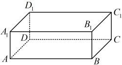

（1）试写出与 \(\overrightarrow{AB}\)相等的所有向量；
（2）试写出  \(\overrightarrow{AA_{1}}\) 的所有相反向量.
解：（1）（要找与 \(\overrightarrow{AB}\)相等的向量，就看哪些向量与 \(\overrightarrow{AB}\)方向相同，长度相等）
在长方体  \(ABCD-A_{1}B_{1}C_{1}D_{1}\) 中，DC， \(A_{1}B_{1}\)， \(D_{1}C_{1}\) 与 AB 平行且相等，所以与  \(\overrightarrow{AB}\) 相等的向量有  \(\overrightarrow{DC}\)， \(\overrightarrow{A_{1}B_{1}}\)， \(\overrightarrow{D_{1}C_{1}}\)。
（2）在长方体  \(ABCD-A_1B_1C_1D_1\) 中， \(BB_1\)， \(CC_1\)， \(DD_1\) 与  \(AA_1\) 平行且相等，所以  \(\overrightarrow{AA_1}\) 的相反向量有  \(\overrightarrow{A_1A}\)， \(\overrightarrow{B_1B}\)， \(\overrightarrow{C_1C}\)， \(\overrightarrow{D_1D}\)。

#### 左侧知识点｜`1.1-k2` 空间向量的线性运算

**知识点2：空间向量的线性运算**

**1. 加、减运算的运算法则**

<table border=1 style='margin: auto; word-wrap: break-word;'><tr><td colspan="2"></td><td style='text-align: center; word-wrap: break-word;'>语言表述</td><td style='text-align: center; word-wrap: break-word;'>图形表示</td></tr><tr><td rowspan="2">加法运算</td><td style='text-align: center; word-wrap: break-word;'>三角形法则</td><td style='text-align: center; word-wrap: break-word;'>设向量 b 的起点与向量 a 的终点重合（不重合时可通过平移使其重合），则  \(a+b\) 为 a 的起点指向 b 的终点的向量</td><td style='text-align: center; word-wrap: break-word;'></td></tr><tr><td style='text-align: center; word-wrap: break-word;'>平行四边形法则</td><td style='text-align: center; word-wrap: break-word;'>设向量 a 与 b 共起点 O（不共起点时可先平移至共起点），以两个向量的所在边为邻边作平行四边形，则  \(a+b\) 为该平行四边形一条对角线构成的向量（从 O 出发）</td><td style='text-align: center; word-wrap: break-word;'>\n \(a+b=OA+OB=OC\)</td></tr><tr><td style='text-align: center; word-wrap: break-word;'>减法运算</td><td style='text-align: center; word-wrap: break-word;'>三角形法则</td><td style='text-align: center; word-wrap: break-word;'>设向量 a 与 b 共起点 O（不共起点时可先平移至共起点），则  \(a-b\) 为从 b 的终点指向 a 的终点的向量</td><td style='text-align: center; word-wrap: break-word;'></td></tr></table>

注：若首尾顺次相接的若干空间向量构成封闭图形，则它们的和为  \(\mathbf{0}\)，即  \(\overrightarrow{A_1A_2} + \overrightarrow{A_2A_3} + \cdots + \overrightarrow{A_{n-1}A_n} + \overrightarrow{A_nA_1} = \mathbf{0}\)。

2. 空间向量的数乘运算

<table border=1 style='margin: auto; word-wrap: break-word;'><tr><td style='text-align: center; word-wrap: break-word;'>定义</td><td colspan="3">与平面向量一样，实数  \(\lambda\) 与空间向量  \(a\) 的乘积  \(\lambda a\) 仍然是一个向量，我们把这称为空间向量的数乘</td></tr><tr><td rowspan="4">几何意义</td><td style='text-align: center; word-wrap: break-word;'>\(\lambda &gt; 0\)</td><td style='text-align: center; word-wrap: break-word;'>\(\lambda a\) 与向量  \(a\) 的方向相同</td><td rowspan="3"></td></tr><tr><td style='text-align: center; word-wrap: break-word;'>\(\lambda &lt; 0\)</td><td style='text-align: center; word-wrap: break-word;'>\(\lambda a\) 与向量  \(a\) 的方向相反</td></tr><tr><td style='text-align: center; word-wrap: break-word;'>\(\lambda = 0\)</td><td style='text-align: center; word-wrap: break-word;'>\(\lambda a = 0\)，方向是任意的</td></tr><tr><td colspan="3">\(\lambda a\) 的长度是  \(a\) 长度的  \(|\lambda|\) 倍</td></tr></table>

注：①与平面向量相同，实数与空间向量不能进行加法和减法运算.

②若 \(a=0\)，则 \(\lambda a=0\)；若 \(\lambda a=0\)，则 \(\lambda=0\)或 \(a=0\)。

3. 线性运算的运算律（下述  \(\lambda\)， \(\mu\) 为实数）

<table border=1 style='margin: auto; word-wrap: break-word;'><tr><td style='text-align: center; word-wrap: break-word;'>交换律</td><td style='text-align: center; word-wrap: break-word;'>\(a + b = b + a\)</td></tr><tr><td style='text-align: center; word-wrap: break-word;'>结合律</td><td style='text-align: center; word-wrap: break-word;'>\((a + b) + c = a + (b + c)\),  \(\lambda(\mu a) = (\lambda \mu)a\)</td></tr><tr><td style='text-align: center; word-wrap: break-word;'>分配律</td><td style='text-align: center; word-wrap: break-word;'>\((\lambda + \mu)a = \lambda a + \mu a\),  \(\lambda(a + b) = \lambda a + \lambda b\)</td></tr></table>

##

> 对应教材例题：例2, 例3

#### 任务 02｜例2

【例 2】如图， \(ABCD-A_1B_1C_1D_1\) 为平行六面体，则  \(\overrightarrow{AB} + \overrightarrow{AD} + \overrightarrow{CC_1} = (\ )\)
A.  \(\overrightarrow{CA}\)    B.  \(\overrightarrow{AC}\)
C.  \(\overrightarrow{AC_1}\)    D.  \(\overrightarrow{C_1A}\)

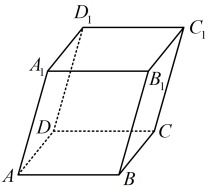

解析：如图，由空间向量加法的平行四边形
法则，\(\overrightarrow{AB}+\overrightarrow{AD}=\overrightarrow{AC}\)，

所以\(\overrightarrow{AB}+\overrightarrow{AD}+\overrightarrow{CC_1}=\overrightarrow{AC}+\overrightarrow{CC_1}=\overrightarrow{AC_1}\)。

答案：C

#### 任务 03｜例3

【例3】如图，在四面体ABCD中，E是BC的中点， \(\overrightarrow{AE}=4\overrightarrow{AF}\)，则（）

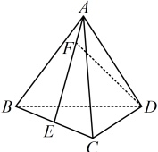

A.  \(\overrightarrow{DF} = \frac{1}{4}\overrightarrow{AB} + \frac{1}{4}\overrightarrow{AC} - \overrightarrow{AD}\)
B.  \(\overrightarrow{DF} = \frac{1}{8}\overrightarrow{AB} + \frac{1}{8}\overrightarrow{AC} - \overrightarrow{AD}\)
C.  \(\overrightarrow{DF} = -\frac{1}{4}\overrightarrow{AB} - \frac{1}{4}\overrightarrow{AC} + \overrightarrow{AD}\)
D.  \(\overrightarrow{DF} = -\frac{1}{8}\overrightarrow{AB} - \frac{1}{8}\overrightarrow{AC} + \overrightarrow{AD}\)
解析：结合选项可知，需要把\(\overrightarrow{DF}\)用\(\overrightarrow{AB}\)，\(\overrightarrow{AC}\)，\(\overrightarrow{AD}\)表示，观察图形可发现，由\(D\)到\(F\)，与上述三个向量关联较强的路径可以是\(D\to A\to F\)，由图可知\(\overrightarrow{DF}=\overrightarrow{DA}+\overrightarrow{AF}=-\overrightarrow{AD}+\frac{1}{4}\overrightarrow{AE}\) ①，还需把\(\overrightarrow{AE}\)化掉，可结合\(E\)为\(BC\)中点来化，因为点\(E\)是\(BC\)的中点，所以\(\overrightarrow{AE}=\frac{1}{2}(\overrightarrow{AB}+\overrightarrow{AC})\)，代入①得\(\overrightarrow{DF}=-\overrightarrow{AD}+\frac{1}{4}\times\frac{1}{2}(\overrightarrow{AB}+\overrightarrow{AC})=\frac{1}{8}\overrightarrow{AB}+\frac{1}{8}\overrightarrow{AC}-\overrightarrow{AD}\)。
答案：B

#### 方法类型｜类型Ⅰ 线性运算：代数化简、平行六面体向量化简

#### 任务 04｜例9

【例9】化简下列算式：
(1)  \(3(2a - b - 4c) - 4(a - 2b + 3c)\); (2)  \(\overrightarrow{OA} - [\overrightarrow{OB} - (\overrightarrow{AB} - \overrightarrow{AC})]\).
解：（1） \(3(2a-b-4c)-4(a-2b+3c)=6a-3b-12c-4a+8b-12c=2a+5b-24c\)
（2） \(\overrightarrow{OA}-[\overrightarrow{OB}-(\overrightarrow{AB}-\overrightarrow{AC})]=\overrightarrow{OA}-\overrightarrow{OB}+(\overrightarrow{AB}-\overrightarrow{AC})=\overrightarrow{OA}+\overrightarrow{BO}+(\overrightarrow{AB}+\overrightarrow{CA})=\overrightarrow{BO}+\overrightarrow{OA}+(\overrightarrow{CA}+\overrightarrow{AB})=\overrightarrow{BO}+\overrightarrow{OA}+\overrightarrow{CB}=\overrightarrow{BA}+\overrightarrow{CB}=\overrightarrow{CB}+\overrightarrow{BA}=\overrightarrow{CA}\)

#### 任务 05｜例10

【例 10】在平行六面体  \(ABCD-A_1B_1C_1D_1\) 中，化简下列表达式，并在图中标出化简结果的向量.
(1)  \(\overrightarrow{DC} + \overrightarrow{A_1D_1} + \frac{1}{2}\overrightarrow{CC_1}\); (2)  \(\overrightarrow{AA_1} + \frac{1}{2}\overrightarrow{AB} + \frac{1}{2}\overrightarrow{AD}\).

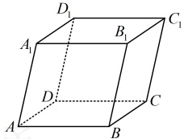

解：（1）（所给向量没有连成首尾相接的形式，不方便直接相加，怎么办呢？由于图形是平行六面体，有丰富的平行关系，所以可考虑通过平移一些向量来使相加的向量连成首尾相接的形式）
设 \(P\) 为 \(CC_1\) 的中点，则如图 1，\(\overrightarrow{DC} + \overrightarrow{A_1D_1} + \frac{1}{2}\overrightarrow{CC_1} = \overrightarrow{DC} + \overrightarrow{AD} + \overrightarrow{CP} = \overrightarrow{AD} + \overrightarrow{DC} + \overrightarrow{CP} = \overrightarrow{AP}\)。

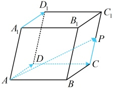

图1

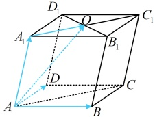

图2

（2）（相加的三项中，后两项的系数都是 \(\frac{1}{2}\)，故可考虑先把这两项提 \(\frac{1}{2}\)出来，再相加）
如图2，设 \(A_1C_1 \cap B_1D_1 = O\)，则 \(O\)为 \(A_1C_1\)的中点，所以 \(\frac{1}{2}\overrightarrow{AB} + \frac{1}{2}\overrightarrow{AD} = \frac{1}{2}(\overrightarrow{AB} + \overrightarrow{AD}) = \frac{1}{2}\overrightarrow{AC}\)，
故 \(\overrightarrow{AA_1} + \frac{1}{2}\overrightarrow{AB} + \frac{1}{2}\overrightarrow{AD} = \overrightarrow{AA_1} + \frac{1}{2}\overrightarrow{AC} = \overrightarrow{AA_1} + \frac{1}{2}\overrightarrow{A_1C_1} = \overrightarrow{AA_1} + \overrightarrow{A_1O} = \overrightarrow{AO}\)。
【反思】对于空间向量的线性运算，其处理方法与平面向量的线性运算类似。若参与运算的向量是用诸如a，b，c这种符号表示的，则只需将算式展开，再合并同类项；若参与运算的向量是用起点和终点表示的，则常通过平移来产生有关运算法则需要的图形（如连成首尾相接，或构成平行四边形等），再进行运算。

- 本批例题没有直属变式，按路线进入对应配套题。

### 当前动作 3：做本批对应 A/B/C 习题（无答案）

> 本批配套题承接：1.1-k1, 1.1-k2, 类型Ⅰ 线性运算

#### A组

##### 任务 06｜A1

1. (2025 • 新疆巴音郭楞期末)

如图，在四面体 OABC 中，N 是 BC 的中点，设  \(\overrightarrow{OA} = a\)， \(\overrightarrow{OB} = b\)， \(\overrightarrow{OC} = c\)，则  \(\overrightarrow{AN} =\) （ ）

A.  \(a + \frac{1}{2}b + \frac{1}{2}c\)  B.  \(\frac{1}{2}a + b + c\)

C.  \(-a + \frac{1}{2}b + \frac{1}{2}c\)  D.  \(-a + \frac{1}{2}b + c\)

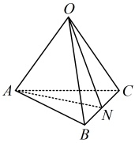

##### 任务 07｜A2

2.（2025·全国模拟）

化简下列算式：

（1） \(2(a-2b-3c)-3(a+2b-c)\)；

（2） \(\overrightarrow{AB}-\overrightarrow{DB}-\overrightarrow{AC}\).

##### 任务 08｜A3

3.（2025 · 山东菏泽模拟）

如图，在正方体  \(ABCD-A_1B_1C_1D_1\) 中，G 为  \(CC_1\) 中点，O 为 AC 与 BD 的交点，化简下列各式：

(1)  \(\overrightarrow{AB} - \overrightarrow{BC}\);

(2)  \(\overrightarrow{A_1B_1} + \overrightarrow{A_1D_1} + \overrightarrow{C_1C}\);

(3)  \(\frac{1}{2}(\overrightarrow{GD} + \overrightarrow{GB}) - \overrightarrow{A_1O}\).

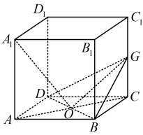

### 当前动作 4：本批验收

- [ ] 能闭卷复述本批方法及适用条件。
- [ ] 教学例题能解释关键步骤，不只是记住结论。
- [ ] 直属变式和对应习题有独立过程。
- [ ] 若使用过提示或答案，已用未见题或延迟闭卷复测补证。
- [ ] 当前循环没有未解决的第一断点。

> **推进门：** 本批例题理解、直属变式、对应习题和独立复测证据齐全后才可进入下一批；提示或看答案的题必须以未见题或延迟闭卷复测补证。
> **失败处理：** 只报告第一处断点并给最小提示；不得提前展示下一批或当前题答案。
> 未满足推进门时停在本循环，不展示下一循环的当前动作。

---

## 循环 2/10：共线概念与向量拆分

### 当前动作 1：看本批视频

- `3.1.2.1` 3.1.2.1 空间向量拆分法
  - 文件：`C:\Users\poyi\Downloads\课程合集\3.1 空间向量与立体几何\3.1.2.1 空间向量拆分法.mp4`

> 看完本批视频后停下来，不要提前观看下一循环。

### 当前动作 2：按本批做题路径推进

本批知识点：
- `1.1-k3` 共线向量与共面向量
本批类型：
- 类型Ⅱ 证明平行、共线：正方体/九点图中的共线或平行证明

#### 左侧知识点｜`1.1-k3` 共线向量与共面向量

**知识点 3：共线向量与共面向量**

**1. 直线的方向向量**

如图，O 是直线 l 上一点，在直线 l 上取非零向量  \(\boldsymbol{a}\)，则对于直线 l 上任意一点 P，由数乘向量的定义及向量共线的充要条件可知，存在实数  \(\lambda\)，使得  \(\overrightarrow{OP} = \lambda \boldsymbol{a}\)。我们把与向量  \(\boldsymbol{a}\) 平行的非零向量称为直线 l 的方向向量。直线可以由直线上一点和它的方向向量确定。

注：①零向量不能作为直线的方向向量；

②根据方向向量的定义，求任一直线 l 的方向向量，

可在直线 l 上选取两个不同的点 A 和 B，那么与  \(\overrightarrow{AB}\) 平行的

非零向量就是直线 l 的方向向量.

**2. 共面向量**

向量平行于直线：如图，若表示向量  \(a\) 的有向线段  \(\overrightarrow{OA}\) 所在的直线  \(OA\) 与直线  \(l\) 平行或重合，则称  \(a \parallel l\)。

向量平行于平面：如图，若直线 OA 平行于平面  \(\alpha\) 或在平面  \(\alpha\) 内，那么称向量 a 平行于平面  \(\alpha\).

共面向量：平行于同一个平面的向量，叫做共面向量.

**3. 共线向量与共面向量的对比**

<table border=1 style='margin: auto; word-wrap: break-word;'><tr><td style='text-align: center; word-wrap: break-word;'></td><td style='text-align: center; word-wrap: break-word;'>共线（平行）向量</td><td style='text-align: center; word-wrap: break-word;'>共面向量</td></tr><tr><td style='text-align: center; word-wrap: break-word;'>定义</td><td style='text-align: center; word-wrap: break-word;'>表示若干空间向量的有向线段所在的直线互相平行或重合（规定零向量与任意向量共线）</td><td style='text-align: center; word-wrap: break-word;'>平行于同一个平面的向量</td></tr><tr><td style='text-align: center; word-wrap: break-word;'>充要条件</td><td style='text-align: center; word-wrap: break-word;'>共线向量定理：对任意两个空间向量  \(a, b (b \neq \emptyset)\)， \(a \parallel b\) 的充要条件是存在实数  \(\lambda\)，使  \(a = \lambda b\)</td><td style='text-align: center; word-wrap: break-word;'>共面向量定理：向量  \(p\) 与两个不共线向量  \(a, b\) 共面的充要条件是存在唯一的有序实数对  \((x, y)\)，使  \(p = x a + y b\)</td></tr><tr><td style='text-align: center; word-wrap: break-word;'>推论</td><td style='text-align: center; word-wrap: break-word;'>三点共线系数和结论：设  \(O, A, B\) 不共线，已知  \(\overrightarrow{OP} = x\overrightarrow{OA} + y\overrightarrow{OB}\)，则  \(A, P\)，</td><td style='text-align: center; word-wrap: break-word;'>四点共面系数和结论：设  \(O, A, B, C\) 不共面，若  \(\overrightarrow{OP} = x\overrightarrow{OA} + y\overrightarrow{OB} + z\overrightarrow{OC}\)，则  \(P, A, B\)，</td></tr></table>

推论补全：若 \(O,A,B\) 不共线，且 \(\overrightarrow{OP}=x\overrightarrow{OA}+y\overrightarrow{OB}\)，则 \(A,P,B\) 共线当且仅当 \(x+y=1\)。若 \(O,A,B,C\) 不共面，且 \(\overrightarrow{OP}=x\overrightarrow{OA}+y\overrightarrow{OB}+z\overrightarrow{OC}\)，则 \(P,A,B,C\) 共面当且仅当 \(x+y+z=1\)。

##

> 对应教材例题：例4, 例5

#### 任务 09｜例4

【例4】（多选）下列说法中，正确的有（）
A. 设  \(\overrightarrow{a}\),  \(\overrightarrow{b}\),  \(\overrightarrow{c}\) 是空间向量，若  \(\overrightarrow{a}\) 与  \(\overrightarrow{b}\) 共线， \(\vec{b}\) 与  \(\vec{c}\) 共线，则  \(\vec{a}\) 与  \(\vec{c}\) 共线

B．若两个非零向量  \(\overrightarrow{AB}\) 与  \(\overrightarrow{CD}\) 满足  \(\overrightarrow{AB} + \overrightarrow{CD} = \overrightarrow{0}\)，则  \(\overrightarrow{AB} \parallel \overrightarrow{CD}\)

C. 零向量与任何向量都共线

D．两个单位向量一定是相等向量

解析：A项，涉及向量共线的分析，别忘了考虑零向量的特殊性，

当 \(\vec{b}=\vec{0}\)时，满足 \(\vec{a}\)与 \(\vec{b}\)共线， \(\vec{b}\)与 \(\vec{c}\)共线，但无法得到 \(\vec{a}\)与 \(\vec{c}\)共线，故A项错误；

B项，由 \(\overrightarrow{AB}+\overrightarrow{CD}=\overrightarrow{0}\)可得 \(\overrightarrow{AB}=-\overrightarrow{CD}\)，所以 \(\overrightarrow{AB}\)与 \(\overrightarrow{CD}\)为相反向量，

满足 \(\overrightarrow{AB}\parallel\overrightarrow{CD}\)，故B项正确；

C项，零向量与任意向量都共线，故C项正确；

D项，单位向量指的是模长为1的向量，并没有规定方向，所以两个单位向量的方向不一定相同，它们不一定是相等向量，故D项错误。

答案：BC

#### 任务 10｜例5

【例5】若a，b，c是空间中一组不共面的向量，则下列各项中，一定不共面的一组向量是（）
A. a-b, b+c, c+a
B.  \(-a+c\),  \(-b-c\),  \(a+b\)
C.  \(a+b\), b-c, a+c
D.  \(a+b\), a-b, c
解析：由于 \(a, b, c\) 不共面，故可想象，所给的每组向量中，任意两个向量都不共线，故要判断三个向量是否共面，就看其中一个向量能否用另外两个向量表示，
A 项，\(c + a = (a - b) + (b + c)\)，由共面向量定理可知本组三个向量共面，故 A 项错误；
B 项，\(-a + c = -(-b - c) - (a + b)\)，所以本组三个向量共面，故 B 项错误；
C 项，\(a + b = (b - c) + (a + c)\)，所以本组三个向量共面，故 C 项错误；
D 项，单选题已排除 A、B、C 三个选项，到此已可得出 D 项正确，下面我们也详细

分析一下理由，

记  \(a\)， \(b\) 都是平面  \(\alpha\) 内的向量，因为  \(a\)， \(b\)，

 \(c\) 不共面，所以  \(c\) 不是  \(\alpha\) 内的向量，

又因为  \(a + b\)， \(a - b\) 也是  \(\alpha\) 内的向量，所以

 \(a + b\)， \(a - b\)， \(c\) 不共面，故 D 项正确。

答案：D

#### 方法类型｜类型Ⅱ 证明平行、共线：正方体/九点图中的共线或平行证明

#### 任务 11｜例11

【例 11】已知向量  \(\boldsymbol{a}\),  \(\boldsymbol{b}\),  \(\boldsymbol{c}\) 不共面， \(\overrightarrow{AB}=4\boldsymbol{a}+5\boldsymbol{b}+3\boldsymbol{c}\),  \(\overrightarrow{AC}=2\boldsymbol{a}+3\boldsymbol{b}+\boldsymbol{c}\),  \(\overrightarrow{AD}=6\boldsymbol{a}+7\boldsymbol{b}+5\boldsymbol{c}\), 求证： \(\boldsymbol{B}\),  \(\boldsymbol{C}\),  \(\boldsymbol{D}\) 三点共线.
证明：（要证 \(B\), \(C\), \(D\) 三点共线，只需证 \(\overrightarrow{BC}\) 与 \(\overrightarrow{CD}\) 共线，条件没给 \(\overrightarrow{BC}\) 和 \(\overrightarrow{CD}\)，故先求它们，怎么求？观察所给的向量发现可按 \(\overrightarrow{BC} = \overrightarrow{AC} - \overrightarrow{AB}\) 求 \(\overrightarrow{BC}\)，按 \(\overrightarrow{CD} = \overrightarrow{AD} - \overrightarrow{AC}\) 求 \(\overrightarrow{CD}\)）
由题意，\(\overrightarrow{BC} = \overrightarrow{AC} - \overrightarrow{AB} = (2a + 3b + c) - (4a + 5b + 3c) = 2a + 3b + c - 4a - 5b - 3c = -2a - 2b - 2c\)，
\(\overrightarrow{CD} = \overrightarrow{AD} - \overrightarrow{AC} = (6a + 7b + 5c) - (2a + 3b + c) = 6a + 7b + 5c - 2a - 3b - c = 4a + 4b + 4c\)，
所以 \(\overrightarrow{CD} = -2\overrightarrow{BC}\)，从而 \(\overrightarrow{BC}\) 与 \(\overrightarrow{CD}\) 共线，故 \(B\), \(C\), \(D\) 三点共线。
【反思】证三点共线，一种常用方法是转化为证明向量共线。本题没有图形背景，只给出了有关向量的代数表达式，若是在具体的图形下证明某三点共线，其处理方法也是类似的，但可能需要结合图形的一些几何特征来分析，我们来看下面的变式1。

##### 任务 12｜紧跟：变式1（对应例11，无解答）

【变式1】如图，在正方体  \(ABCD-A_1B_1C_1D_1\) 中，点  \(E\)， \(F\) 满足  \(\overrightarrow{A_1E} = 2\overrightarrow{ED_1}\)， \(\overrightarrow{A_1F} = \frac{2}{3}\overrightarrow{FC}\)。
（1）将 \(\overrightarrow{EF}\)用 \(\overrightarrow{A_{1}A}\)， \(\overrightarrow{A_{1}B_{1}}\)， \(\overrightarrow{A_{1}D_{1}}\)表示；

（2）证明：E，F，B三点共线.

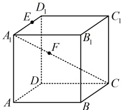

##### 任务 13｜紧跟：变式2（对应例11，无解答）

【变式 2】已知  \(O\)， \(A\)， \(B\)， \(C\)， \(D\)， \(E\)， \(F\)， \(G\)， \(H\) 为空间的 9 个点（如图所示），并且  \(\overrightarrow{OE} = k\overrightarrow{OA}\)， \(\overrightarrow{OF} = k\overrightarrow{OB}\)， \(\overrightarrow{OH} = k\overrightarrow{OD}\)， \(\overrightarrow{AC} = \overrightarrow{AD} + m\overrightarrow{AB}\)， \(\overrightarrow{EG} = \overrightarrow{EH} + m\overrightarrow{EF}\)，求证： \(AC \parallel EG\)。

### 当前动作 3：做本批对应 A/B/C 习题（无答案）

> 本批配套题承接：1.1-k3, 类型Ⅱ 证明平行、共线

#### B组

##### 任务 14｜B10

10. （2025·上海模拟）

如图，在四面体  \(ABCD\) 中，点  \(E, F, I, H\) 分别是  \(AB, AC, CD, BD\) 的中点， \(G\) 为  \(EI\) 的中点，判断  \(G, F, H\) 三点是否共线，并说明理由.

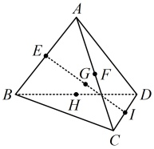

### 当前动作 4：本批验收

- [ ] 能闭卷复述本批方法及适用条件。
- [ ] 教学例题能解释关键步骤，不只是记住结论。
- [ ] 直属变式和对应习题有独立过程。
- [ ] 若使用过提示或答案，已用未见题或延迟闭卷复测补证。
- [ ] 当前循环没有未解决的第一断点。

> **推进门：** 本批例题理解、直属变式、对应习题和独立复测证据齐全后才可进入下一批；提示或看答案的题必须以未见题或延迟闭卷复测补证。
> **失败处理：** 只报告第一处断点并给最小提示；不得提前展示下一批或当前题答案。
> 未满足推进门时停在本循环，不展示下一循环的当前动作。

---

## 循环 3/10：空间向量等值面法

### 当前动作 1：看本批视频

- `3.1.2.2` 3.1.2.2 空间向量等值面法
  - 文件：`C:\Users\poyi\Downloads\课程合集\3.1 空间向量与立体几何\3.1.2.2 空间向量等值面法.mp4`
- 前置方法必须已通过：`decomposition`

> 看完本批视频后停下来，不要提前观看下一循环。

### 当前动作 2：按本批做题路径推进

本批复用的左侧知识点（前置循环必须已通过）：
- `1.1-k3` 共线向量与共面向量

- 本批例题没有直属变式，按路线进入对应配套题。

#### 方法检查｜`1.1-equal-surface-check-1` 等值面法方法检查（不计入教材题量）

设 O、A、B、C 四点不共面，点 P 满足 OP=xOA+yOB+zOC。请只用等值面法回答：P 在平面 ABC 内时 x、y、z 应满足什么关系？再自取一组三个非零系数构造一个满足条件的 P，并说明为什么不能只检查三个系数都非零。

> 独立作答，不提供答案；未通过时停在本循环。

#### 方法检查｜`1.1-equal-surface-check-2` 等值面法末减出近迁移（不计入教材题量）

设 O、A、B、C 四点不共面，E、F 分别满足 OE=(1/2)OA+(1/2)OB+OC，OF=OA+2OB+(1/2)OC。请用等值面法判断 E、F 各落在哪个倍面，并只通过系数相减判断向量 EF 的系数和；说明这一步为什么比重新作图更稳定。

> 独立作答，不提供答案；未通过时停在本循环。

### 当前动作 3：做本批对应 A/B/C 习题（无答案）

> 本批配套题承接：1.1-k3

- 当前覆盖账本没有为本批单独分配 A/B/C 题；用本批例题过程与未见变式验收，不从题名猜题。

### 当前动作 4：本批验收

- [ ] 能闭卷复述本批方法及适用条件。
- [ ] 教学例题能解释关键步骤，不只是记住结论。
- [ ] 直属变式和对应习题有独立过程。
- [ ] 若使用过提示或答案，已用未见题或延迟闭卷复测补证。
- [ ] 当前循环没有未解决的第一断点。

> **推进门：** 本批例题理解、直属变式、对应习题和独立复测证据齐全后才可进入下一批；提示或看答案的题必须以未见题或延迟闭卷复测补证。
> **失败处理：** 只报告第一处断点并给最小提示；不得提前展示下一批或当前题答案。
> 未满足推进门时停在本循环，不展示下一循环的当前动作。

---

## 循环 4/10：共面证明

### 当前动作 1：看本批视频

- `3.1.4.2` 3.1.4.2 证明共面
  - 文件：`C:\Users\poyi\Downloads\课程合集\3.1 空间向量与立体几何\3.1.4.2 证明共面.mp4`
- 前置方法必须已通过：`decomposition`

> 看完本批视频后停下来，不要提前观看下一循环。

### 当前动作 2：按本批做题路径推进

本批复用的左侧知识点（前置循环必须已通过）：
- `1.1-k3` 共线向量与共面向量
本批类型：
- 类型Ⅲ 证明共面：系数和与共面表示

本批补充桥接：
- **四点共面系数和=1** (`micro-four-point-coplanar`)
  - 固定公共起点 O，把待判定点写成 OP=xOA+yOB+zOC。
  - 正向证明：若 P 在平面 ABC 内，写 AP=uAB+vAC，换回公共起点得 OP=(1-u-v)OA+uOB+vOC，所以 x+y+z=1。
  - 逆向证明：若 x+y+z=1，则 OP=OA+yAB+zAC，点 P 可由 A 沿平面内两条方向到达，因此 P 在平面 ABC 内。
  - 最后区分点的位置向量系数与任意自由向量系数；换公共起点时必须重新推导。

#### 方法类型｜类型Ⅲ 证明共面：系数和与共面表示

#### 任务 15｜例12

【例 12】已知 \(A, B, C\) 三点不共线，且平面 \(ABC\) 外一点 \(O\) 满足 \(\overrightarrow{OM} = \frac{1}{3}\overrightarrow{OA} + \frac{1}{3}\overrightarrow{OB} + \frac{1}{3}\overrightarrow{OC}\)，判断 \(\overrightarrow{MA}, \overrightarrow{MB}, \overrightarrow{MC}\) 三个向量是否共面。
解：（要判断  \(\overrightarrow{MA}\)， \(\overrightarrow{MB}\)， \(\overrightarrow{MC}\) 是否共面，就看能否找到实数  \(\lambda\) 和  \(\mu\)，使  \(\overrightarrow{MA} = \lambda \overrightarrow{MB} + \mu \overrightarrow{MC}\)。题设条件给出了  \(\overrightarrow{OM} = \frac{1}{3} \overrightarrow{OA} + \frac{1}{3} \overrightarrow{OB} + \frac{1}{3} \overrightarrow{OC}\)，而上述目标式中的向量不涉及点  \(O\)，故考虑消去  \(O\)，怎么消？观察发现可将  \(\overrightarrow{OM}\) 拆分成  \(\frac{1}{3} \overrightarrow{OM} + \frac{1}{3} \overrightarrow{OM} + \frac{1}{3} \overrightarrow{OM}\)，再分别与  \(\frac{1}{3} \overrightarrow{OA}\)， \(\frac{1}{3} \overrightarrow{OB}\)， \(\frac{1}{3} \overrightarrow{OC}\) 组合，即可消去  \(O\)，故尝试按此变形）
因为  \(\overrightarrow{OM} = \frac{1}{3} \overrightarrow{OA} + \frac{1}{3} \overrightarrow{OB} + \frac{1}{3} \overrightarrow{OC}\)，所以  \(\frac{1}{3} \overrightarrow{OM} + \frac{1}{3} \overrightarrow{OM} + \frac{1}{3} \overrightarrow{OM} = \frac{1}{3} \overrightarrow{OA} + \frac{1}{3} \overrightarrow{OB} + \frac{1}{3} \overrightarrow{OC}\)，
从而  \(\overrightarrow{OM} + \overrightarrow{OM} + \overrightarrow{OM} = \overrightarrow{OA} + \overrightarrow{OB} + \overrightarrow{OC}\)，故  \(\overrightarrow{OA} - \overrightarrow{OM} = -(\overrightarrow{OB} - \overrightarrow{OM}) - (\overrightarrow{OC} - \overrightarrow{OM})\)，
所以  \(\overrightarrow{MA} = -\overrightarrow{MB} - \overrightarrow{MC}\)，故  \(\overrightarrow{MA}\)， \(\overrightarrow{MB}\)， \(\overrightarrow{MC}\) 三个向量共面。
【反思】①类似于平面上的 \(\overrightarrow{OM}=x\overrightarrow{OA}+y\overrightarrow{OB}\)， \(M\)， \(A\)， \(B\)三点共线 \(\Leftrightarrow x+y=1\)，在空间中，若 \(\overrightarrow{OM}=x\overrightarrow{OA}+y\overrightarrow{OB}+z\overrightarrow{OC}\)，则 \(M\)， \(A\)， \(B\)， \(C\)四点共面 \(\Leftrightarrow x+y+z=1\)（四点共面的系数和结论），本题结论实质上就是 \(M\)， \(A\)， \(B\)， \(C\)四点共面，故其处理方法与平面上证 \(M\)， \(A\)， \(B\)共线类似，我们将 \(\overrightarrow{OM}\)按 \(\overrightarrow{OA}\)， \(\overrightarrow{OB}\)， \(\overrightarrow{OC}\)的系数进行了拆分。②要看三个不共线的向量是否共面，就看其中一个向量能否用另外两个向量表示。若能，则三个向量共面；若不能，则三个向量不共面。不仅证向量共面可以这么做，证四点共面，也可类似处理，我们来看一个变式。

##### 任务 16｜紧跟：变式（对应例12，无解答）

【变式】如图，已知平行六面体 \(ABCD-A_1B_1C_1D_1\)中， \(E\)， \(F\)， \(G\)， \(H\)分别是棱 \(A_1D_1\)， \(C_1D_1\)， \(CC_1\)， \(AB\)的中点。
（1）设 \(\overrightarrow{EG} = x\overrightarrow{AB} + y\overrightarrow{AD} + z\overrightarrow{AA_1}\)，其中 \(x, y, z \in \mathbb{R}\)，求 \(x\)， \(y\)， \(z\)的值；
（2）证明： \(E\)， \(F\)， \(G\)， \(H\)四点共面。

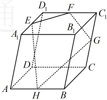

### 当前动作 3：做本批对应 A/B/C 习题（无答案）

> 本批配套题承接：1.1-k3, 类型Ⅲ 证明共面

#### B组

##### 任务 17｜B9

9. （2025·河北模拟）

如图，在正四棱锥  \(P-ABCD\) 中， \(E\)， \(F\) 分别为  \(PA\)， \(PC\) 的中点， \(\overrightarrow{DG} = 2\overrightarrow{GP}\)

（1）若 \(\overrightarrow{BG}=x\overrightarrow{BA}+y\overrightarrow{BC}+z\overrightarrow{BP}(x,y,z\in\mathbf{R})\)，求 \(x\)， \(y\)， \(z\)的值；

（2）证明：B，E，G，F四点共面.

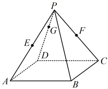

### 当前动作 4：本批验收

- [ ] 能闭卷复述本批方法及适用条件。
- [ ] 教学例题能解释关键步骤，不只是记住结论。
- [ ] 直属变式和对应习题有独立过程。
- [ ] 若使用过提示或答案，已用未见题或延迟闭卷复测补证。
- [ ] 当前循环没有未解决的第一断点。

> **推进门：** 本批例题理解、直属变式、对应习题和独立复测证据齐全后才可进入下一批；提示或看答案的题必须以未见题或延迟闭卷复测补证。
> **失败处理：** 只报告第一处断点并给最小提示；不得提前展示下一批或当前题答案。
> 未满足推进门时停在本循环，不展示下一循环的当前动作。

---

## 循环 5/10：数量积基础与投影

### 当前动作 1：看本批视频

- `3.1.4.3` 3.1.4.3 向量夹角与直线夹角
  - 文件：`C:\Users\poyi\Downloads\课程合集\3.1 空间向量与立体几何\3.1.4.3 向量夹角与直线夹角.mp4`
- 前置方法必须已通过：`space_vector_ops, decomposition`

> 看完本批视频后停下来，不要提前观看下一循环。

### 当前动作 2：按本批做题路径推进

本批知识点：
- `1.1-k4` 数量积、夹角与投影向量

本批补充桥接：
- **投影向量定义、方向与标量长度** (`bridge-1.1-projection`)
  - 先区分投影向量与投影长度：前者有方向，后者是标量。
  - 向量 \(a\) 在非零向量 \(b\) 方向上的投影向量为 \(\frac{a\cdot b}{|b|^2}b\)，符号决定与 \(b\) 同向或反向。
  - 有向投影长度（标量投影）为 \(\frac{a\cdot b}{|b|}\)；若题目问不带方向的投影线段长度，则取 \(\frac{|a\cdot b|}{|b|}\)，不能把这两个量与投影向量混写。
  - 向直线投影时先把向量起点平移到直线上，再由终点作垂线；向平面投影时分别投影起点与终点。
  - 用垂足图形和数量积公式各复核一次方向与长度。

#### 左侧知识点｜`1.1-k4` 数量积、夹角与投影向量

**知识点 4：空间向量的数量积运算**

**1. 空间向量的夹角**

<table border=1 style='margin: auto; word-wrap: break-word;'><tr><td style='text-align: center; word-wrap: break-word;'>定义</td><td style='text-align: center; word-wrap: break-word;'>如图，已知两个非零向量  \(a, b\)，在空间中任取一点  \(O\)，作  \(\overrightarrow{OA}=a\)， \(\overrightarrow{OB}=b\)，则  \(\angle AOB\) 叫做向量  \(a, b\) 的夹角. </td></tr><tr><td style='text-align: center; word-wrap: break-word;'>记法</td><td style='text-align: center; word-wrap: break-word;'>\(&lt;a,b&gt;\)</td></tr><tr><td style='text-align: center; word-wrap: break-word;'>范围</td><td style='text-align: center; word-wrap: break-word;'>\(&lt;a,b\rangle\in[0,\pi]\)，当  \(&lt;a,b&gt;\)= \(\frac{\pi}{2}\) 时， \(a\perp b\)</td></tr></table>

注：①当 a 与 b 同向时， \(\langle a,b\rangle=0\)；当 a 与 b 反向时， \(\langle a,b\rangle=\pi\)；

②记a与b的夹角为 \(\theta\)，则a与-b的夹角为 \(\pi-\theta\)；

③只有两个非零向量才有夹角，零向量与任意向量不定义夹角.

**2. 空间向量的数量积**

①定义：已知两个非零向量  \(a, b\)，则  \(|a| \cdot |b| \cdot \cos \langle a, b \rangle\)

叫做  \(a, b\) 的数量积，记作  \(a \cdot b\)，即  \(a \cdot b = |a| \cdot |b| \cdot \cos \langle a, b \rangle\)。

特别地，零向量与任意向量的数量积为 0。

②运算律：(i)  \((\lambda a) \cdot b = \lambda (a \cdot b)\)， \(\lambda \in \mathbb{R}\)；

(ii) 交换律： \(a \cdot b = b \cdot a\)；

(iii) 分配律： \((a + b) \cdot c = a \cdot c + b \cdot c\)。

注：①向量的数量积  \(a \cdot b\) 不能写作  \(a \times b\) 或  \(ab\)。

②与平面向量相同，空间向量的线性运算的结果为向量，而两个向量的数量积的运算结果为实数.

③数量积运算不满足结合律，即 \((a \cdot b) \cdot c \neq a \cdot (b \cdot c)\)，由于向量的运算中没有规定除法，因此 \(a \cdot b=b \cdot c\) 不能推出 \(a=c\)。

④利用数量积我们可以判断两个非零且不共线的向量

a，b 的夹角  \(\theta\) 的锐、直、钝：

(i)  \(\theta\) 为锐角  \(\Leftrightarrow a \cdot b > 0\);

(ii)  \(\theta\) 为直角  \(\Leftrightarrow a \cdot b = 0\);

分析一下理由，

记  \(a\)， \(b\) 都是平面  \(\alpha\) 内的向量，因为  \(a\)， \(b\)，

 \(c\) 不共面，所以  \(c\) 不是  \(\alpha\) 内的向量，

又因为  \(a + b\)， \(a - b\) 也是  \(\alpha\) 内的向量，所以

(iii)  \(\theta\) 为钝角  \(\Leftrightarrow a \cdot b < 0\)

**3. 空间向量数量积的性质**

<table border=1 style='margin: auto; word-wrap: break-word;'><tr><td style='text-align: center; word-wrap: break-word;'>性质</td><td style='text-align: center; word-wrap: break-word;'>作用</td></tr><tr><td style='text-align: center; word-wrap: break-word;'>若 a, b 为非零向量，则  \(a \perp b \Leftrightarrow a \cdot b = 0\)</td><td style='text-align: center; word-wrap: break-word;'>用于翻译或证明两向量垂直</td></tr><tr><td style='text-align: center; word-wrap: break-word;'>\(a \cdot a = |a|^2\)</td><td rowspan="2">用于求空间中线段的长度</td></tr><tr><td style='text-align: center; word-wrap: break-word;'>\(|a| = \sqrt{a \cdot a} = \sqrt{a^2}\)</td></tr><tr><td style='text-align: center; word-wrap: break-word;'>若 a, b 为非零向量，则  \(\cos &lt;a, b&gt; = \frac{a \cdot b}{|a| \cdot |b|}\)</td><td style='text-align: center; word-wrap: break-word;'>用于求有关的空间角</td></tr><tr><td style='text-align: center; word-wrap: break-word;'>\(|a \cdot b| \le |a| \cdot |b|\) （当且仅当 a, b 共线时，等号成立）</td><td style='text-align: center; word-wrap: break-word;'>用于求数量积的最值</td></tr></table>

**4. 投影向量**

<table border=1 style='margin: auto; word-wrap: break-word;'><tr><td style='text-align: center; word-wrap: break-word;'>投影类型</td><td style='text-align: center; word-wrap: break-word;'>定义</td><td style='text-align: center; word-wrap: break-word;'>图形表示</td></tr><tr><td style='text-align: center; word-wrap: break-word;'>向量向向量投影</td><td style='text-align: center; word-wrap: break-word;'>空间中，要将向量  \(a\) 向向量  \(b\) 投影，可以先将它们平移到同一个平面  \(\alpha\) 内，进而利用平面上向量的投影来求  \(a\) 在  \(b\) 方向上的投影向量  \(c\)，其计算公式为  \(\frac{a \cdot b}{|b|^2} b\)</td><td style='text-align: center; word-wrap: break-word;'></td></tr><tr><td style='text-align: center; word-wrap: break-word;'>向量向直线投影</td><td style='text-align: center; word-wrap: break-word;'>将向量  \(a\) 进行平移，使其起点落在  \(l\) 上，记作  \(\overrightarrow{OA}\)，再过终点  \(A\) 向直线  \(l\) 作垂线，垂足为  \(B\)，则  \(\overrightarrow{OB}\) 即为  \(a\) 在直线  \(l\) 上的投影向量</td><td style='text-align: center; word-wrap: break-word;'></td></tr><tr><td style='text-align: center; word-wrap: break-word;'>向量向平面投影</td><td style='text-align: center; word-wrap: break-word;'>如图，向量  \(a\) 向平面  \(\beta\) 投影，就是分别由向量  \(a\) 的起点  \(A\) 和终点  \(B\) 作平面  \(\beta\) 的垂线，垂足分别为  \(A&#x27;\)， \(B&#x27;\)，得到向量  \(\overrightarrow{A&#x27;B&#x27;}\)，向量  \(\overrightarrow{A&#x27;B&#x27;}\) 称为向量  \(a\) 在平面  \(\beta\) 上的投影向量。这时，向量  \(a\)， \(\overrightarrow{A&#x27;B&#x27;}\) 的夹角就是向量  \(a\) 所在直线与平面  \(\beta\) 所成的角</td><td style='text-align: center; word-wrap: break-word;'></td></tr></table>

注： \(a \cdot b\) 等于向量  \(a\) 在向量  \(b\) 上的投影向量  \(c\) 与向量  \(b\) 的数量积，即  \(a \cdot b = c \cdot b\)。

**类型 I：空间向量的线性运算**

**类型Ⅱ：利用空间向量证明平行、共线**

类型III：利用空间向量证明共面

类型IV：空间向量的数量积

**类型V：利用空间向量求长度、距离**

**类型VI：利用空间向量求角**

> 对应教材例题：例6, 例7, 例8

#### 任务 18｜例6

【例6】如图，\(ABCD-A_1B_1C_1D_1\)为正方体，分别求向量\(\overrightarrow{AC}\)与向量\(\overrightarrow{A_1B_1}\)，\(\overrightarrow{B_1A_1}\)，\(\overrightarrow{AD_1}\)，\(\overrightarrow{CD_1}\)，\(\overrightarrow{B_1D_1}\)的夹角。

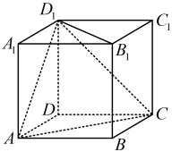

解：（要分析同量的夹角，可尝试将两同重平移至同一平面，再用几何方法计算）
由正方体的结构特征， \(\overrightarrow{A_{1}B_{1}} = \overrightarrow{AB}\)，
所以  \(\overrightarrow{AC}, \overrightarrow{A_{1}B_{1}} = \overrightarrow{AC}, \overrightarrow{AB} = 45^{\circ}\)，
 \(\overrightarrow{AC}, \overrightarrow{B_{1}A_{1}} = \overrightarrow{AC}, \overrightarrow{-AB} > 180^{\circ} - \overrightarrow{AC}, \overrightarrow{AB} = 180^{\circ} - 45^{\circ} = 135^{\circ}\)，
由正方体的性质， \(\overrightarrow{AD_{1}} = \overrightarrow{AC} = \overrightarrow{CD_{1}}\)，
所以  \(\triangle ACD_{1}\) 为等边三角形，
故  \(\overrightarrow{AC}, \overrightarrow{AD_{1}} = \angle CAD_{1} = 60^{\circ}\)，
 \(\overrightarrow{AC}, \overrightarrow{CD_{1}} = \overrightarrow{CD} = \overrightarrow{-CA}, \overrightarrow{CD_{1}} > 180^{\circ} - \overrightarrow{CA}, \overrightarrow{CD_{1}} = 180^{\circ} - \angle ACD_{1} = 180^{\circ} - 60^{\circ} = 120^{\circ}\)，
因为  \(\overrightarrow{B_{1}D_{1}} = \overrightarrow{BD}\)，所以  \(\overrightarrow{AC}, \overrightarrow{B_{1}D_{1}} = \overrightarrow{AC}, \overrightarrow{BD} > 180^{\circ} = 180^{\circ} = 120^{\circ}\)，
由正方体的性质， \(\overrightarrow{AC} \perp \overrightarrow{BD}\)，
所以  \(\overrightarrow{AC}, \overrightarrow{B_{1}D_{1}} = \overrightarrow{AC}, \overrightarrow{BD} = 90^{\circ}\)。

#### 任务 19｜例7

【例 7】已知正四面体 \(ABCD\) 的棱长为 1，E，F 分别是 \(AD\)，\(CD\) 的中点，则 \(\overrightarrow{EF} \cdot \overrightarrow{AB} =\)___。
解析：如图，正四面体中， \(\overrightarrow{EF}=\frac{1}{2}\overrightarrow{AC}\)，容易研究 \(\overrightarrow{AC}\)和 \(\overrightarrow{AB}\)的长度、夹角，故直接用定义求目标的数量积，

因为  \(E\)， \(F\) 分别是  \(AD\)， \(CD\) 的中点，所以
 \(\overrightarrow{EF} = \frac{1}{2}\overrightarrow{AC}\)，故  \(\overrightarrow{EF} \cdot \overrightarrow{AB} = \frac{1}{2}\overrightarrow{AC} \cdot \overrightarrow{AB}\)
 \(= \frac{1}{2}|\overrightarrow{AC}| \cdot |\overrightarrow{AB}| \cdot \cos <\overrightarrow{AC},\overrightarrow{AB}>\)
 \(= \frac{1}{2} \times 1 \times 1 \times \cos \frac{\pi}{3} = \frac{1}{4}\).

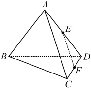

答案： \(\frac{1}{4}\)

#### 任务 20｜例8

【例8】如图所示，在正方体 \(ABCD-A_1B_1C_1D_1\) 中，向量 \(\overrightarrow{AC}\) 在直线 \(AB\) 上的投影向量是___，向量 \(\overrightarrow{AC_1}\) 在平面 \(ABCD\) 上的投影向量是___。

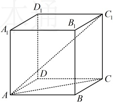

解析：由正方体的性质， \(AB \perp BC\)，
所以  \(\overrightarrow{AC}\) 在直线 AB 上的投影向量是  \(\overrightarrow{AB}\)，
又因为  \(C_1C \perp\) 平面 ABCD，所以  \(\overrightarrow{AC_1}\) 在平面
ABCD 上的投影向量是  \(\overrightarrow{AC}\)。
答案： \(\overrightarrow{AB}\)， \(\overrightarrow{AC}\)
从概念层面来看，空间向量与平面向量有很多类似的地方。我们学习空间向量的目的是希望能用它来解决一些立体几何问题，所以本节核心题型的设计思路都是从概念出发，再到应用。首先我们设计了类型Ⅰ来巩固空间向量的线性运算，接着又设计了两组题（类型Ⅱ的利用空间向量证平行、共线和类型Ⅲ的利用空间向量证共面）来强化空间向量线性运算的应用，类型Ⅳ针对空间向量的数量积计算，巩固了数量积的概念后，我们又设计了类型V和类型VI这两组题来教大家如何用数量积来解决长度、距离、角度的问题。请同学们跟着例题和反思好好去学习、体悟吧。

- 本批例题没有直属变式，按路线进入对应配套题。

#### 方法检查｜`1.1-projection-check-1` 投影向量方向与长度检查（不计入教材题量）

在正方体中自选一条面对角线和一条棱，先画出面对角线在该棱所在直线上的投影方向，再用数量积写出投影长度；最后说明投影向量与投影长度为什么不是同一个量。

> 独立作答，不提供答案；未通过时停在本循环。

### 当前动作 3：做本批对应 A/B/C 习题（无答案）

> 本批配套题承接：1.1-k4

#### B组

##### 任务 21｜B4

4.（2025·四川内江期末）

如图，已知三棱锥  \(A-BCD\) 的每条棱长都为 2，则  \(\overrightarrow{AB} \cdot \overrightarrow{CD} =\) （ ）

A.  \(2\sqrt{3}\) B.  \(\sqrt{3}\) C. 2 D. 0

##### 任务 22｜B5

5. （2025·新疆博尔塔拉期末）

如图，在棱长为2的正方体  \(ABCD-A_{1}B_{1}C_{1}D_{1}\) 中，E 是棱  \(A_{1}D_{1}\) 的中点，则  \(\overrightarrow{EB_{1}}\cdot\overrightarrow{EB}=\) （ ）

A. 4

B. 5

C. 6

D.  \(4\sqrt{2}\)

### 当前动作 4：本批验收

- [ ] 能闭卷复述本批方法及适用条件。
- [ ] 教学例题能解释关键步骤，不只是记住结论。
- [ ] 直属变式和对应习题有独立过程。
- [ ] 若使用过提示或答案，已用未见题或延迟闭卷复测补证。
- [ ] 当前循环没有未解决的第一断点。

> **推进门：** 本批例题理解、直属变式、对应习题和独立复测证据齐全后才可进入下一批；提示或看答案的题必须以未见题或延迟闭卷复测补证。
> **失败处理：** 只报告第一处断点并给最小提示；不得提前展示下一批或当前题答案。
> 未满足推进门时停在本循环，不展示下一循环的当前动作。

---

## 循环 6/10：数量积展开、极化与重心

### 当前动作 1：看本批视频

- 本循环没有新增视频，复用已通过的前置方法。
- 前置方法必须已通过：`line_line_angle`

> 看完本批视频后停下来，不要提前观看下一循环。

### 当前动作 2：按本批做题路径推进

本批复用的左侧知识点（前置循环必须已通过）：
- `1.1-k4` 数量积、夹角与投影向量
本批类型：
- 类型Ⅳ 数量积：点积、极化恒等式和最值

本批补充桥接：
- **三角形重心的向量表示** (`bridge-1.1-centroid`)
  - 取 BC 中点 M，先写 \(\overrightarrow{OM}=\frac{\overrightarrow{OB}+\overrightarrow{OC}}{2}\)。
  - 利用重心 G 在中线 AM 上且 \(AG:GM=2:1\)，写 \(\overrightarrow{OG}=\overrightarrow{OA}+\frac{2}{3}\overrightarrow{AM}\)。
  - 代入 \(\overrightarrow{AM}=\overrightarrow{OM}-\overrightarrow{OA}\)，整理得 \(\overrightarrow{OG}=\frac{\overrightarrow{OA}+\overrightarrow{OB}+\overrightarrow{OC}}{3}\)。
  - 交换 A、B、C 再推一次，确认三个系数由三顶点等权地位决定。
- **极化恒等式与数量积最值** (`bridge-1.1-polarization`)
  - 展开 \(|a+b|^2=(a+b)\cdot(a+b)\)，得到 \(2a\cdot b=|a+b|^2-|a|^2-|b|^2\)；展开 \(|a-b|^2\)，得到 \(2a\cdot b=|a|^2+|b|^2-|a-b|^2\)。
  - 题目给和向量、差向量或中点距离时，先选能直接替换目标数量积的一种形式，不同时套两套恒等式。
  - 先区分全空间型与区域型最值：任意点没有额外区域时，先完成平方或用中点恒等式判断等号点；动点被限制在长方体、平面或线段内时，还要在真实定义域内检查端点、顶点、边界和内部点。
  - 最后回代原几何对象，确认中心点、中点、向量方向和定义域没有被替换错。

#### 方法类型｜类型Ⅳ 数量积：点积、极化恒等式和最值

#### 任务 23｜例13

【例 13】棱长为 1 的正四面体  \(ABCD\) 中， \(E\) 是  \(BC\) 的中点，则  \(\overrightarrow{AE} \cdot \overrightarrow{AD} =\) ___.
解析：如图，用定义求  \(\overrightarrow{AE} \cdot \overrightarrow{AD}\) 需要先算  \(\cos \angle DAE\)，比较麻烦，能否不求  \(\cos \angle DAE\)？在正四面体中， \(\overrightarrow{AB}\)， \(\overrightarrow{AC}\)， \(\overrightarrow{AD}\) 的长度和两两夹角都已知，故可考虑根据  \(E\) 为  \(BC\) 中点把  \(\overrightarrow{AE}\) 用  \(\overrightarrow{AB}\) 和  \(\overrightarrow{AC}\) 表示，再求  \(\overrightarrow{AE} \cdot \overrightarrow{AD}\)，因为  \(E\) 为  \(BC\) 中点，所以  \(\overrightarrow{AE} = \frac{1}{2}\overrightarrow{AB} + \frac{1}{2}\overrightarrow{AC}\)，故  \(\overrightarrow{AE} \cdot \overrightarrow{AD} = \left( \frac{1}{2}\overrightarrow{AB} + \frac{1}{2}\overrightarrow{AC} \right) \cdot \overrightarrow{AD}\)
 \(= \frac{1}{2}\overrightarrow{AB} \cdot \overrightarrow{AD} + \frac{1}{2}\overrightarrow{AC} \cdot \overrightarrow{AD} = \frac{1}{2}\left| \overrightarrow{AB} \right| \cdot \left| \overrightarrow{AD} \right| \cdot \cos \angle BAD + \frac{1}{2}\left| \overrightarrow{AC} \right| \cdot \left| \overrightarrow{AD} \right| \cdot \cos \angle CAD\)
 \(= \frac{1}{2} \times 1 \times 1 \times \cos \frac{\pi}{3} + \frac{1}{2} \times 1 \times 1 \times \cos \frac{\pi}{3} = \frac{1}{2}\).
答案： \(\frac{1}{2}\)
【反思】与求平面向量数积类似，求空间向量的数量积，除了用定义之外，还有拆解法、极化恒等式（后面的例14会涉及）等方法可以使用，本题使用的是拆解法，即选择一些已知长度、夹角的向量，先用它们表示求数量积的向量，再将所求数量积转化为这些已知长度、夹角的向量之间的数量积来算。本题的图形较简单，我们来看一个图形稍复杂一点的变式。

##### 任务 24｜紧跟：变式（对应例13，无解答）

【变式】如图，在平行六面体  \(ABCD - A_1B_1C_1D_1\) 中， \(AB = AD = AA_1 = 1\)， \(\angle A_1AB = \angle A_1AD = \angle BAD = 60^\circ\)，则  \(\overrightarrow{BD_1} \cdot \overrightarrow{AC}\) 的值为（ ）
A. 1          B.  \(\sqrt{2}\)          C.  \(\sqrt{3}\)          D. -1

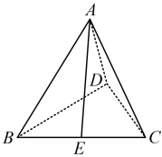

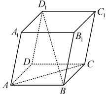

#### 任务 25｜例14

【例 14】已知正三棱锥  \(S-ABC\) 的底面  \(ABC\) 的边长为 2， \(P\) 是空间中任意一点，则  \(\overrightarrow{PA} \cdot (\overrightarrow{PB} + \overrightarrow{PC})\) 的最小值为（ ）
A.  \(-\frac{3}{2}\) \quad B.  \(-\frac{\sqrt{3}}{2}\) \quad C.  \(-\frac{1}{2}\) \quad D.  \(-\frac{1}{4}\)
解析：设  \(BC\) 中点为  \(D\)，则  \(\overrightarrow{PB} + \overrightarrow{PC} = 2\overrightarrow{PD} \Rightarrow \overrightarrow{PA} \cdot (\overrightarrow{PB} + \overrightarrow{PC}) = \overrightarrow{PA} \cdot (2\overrightarrow{PD}) = 2\overrightarrow{PA} \cdot \overrightarrow{PD}\) ①，
注意到  \(\overrightarrow{PA}\)， \(\overrightarrow{PD}\) 共起点，底边  \(AD\) 的长也容易计算，故想到用极化恒等式计算  \(\overrightarrow{PA} \cdot \overrightarrow{PD}\)，如图， \(\triangle ABC\) 是边长为 2 的正三角形，所以  \(AD \perp BC\)，故  \(|\overrightarrow{AD}| = |\overrightarrow{AB}| \cdot \sin \angle ABD = 2 \sin 60^\circ = \sqrt{3}\)，
设 \(AD\) 中点为 \(G\)，则由极化恒等式，\(\overrightarrow{PA} \cdot \overrightarrow{PD} = |\overrightarrow{PG}|^2 - |\overrightarrow{GA}|^2 = |\overrightarrow{PG}|^2 - \frac{1}{4}|\overrightarrow{AD}|^2\)
\(= |\overrightarrow{PG}|^2 - \frac{3}{4} \geq -\frac{3}{4}\)，代入①得 \(\overrightarrow{PA} \cdot (\overrightarrow{PB} + \overrightarrow{PC}) = 2\overrightarrow{PA} \cdot \overrightarrow{PD} \geq 2 \times \left(-\frac{3}{4}\right) = -\frac{3}{2}\)，
当且仅当 \(P\) 与 \(G\) 重合时取等号，所以 \(\overrightarrow{PA} \cdot (\overrightarrow{PB} + \overrightarrow{PC})\) 的最小值为 \(-\frac{3}{2}\)。

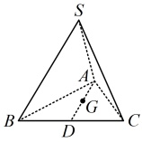

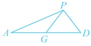

答案：A
【反思】极化恒等式是我们在平面向量数量积问题中学过的方法，如上图，设  \(G\) 为  \(AD\) 中点，则  \(\overrightarrow{PA} \cdot \overrightarrow{PD} = (\overrightarrow{PG} + \overrightarrow{GA}) \cdot (\overrightarrow{PG} + \overrightarrow{GD}) = \overrightarrow{PG}^2 + \overrightarrow{PG} \cdot \overrightarrow{GD} + \overrightarrow{GA} \cdot \overrightarrow{PG} + \overrightarrow{GA} \cdot \overrightarrow{GD} = \overrightarrow{PG}^2 + \overrightarrow{PG} \cdot (\overrightarrow{GD} + \overrightarrow{GA}) + \overrightarrow{GA} \cdot (-\overrightarrow{GA}) = \overrightarrow{PG}^2 + \overrightarrow{PG} \cdot \mathbf{0} - \overrightarrow{GA}^2 = |\overrightarrow{PG}|^2 - |\overrightarrow{GA}|^2\)。

#### 方法检查｜`1.1-centroid-check-1` 三角形重心向量回顾（不计入教材题量）

设 G 是三角形 ABC 的重心，O 为任意公共起点。请不引用现成结论，先取 BC 中点 M，通过 OG=OA+AG 和 AG=(2/3)AM 推出 OG 关于 OA、OB、OC 的表示，再说明为什么三个系数应当对称。

> 独立作答，不提供答案；未通过时停在本循环。

### 当前动作 3：做本批对应 A/B/C 习题（无答案）

> 本批配套题承接：1.1-k4, 类型Ⅳ 数量积

#### B组

##### 任务 26｜B11

11.（2025·山东模拟）

已知正四面体 OABC 的棱长为 2，点 G 是  \(\triangle OBC\) 的重心，M 是线段 AG 的中点.

（1）用 \(\overrightarrow{OA}\)， \(\overrightarrow{OB}\)， \(\overrightarrow{OC}\)表示 \(\overrightarrow{OM}\)，并求出 \(|\overrightarrow{OM}|\)；

（2）证明： \(OM \perp BC\)

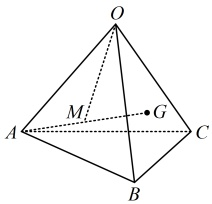

### 当前动作 4：本批验收

- [ ] 能闭卷复述本批方法及适用条件。
- [ ] 教学例题能解释关键步骤，不只是记住结论。
- [ ] 直属变式和对应习题有独立过程。
- [ ] 若使用过提示或答案，已用未见题或延迟闭卷复测补证。
- [ ] 当前循环没有未解决的第一断点。

> **推进门：** 本批例题理解、直属变式、对应习题和独立复测证据齐全后才可进入下一批；提示或看答案的题必须以未见题或延迟闭卷复测补证。
> **失败处理：** 只报告第一处断点并给最小提示；不得提前展示下一批或当前题答案。
> 未满足推进门时停在本循环，不展示下一循环的当前动作。

---

## 循环 7/10：数量积求长度与求角

### 当前动作 1：看本批视频

- 本循环没有新增视频，复用已通过的前置方法。
- 前置方法必须已通过：`line_line_angle`

> 看完本批视频后停下来，不要提前观看下一循环。

### 当前动作 2：按本批做题路径推进

本批复用的左侧知识点（前置循环必须已通过）：
- `1.1-k4` 数量积、夹角与投影向量
本批类型：
- 类型Ⅴ 求长度、距离：三面角或平行六面体中的长度距离
- 类型Ⅵ 求角：三角求和、正四面体、正三棱柱异面直线角

#### 方法类型｜类型Ⅴ 求长度、距离：三面角或平行六面体中的长度距离

#### 任务 27｜例15

【例 15】如图，四棱锥的底面  \(ABCD\) 为平行四边形， \(\angle APB = \angle APC = \angle BPC = \frac{\pi}{3}\)， \(PA = 3\)， \(PB =\)
PC=2，M是PD的中点.
（1）若 \(\overrightarrow{BD}=m\overrightarrow{PA}+n\overrightarrow{PB}+p\overrightarrow{PC}\)，求 \(m+n+p\)的值；
（2）求线段 BM 的长.
解：（1）由题意， \(\overrightarrow{BD} = \overrightarrow{BA} + \overrightarrow{BC} = \overrightarrow{PA} - \overrightarrow{PB} + \overrightarrow{PC} - \overrightarrow{PB} = \overrightarrow{PA} - 2\overrightarrow{PB} + \overrightarrow{PC}\) ①，
又 \(\overrightarrow{BD} = m\overrightarrow{PA} + n\overrightarrow{PB} + p\overrightarrow{PC}\)，所以与①对比得  \(m=1\)， \(n=-2\)， \(p=1\)，故  \(m+n+p=0\)。
（2）（由于  \(\overrightarrow{PA}\)， \(\overrightarrow{PB}\)， \(\overrightarrow{PC}\) 已知长度和两两夹角，故若能将  \(\overrightarrow{BM}\) 用它们表示，就能通过平方转化为数量积，从而求得  \(|\overrightarrow{BM}|\)）由（1）可知  \(\overrightarrow{BD} = \overrightarrow{PA} - 2\overrightarrow{PB} + \overrightarrow{PC}\)，因为  \(M\) 是  \(PD\) 中点，所以  \(\overrightarrow{BM} = \frac{1}{2}\overrightarrow{BP} + \frac{1}{2}\overrightarrow{BD} = -\frac{1}{2}\overrightarrow{PB} + \frac{1}{2}(\overrightarrow{PA} - 2\overrightarrow{PB} + \overrightarrow{PC}) = \frac{1}{2}\overrightarrow{PA} - \frac{3}{2}\overrightarrow{PB} + \frac{1}{2}\overrightarrow{PC}\)，
从而  \(\overrightarrow{BM}^2 = \left(\frac{1}{2}\overrightarrow{PA} - \frac{3}{2}\overrightarrow{PB} + \frac{1}{2}\overrightarrow{PC}\right)^2 = \frac{1}{4}\overrightarrow{PA}^2 + \frac{9}{4}\overrightarrow{PB}^2 + \frac{1}{4}\overrightarrow{PC}^2 - \frac{3}{2}\overrightarrow{PA} \cdot \overrightarrow{PB} + \frac{1}{2}\overrightarrow{PA} \cdot \overrightarrow{PC} - \frac{3}{2}\overrightarrow{PB} \cdot \overrightarrow{PC}\)
 \(= \frac{1}{4}\left|\overrightarrow{PA}\right|^2 + \frac{9}{4}\left|\overrightarrow{PB}\right|^2 + \frac{1}{4}\left|\overrightarrow{PC}\right|^2 - \frac{3}{2}\left|\overrightarrow{PA}\right| \cdot \cos \angle APB + \frac{1}{2}\left|\overrightarrow{PA}\right| \cdot \left|\overrightarrow{PC}\right| \cdot \cos \angle APC - \frac{3}{2}\left|\overrightarrow{PB}\right| \cdot \left|\overrightarrow{PC}\right| \cdot \cos \angle BPC\)
 \(= \frac{1}{4} \times 3^2 + \frac{9}{4} \times 2^2 + \frac{1}{4} \times 2^2 - \frac{3}{2} \times 3 \times 2 \times \cos \frac{\pi}{3} + \frac{1}{2} \times 3 \times 2 \times \cos \frac{\pi}{3} - \frac{3}{2} \times 2 \times 2 \times \cos \frac{\pi}{3} = \frac{25}{4}\)，
故  \(\left|\overrightarrow{BM}\right| = \frac{5}{2}\)，所以线段  \(BM\) 的长为  \(\frac{5}{2}\)。

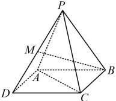

【反思】在空间中求长度，可将长度看成向量的模，而求向量模，又可选择若干已知长度和两两夹角的向量来表示该向量，再通过平方将模转化为数量积来计算。

##### 任务 28｜紧跟：变式1（对应例15，无解答）

【变式1】如图，平行六面体  \(ABCD-A_1B_1C_1D_1\) 中， \(\angle BAA_1 = \angle DAA_1 = 30^\circ\)， \(AB = AD = 1\)， \(AA_1 = \sqrt{3}\)，若  \(AC_1 = 2\sqrt{3}\)，则  \(\angle BAD =\) ___。

##### 任务 29｜紧跟：变式2（对应例15，无解答）

【变式 2】如图，边长为 1 的正方形 \(ABCD\) 所在平面与正方形 \(ABEF\) 所在平面互相垂直，动点 \(M\)，\(N\) 满足 \(\overrightarrow{CM} = \lambda \overrightarrow{CA}\)，\(\overrightarrow{BN} = \lambda \overrightarrow{BF}\)，其中 \(0 < \lambda < 1\)。
（1）若  \(\overrightarrow{MN} = x\overrightarrow{AB} + y\overrightarrow{AD} + z\overrightarrow{AF}\)，求实数 x, y, z 的值（用  \(\lambda\) 表示）；

（2）求线段 MN 的长度的最小值.

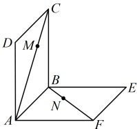

#### 方法类型｜类型Ⅵ 求角：三角求和、正四面体、正三棱柱异面直线角

#### 任务 30｜例16

【例 16】若空间向量  \(a\)， \(b\)， \(c\) 满足  \(a + b + c = 0\)，且  \(|a| = 2\)， \(|b| = 3\)， \(|c| = 4\)，则  \(\cos \langle a, b \rangle =\) （ ）
A.  \(\frac{1}{3}\)  B.  \(\frac{\sqrt{2}}{3}\)  C.  \(\frac{\sqrt{3}}{3}\)  D.  \(\frac{1}{4}\)
解析：所求为  \(\cos <a,b>\)，联想到夹角余弦公式  \(\cos <a,b> = \frac{a\cdot b}{|a|\cdot|b|}\)，其中  \(|a|\) 和  \(|b|\) 已知，还差  \(a\cdot b\)，那怎样产生  \(a\cdot b\)? 可考虑将  \(a+b+c=0\) 平方，但若直接平方，还会产生额外的  \(a\cdot c\) 和  \(b\cdot c\)，怎么办呢？把  \(c\) 移到等号另一侧，再平方，就不会有这两个干扰项了，
因为  \(a+b+c=0\)，所以  \(a+b=-c\)，从而  \((a+b)^2 = (-c)^2\)，故  \(a^2 + b^2 + 2a\cdot b = c^2\)，
所以 \(|a|^2 + |b|^2 + 2a \cdot b = |c|^2\)，将所给数据代入得 \(2^2 + 3^2 + 2a \cdot b = 4^2 \Rightarrow a \cdot b = \frac{3}{2} \Rightarrow \cos \langle a, b \rangle = \frac{a \cdot b}{|a| \cdot |b|} = \frac{\frac{3}{2}}{2 \times 3} = \frac{1}{4}\)。
答案：D
【反思】与平面向量中的处理方法类似，在空间向量中，涉及夹角，往往用夹角余弦公式处理，其核心是计算数量积和模。本题没有图形，且模是已知的，在具体的图形下，也可能有类似的问题，
我们来看两个变式。

##### 任务 31｜紧跟：变式1（对应例16，无解答）

【变式1】如图，正四面体OABC中，E，F分别为AB，OC的中点，则向量 \(\overrightarrow{OE}\)与 \(\overrightarrow{BF}\)的夹角余弦值为___。

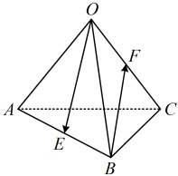

##### 任务 32｜紧跟：变式2（对应例16，无解答）

【变式 2】如图，在三棱柱  \(ABC-A_1B_1C_1\) 中，底面边长和侧棱长都相等，
 \(\angle BAA_1 = \angle CAA_1 = 60^\circ\)，则直线  \(AB_1\) 与  \(BC_1\) 所成角的余弦值为（ ）
A.  \(\frac{\sqrt{3}}{3}\)
B.  \(\frac{\sqrt{3}}{6}\)
C.  \(\frac{\sqrt{6}}{6}\)
D.  \(\frac{\sqrt{6}}{3}\)

### 当前动作 3：做本批对应 A/B/C 习题（无答案）

> 本批配套题承接：1.1-k4, 类型Ⅴ 求长度、距离, 类型Ⅵ 求角

#### B组

##### 任务 33｜B12

12\. （2025·浙江台州模拟）

如图，在三棱锥  \(P-ABC\) 中，若  \(AB = AC = 3\)， \(AP = 4\)， \(\angle BAC = \angle PAC = \angle BAP = 60^\circ\)，点  \(D\) 为棱  \(BC\) 上一点，且  \(CD = 2BD\)，点  \(M\) 为线段  \(AD\) 的中点。

（1）求PM的长；

（2）求异面直线PM与AC所成角的余弦值.

### 当前动作 4：本批验收

- [ ] 能闭卷复述本批方法及适用条件。
- [ ] 教学例题能解释关键步骤，不只是记住结论。
- [ ] 直属变式和对应习题有独立过程。
- [ ] 若使用过提示或答案，已用未见题或延迟闭卷复测补证。
- [ ] 当前循环没有未解决的第一断点。

> **推进门：** 本批例题理解、直属变式、对应习题和独立复测证据齐全后才可进入下一批；提示或看答案的题必须以未见题或延迟闭卷复测补证。
> **失败处理：** 只报告第一处断点并给最小提示；不得提前展示下一批或当前题答案。
> 未满足推进门时停在本循环，不展示下一循环的当前动作。

---

## 循环 8/10：二面角平面角前置与应用

### 当前动作 1：看本批视频

- `3.1.4.5` 3.1.4.5 平面与平面的夹角
  - 文件：`C:\Users\poyi\Downloads\课程合集\3.1 空间向量与立体几何\3.1.4.5 平面与平面的夹角.mp4`
- 前置方法必须已通过：`parallel_perpendicular, line_line_angle`

> 看完本批视频后停下来，不要提前观看下一循环。

### 当前动作 2：按本批做题路径推进

本批复用的左侧知识点（前置循环必须已通过）：
- `1.1-k4` 数量积、夹角与投影向量

本批补充桥接：
- **二面角平面角的定义与合法截面** (`bridge-1.1-dihedral-definition`)
  - 在二面角棱 l 上取同一点 O，并在两个半平面内分别作 OA、OB 垂直于 l。
  - 角 AOB 定义为该二面角的平面角；换棱上另一点作同样的垂线会得到同角，因为对应射线分别平行。
  - 两条射线必须同起点且都垂直于棱；不满足任一条件时，看到的角不能直接代表二面角。
  - 若题目给出的两条垂棱线段落在棱上的不同点，先将其中一条平移到另一条的起点，再用平移不改变方向的性质比较夹角；求两端点距离时保留沿棱方向的中间一段，不能假装已经是同一点截面。
  - 法向量夹角可能等于二面角或其补角，最后必须结合半平面方向判断。

- 本批例题没有直属变式，按路线进入对应配套题。

#### 方法检查｜`1.1-dihedral-check-1` 二面角平面角识别（不计入教材题量）

给定二面角 alpha-l-beta，在棱 l 上任选一点 O，分别在两个面内作 OA、OB 垂直于 l。请说明角 AOB 为什么代表该二面角的平面角，并列出点不在同一截面或射线未垂直于棱时为什么不能直接套用。

> 独立作答，不提供答案；未通过时停在本循环。

### 当前动作 3：做本批对应 A/B/C 习题（无答案）

> 本批配套题承接：1.1-k4

#### B组

##### 任务 34｜B6

6.（2025·山东菏泽期末）

如图，已知正三角形 ABC 和正方形 BCDE 的边长均为 2，且二面角 A-BC-D 的大小为  \(\frac{\pi}{3}\)，则  \(\overrightarrow{AC} \cdot \overrightarrow{BD} = (\quad)\)

A.  \(2-\sqrt{3}\) B.  \(2+\sqrt{3}\) C.  \(-2-\sqrt{3}\) D.  \(-2+\sqrt{3}\)

##### 任务 35｜B7

7. （2025·四川成都期末）

如图，二面角  \(\alpha-l-\beta\) 的棱上有两个点  \(A\)， \(B\)，线段  \(AC\) 与  \(BD\) 分别在这个二面角的两个面内，并且都垂直于棱  \(l\)。若  \(AB=1\)， \(AC=2\)， \(BD=3\)，二面角  \(\alpha-l-\beta\) 的平面角为  \(\frac{\pi}{3}\)，则  \(CD=\)（ ）

A. 2

B.  \(2\sqrt{2}\)

C.  \(2\sqrt{3}\)

D.  \(2\sqrt{5}\)

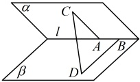

### 当前动作 4：本批验收

- [ ] 能闭卷复述本批方法及适用条件。
- [ ] 教学例题能解释关键步骤，不只是记住结论。
- [ ] 直属变式和对应习题有独立过程。
- [ ] 若使用过提示或答案，已用未见题或延迟闭卷复测补证。
- [ ] 当前循环没有未解决的第一断点。

> **推进门：** 本批例题理解、直属变式、对应习题和独立复测证据齐全后才可进入下一批；提示或看答案的题必须以未见题或延迟闭卷复测补证。
> **失败处理：** 只报告第一处断点并给最小提示；不得提前展示下一批或当前题答案。
> 未满足推进门时停在本循环，不展示下一循环的当前动作。

---

## 循环 9/10：极化与四点共面综合

### 当前动作 1：看本批视频

- 本循环没有新增视频，复用已通过的前置方法。
- 前置方法必须已通过：`decomposition, coplanar, line_line_angle`

> 看完本批视频后停下来，不要提前观看下一循环。

### 当前动作 2：按本批做题路径推进

本批复用的左侧知识点（前置循环必须已通过）：
- `1.1-k3` 共线向量与共面向量
- `1.1-k4` 数量积、夹角与投影向量

本批补充桥接：
- **极化恒等式与数量积最值** (`bridge-1.1-polarization`)
  - 展开 \(|a+b|^2=(a+b)\cdot(a+b)\)，得到 \(2a\cdot b=|a+b|^2-|a|^2-|b|^2\)；展开 \(|a-b|^2\)，得到 \(2a\cdot b=|a|^2+|b|^2-|a-b|^2\)。
  - 题目给和向量、差向量或中点距离时，先选能直接替换目标数量积的一种形式，不同时套两套恒等式。
  - 先区分全空间型与区域型最值：任意点没有额外区域时，先完成平方或用中点恒等式判断等号点；动点被限制在长方体、平面或线段内时，还要在真实定义域内检查端点、顶点、边界和内部点。
  - 最后回代原几何对象，确认中心点、中点、向量方向和定义域没有被替换错。
- **四点共面系数和=1** (`micro-four-point-coplanar`)
  - 固定公共起点 O，把待判定点写成 OP=xOA+yOB+zOC。
  - 正向证明：若 P 在平面 ABC 内，写 AP=uAB+vAC，换回公共起点得 OP=(1-u-v)OA+uOB+vOC，所以 x+y+z=1。
  - 逆向证明：若 x+y+z=1，则 OP=OA+yAB+zAC，点 P 可由 A 沿平面内两条方向到达，因此 P 在平面 ABC 内。
  - 最后区分点的位置向量系数与任意自由向量系数；换公共起点时必须重新推导。

- 本批例题没有直属变式，按路线进入对应配套题。

#### 方法检查｜`1.1-polarization-check-1` 极化恒等式近迁移（不计入教材题量）

设 M 是线段 AB 的中点，P 是空间任意一点。请从 PA=PM+MA、PB=PM+MB 且 MB=-MA 出发，独立推出 PA·PB 关于 PM²、MA² 的表达式；再说明若 P 被限制在一个长方体内，求最值时还必须检查什么几何条件。

> 独立作答，不提供答案；未通过时停在本循环。

#### 方法检查｜`1.1-four-point-check-1` 四点共面自造变式（不计入教材题量）

设 O、A、B、C 四点不共面，自取一组三个系数和为 1 的数定义 OP=xOA+yOB+zOC，并说明 P 为什么在平面 ABC 内；再只改变一个系数构造不在该平面内的点，口述系数和判据的来源。

> 独立作答，不提供答案；未通过时停在本循环。

### 当前动作 3：做本批对应 A/B/C 习题（无答案）

> 本批配套题承接：1.1-k3, 1.1-k4

#### B组

##### 任务 36｜B8

8. （2025·上海模拟）

已知 \(P\) 是棱长为 2 的正方体 \(ABCD-A_1B_1C_1D_1\) 内（含正方体表面）任意一点，则 \(\overrightarrow{PA} \cdot \overrightarrow{PC}\) 的最大值为___。

#### C组

##### 任务 37｜C13

13\. (2025 · 安徽模拟)

已知  \(a\),  \(b\),  \(c\) 是空间中不共面的三个向量,  \(\overrightarrow{OA} = a - 2b + c\)， \(\overrightarrow{OB} = pa + b + qc\)， \(\overrightarrow{OC} = 2a + b - 2c\)，若  \(O, A, B, C\) 共面，则  \(3p + 5q = \underline{\quad}\).

### 当前动作 4：本批验收

- [ ] 能闭卷复述本批方法及适用条件。
- [ ] 教学例题能解释关键步骤，不只是记住结论。
- [ ] 直属变式和对应习题有独立过程。
- [ ] 若使用过提示或答案，已用未见题或延迟闭卷复测补证。
- [ ] 当前循环没有未解决的第一断点。

> **推进门：** 本批例题理解、直属变式、对应习题和独立复测证据齐全后才可进入下一批；提示或看答案的题必须以未见题或延迟闭卷复测补证。
> **失败处理：** 只报告第一处断点并给最小提示；不得提前展示下一批或当前题答案。
> 未满足推进门时停在本循环，不展示下一循环的当前动作。

---

## 循环 10/10：外接球、点面距离与压轴综合

### 当前动作 1：看本批视频

- `3.1.4.6.a` 3.1.4.6.a 平面方程与法向量（上）
  - 文件：`C:\Users\poyi\Downloads\课程合集\3.1 空间向量与立体几何\3.1.4.6.a 平面方程与法向量（上）.mp4`
- `3.1.4.6.b` 3.1.4.6.b 平面方程与法向量（下）
  - 文件：`C:\Users\poyi\Downloads\课程合集\3.1 空间向量与立体几何\3.1.4.6.b 平面方程与法向量（下）.mp4`
- `3.1.4.7` 3.1.4.7 距离问题
  - 文件：`C:\Users\poyi\Downloads\课程合集\3.1 空间向量与立体几何\3.1.4.7 距离问题.mp4`
- 前置方法必须已通过：`decomposition, parallel_perpendicular, coplanar, line_line_angle`

> 看完本批视频后停下来，不要提前观看下一循环。

### 当前动作 2：按本批做题路径推进

本批复用的左侧知识点（前置循环必须已通过）：
- `1.1-k3` 共线向量与共面向量
- `1.1-k4` 数量积、夹角与投影向量

本批补充桥接：
- **四点共面系数和=1** (`micro-four-point-coplanar`)
  - 固定公共起点 O，把待判定点写成 OP=xOA+yOB+zOC。
  - 正向证明：若 P 在平面 ABC 内，写 AP=uAB+vAC，换回公共起点得 OP=(1-u-v)OA+uOB+vOC，所以 x+y+z=1。
  - 逆向证明：若 x+y+z=1，则 OP=OA+yAB+zAC，点 P 可由 A 沿平面内两条方向到达，因此 P 在平面 ABC 内。
  - 最后区分点的位置向量系数与任意自由向量系数；换公共起点时必须重新推导。
- **仿射参数求交与同比分点截线** (`bridge-1.1-affine-intersection-ratio`)
  - 同一个交点分别按两条所在直线参数化，参数名称分开记录。
  - 把两种位置向量展开到同一不共面基底，逐项比较系数并检查分母与定义域。
  - 对第二个交点保持相同的起终点方向；两边分点参数相等时，截线平行于第三边。
  - 由线线平行转成线面平行前，补查第三边在目标平面内且截线不在该平面内。
- **三角形重心的向量表示** (`bridge-1.1-centroid`)
  - 取 BC 中点 M，先写 \(\overrightarrow{OM}=\frac{\overrightarrow{OB}+\overrightarrow{OC}}{2}\)。
  - 利用重心 G 在中线 AM 上且 \(AG:GM=2:1\)，写 \(\overrightarrow{OG}=\overrightarrow{OA}+\frac{2}{3}\overrightarrow{AM}\)。
  - 代入 \(\overrightarrow{AM}=\overrightarrow{OM}-\overrightarrow{OA}\)，整理得 \(\overrightarrow{OG}=\frac{\overrightarrow{OA}+\overrightarrow{OB}+\overrightarrow{OC}}{3}\)。
  - 交换 A、B、C 再推一次，确认三个系数由三顶点等权地位决定。
- **正数乘积固定时的和最值** (`bridge-1.1-positive-product-sum`)
  - 先确认两个变量均为正且乘积为正常数。
  - 由平方非负推出和的下界，并把乘积常数代回。
  - 写出两变量相等时的等号条件，再检查候选是否符合几何定义域。
  - 若正数或乘积固定条件不成立，改用函数或边界方法。
- **外接球球心的垂直平分面法** (`bridge-micro-sphere`)
  - 先找具有对称性的顶点或棱，把球心坐标的部分分量由对称性确定。
  - 对三个或更多不共线顶点写等距平方关系，消去半径得到球心约束。
  - 解出球心候选后回代全部关键顶点，最后才讨论半径或距离。
  - 用不带数字的长方体或棱柱变式练习‘选约束—消元—回代’。

- 本批例题没有直属变式，按路线进入对应配套题。

#### 方法检查｜`1.1-affine-intersection-check-1` 双参数求交与同比分点截线（不计入教材题量）

在四面体 OUVW 中，以 OU、OV、OW 为不共面的基向量，点 X、Y、Z 分别落在从 O 出发的三条射线上。设 M 是直线 XZ 与 UW 的交点，N 是直线 YZ 与 VW 的交点。请分别为 M、N 写两套参数表示，通过比较基向量系数求出两边的分点参数；再说明什么参数条件可以推出 MN 平行 UV，并列出分母为零、交点在延长线以及由线线平行转成线面平行时必须检查的条件。只写方法链，不代入 C14 的数据。

> 独立作答，不提供答案；未通过时停在本循环。

#### 方法检查｜`1.1-inequality-check-1` 正数乘积约束下的和最值回顾（不计入教材题量）

设 x、y 为正数且 xy=k，其中 k>0。请用基本不等式求 x+y 的下界并写出等号条件；再说明若题目只给出一个向量共面方程，怎样先确认它确实能化成正数乘积约束。

> 独立作答，不提供答案；未通过时停在本循环。

#### 方法检查｜`1.1-sphere-check-1` 外接球心等距回代（不计入教材题量）

在坐标系中自取一个长方体的四个不共面顶点，设球心坐标未知。请用三组等距平方差消去半径，求出球心候选，并至少回代三个顶点验证等距；不得引用对称性直接跳到结论。

> 独立作答，不提供答案；未通过时停在本循环。

### 当前动作 3：做本批对应 A/B/C 习题（无答案）

> 本批配套题承接：1.1-k3, 1.1-k4

#### C组

##### 任务 38｜C14

14.（2025·重庆模拟）（多选）

如图，在棱长为1的正四面体  \(P-ABC\) 中， \(O\) 为底面  \(ABC\) 的重心， \(G\)， \(F\) 分别为线段  \(PO\)， \(PC\) 上的点（不含端点）， \(D\)， \(E\) 分别为  \(PA\)， \(PB\) 延长线上的点， \(\overrightarrow{PD} = x\overrightarrow{PA}\)， \(\overrightarrow{PE} = y\overrightarrow{PB}\)， \(\overrightarrow{PF} = z\overrightarrow{PC}\)， \(DF\) 交  \(AC\) 于点  \(M\)， \(EF\) 交  \(BC\) 于  \(N\)，则（ ）

A. 若  \(x = y\)，则  \(MN \parallel\) 平面  \(PAB\)

B.  \(\overrightarrow{PO} = \frac{1}{2}\overrightarrow{PA} + \frac{1}{3}\overrightarrow{PB} + \frac{1}{6}\overrightarrow{PC}\)

C. 若  \(z = \frac{1}{2}\) 且平面  \(DEF\) 过点  \(O\)，则  \(x + y\) 的最小值为 4

D. 若  \(G\) 为正四面体  \(P-ABC\) 的外接球心且  \(x = y = 2\)，平面  \(DEF\) 过点  \(G\)，则点  \(F\) 到平面  \(PDE\) 的距离为  \(\frac{\sqrt{6}}{9}\)

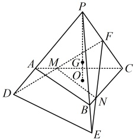

### 当前动作 4：本批验收

- [ ] 能闭卷复述本批方法及适用条件。
- [ ] 教学例题能解释关键步骤，不只是记住结论。
- [ ] 直属变式和对应习题有独立过程。
- [ ] 若使用过提示或答案，已用未见题或延迟闭卷复测补证。
- [ ] 当前循环没有未解决的第一断点。

> **推进门：** 本批例题理解、直属变式、对应习题和独立复测证据齐全后才可进入下一批；提示或看答案的题必须以未见题或延迟闭卷复测补证。
> **失败处理：** 只报告第一处断点并给最小提示；不得提前展示下一批或当前题答案。
> 未满足推进门时停在本循环，不展示下一循环的当前动作。

---

## 小节收尾

所有循环通过后，再做未见近迁移；至少间隔 24 小时后执行闭卷复测。
课程看完、题包可消费或同会话提示后答对，都不能单独替代掌握证据。
