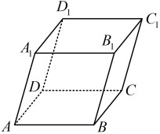
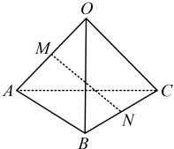
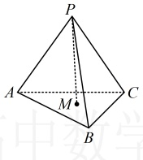

# 第2节 空间向量基本定理、空间向量及其运算的坐标表示：按课程循环学习路径

> 状态：`VERIFIED`
> 共 10 个学习循环；教学例题 13 道、直接变式 4 道、A/B/C 习题 16 道。
> 这是一张完整路线图。实际学习时一次只执行“当前循环”的一个动作，本批未通过不得进入下一批。
> `任务 01` 起为整节连续学习序号；例题、变式和 A/B/C 标签保留教材原编号，教材例号跳跃不代表漏题。

## 执行规则

1. 用户报出要学的小节后，先给当前循环需要看的视频，不一次性倾倒整节任务。
2. 视频看完，立即学习本批知识点和右侧例题；例题教学阶段允许看完整解法。
3. 随后独立完成本批直属变式和对应 A/B/C 习题，作答阶段隐藏答案。
4. 只检查第一处断点并给最小提示；蒙对、提示后答对或看答案不算本批独立通过。
5. 本批例题、直属变式、配套题和独立复测证据齐全后，才进入下一循环。

---

## 循环 1/10：空间向量基本定理与基底判断

### 当前动作 1：看本批视频

- `3.1.2.1` 3.1.2.1 空间向量拆分法
  - 文件：`C:\Users\poyi\Downloads\课程合集\3.1 空间向量与立体几何\3.1.2.1 空间向量拆分法.mp4`
- `3.1.2.2` 3.1.2.2 空间向量等值面法
  - 文件：`C:\Users\poyi\Downloads\课程合集\3.1 空间向量与立体几何\3.1.2.2 空间向量等值面法.mp4`
- 前置方法必须已通过：`space_vector_ops`

> 看完本批视频后停下来，不要提前观看下一循环。

### 当前动作 2：按本批做题路径推进

本批知识点：
- `1.2-k1` 空间向量基本定理、基底与基向量
本批类型：
- 类型Ⅰ 基底表示：判断能否作基底并按路径分解

#### 左侧知识点｜`1.2-k1` 空间向量基本定理、基底与基向量

**知识点 1：空间向量基本定理**

**1. 空间向量基本定理**

如果空间中三个向量  \(a\),  \(b\),  \(c\) 不共面，那么对于任意一个空间向量  \(p\)，存在唯一的有序实数组  \((x, y, z)\)，使得  \(p = x a + y b + z c\)。

**2. 基底与基向量**

如果三个向量  \(a\),  \(b\),  \(c\) 不共面，那么所有空间向量组成的集合就是  \(\{p \mid p = x a + y b + z c, x, y, z \in \mathbb{R}\}\)。这个集合可看作由向量  \(a\),  \(b\),  \(c\) 生成的，我们把  \(\{a, b, c\}\) 叫做空间的一个基底， \(a\),  \(b\),  \(c\) 都叫做基向量。空间中任意三个不共面的向量都可以构成空间的一个基底。

注：①基底不是唯一的，只要三个向量不共面，它们就能作为空间中的一个基底；

②一般情况下，同一向量在不同基底下的表示结果不同.

**3. 单位正交基底**

若空间中一个基底的三个基向量两两垂直，且长度都为1，则该基底叫做单位正交基底，常用 \(\{i,j,k\}\)表示.

由空间向量基本定理可知，对空间中的任意一个向量  \(a\)，均能找到唯一的有序实数组  \((x, y, z)\)，使  \(a = x\mathbf{i} + y\mathbf{j} + z\mathbf{k}\)。像这样，把一个空间向量分解为三个两两垂直的向量，叫做把空间向量进行正交分解。

##

> 对应教材例题：例1

#### 任务 01｜例1

【例 1】平行六面体  \(ABCD-A_1B_1C_1D_1\) 中，下面一定能作为空间中的一个基底的是（ ）
A.  \(\{\overrightarrow{AB}, \overrightarrow{AD}, \overrightarrow{B_1D_1}\}\)
B.  \(\{\overrightarrow{AB}, \overrightarrow{AA_1}, \overrightarrow{C_1D_1}\}\)
C.  \(\{\overrightarrow{AB}, \overrightarrow{A_1A}, \overrightarrow{A_1D_1}\}\)
D.  \(\{\overrightarrow{AA_1}, \overrightarrow{AC}, \overrightarrow{CC_1}\}\)
解析：三个向量能否构成基底，就看这三个向量是否满足不共面，
A 项，如图，平行六面体  \(ABCD-A_1B_1C_1D_1\) 中， \(\overrightarrow{B_1D_1}=\overrightarrow{BD}\)，而  \(\overrightarrow{AB}\)， \(\overrightarrow{AD}\)， \(\overrightarrow{BD}\) 共面，所以  \(\overrightarrow{AB}\)， \(\overrightarrow{AD}\)， \(\overrightarrow{B_1D_1}\) 也共面，
从而  \(\{\overrightarrow{AB},\overrightarrow{AD},\overrightarrow{B_1D_1}\}\) 不能作为基底，
故 A 项错误；
B 项， \(\overrightarrow{C_1D_1}=\overrightarrow{CD}=\overrightarrow{BA}\)，而  \(\overrightarrow{AB}\)， \(\overrightarrow{AA_1}\)， \(\overrightarrow{BA}\) 都是平面  \(ABB_1A_1\) 内的向量，它们共面，
所以  \(\overrightarrow{AB}\)， \(\overrightarrow{AA_1}\)， \(\overrightarrow{C_1D_1}\) 也共面，
从而  \(\{\overrightarrow{AB},\overrightarrow{AA_1},\overrightarrow{C_1D_1}\}\) 不能作为基底，
故 B 项错误；
C 项，由图可知，由  \(\overrightarrow{AB}\) 和  \(\overrightarrow{A_1A}\) 确定的平面是平面  \(ABB_1A_1\)，而  \(\overrightarrow{A_1D_1}\) 不在该平面内，
所以  \(\overrightarrow{AB}\)， \(\overrightarrow{A_1A}\)， \(\overrightarrow{A_1D_1}\) 不共面，故 C 项正确；
D 项，由图可知  \(\overrightarrow{AA_1}\)， \(\overrightarrow{AC}\)， \(\overrightarrow{CC_1}\) 都在平面  \(ACC_1A_1\) 内，所以它们共面， \(\{\overrightarrow{AA_1},\overrightarrow{AC},\overrightarrow{CC_1}\}\) 不能作为基底，故 D 项错误。
答案：C

们都叫做坐标轴。这时我们就建立了一个空间直角坐标系 Oxyz，O 叫做原点，i，j，k 都叫做坐标向量，通过每两条坐标轴的平面叫做坐标平面，分别称为 Oxy 平面，Oyz 平面，Ozx 平面，它们把空间分成八个部分。

2. 空间直角坐标系的作法
画空间直角坐标系 Oxyz 时，一般使  \(\angle xOy = 135^\circ\)（或  \(45^\circ\)）， \(\angle yOz = 90^\circ\)。在空间直角坐标系中，让右手拇指指向 x 轴的正方向，食指指向 y 轴的正方向，如果中指指向 z 轴的正方向，则称这个坐标系为右手直角坐标系，一般使用的坐标系都是右手直角坐标系。
3. 空间点的坐标与空间向量的坐标
在空间直角坐标系 Oxyz 中，给定向量  \(\boldsymbol{a}\)，如图，作  \(\overrightarrow{OA} = \boldsymbol{a}\)，由空间向量基本定理，存在唯一的有序实数组  \((x, y, z)\)，使  \(\boldsymbol{a} = x\dot{\boldsymbol{i}} + y\dot{\boldsymbol{j}} + z\boldsymbol{k}\)。
有序实数组 \((x,y,z)\)叫做a在空间直角坐标系Oxyz中的坐标，上式可简记作 \(\boldsymbol{a}=(x,y,z)\)。 \((x,y,z)\)也称为点A的空间直角坐标，记作 \(A(x,y,z)\)，其中x叫做点A的横坐标，y叫做点A的纵坐标，z叫做点A的竖坐标。

注：(x,y,z)既可以表示向量，也可以表示点，在书写时要注意表示向量时带有等号，如  \(\boldsymbol{a}=(1,0,-1)\)，在表示点时不带等号，如  \(A(1,0,-1)\)。
4. 空间中点的坐标的确定
①垂面法：过点A分别作垂直于x轴、y轴、z轴的平

- 本批例题没有直属变式，按路线进入对应配套题。

### 当前动作 3：做本批对应 A/B/C 习题（无答案）

> 本批配套题承接：1.2-k1, 类型Ⅰ 基底表示

#### B组

##### 任务 02｜B8

8.（2025·北京期末）

已知\(\{a,b,c\}\)为空间的一组基底，则下列向量也能构成空间的一组基底的是（ ）

A. \(a+b\)，\(b-c\)，\(a+c\)

B. \(-a+b+2c\)，\(b+c\)，\(a+b\)

C. \(a+2b\)，\(a+2c\)，\(a+b+c\)

D. \(a+c\)，\(a-b\)，\(b-c\)

### 当前动作 4：本批验收

- [ ] 能闭卷复述本批方法及适用条件。
- [ ] 教学例题能解释关键步骤，不只是记住结论。
- [ ] 直属变式和对应习题有独立过程。
- [ ] 若使用过提示或答案，已用未见题或延迟闭卷复测补证。
- [ ] 当前循环没有未解决的第一断点。

> **推进门：** 本批例题理解、直属变式、对应习题和独立复测证据齐全后才可进入下一批；提示或看答案的题必须以未见题或延迟闭卷复测补证。
> **失败处理：** 只报告第一处断点并给最小提示；不得提前展示下一批或当前题答案。
> 未满足推进门时停在本循环，不展示下一循环的当前动作。

---

## 循环 2/10：空间直角坐标系与点的坐标

### 当前动作 1：看本批视频

- `3.1.3.1` 3.1.3.1 空间直角坐标系
  - 文件：`C:\Users\poyi\Downloads\课程合集\3.1 空间向量与立体几何\3.1.3.1 空间直角坐标系.mp4`
- 前置方法必须已通过：`space_vector_ops, decomposition`

> 看完本批视频后停下来，不要提前观看下一循环。

### 当前动作 2：按本批做题路径推进

本批知识点：
- `1.3-k1` 空间直角坐标系与空间点坐标

#### 左侧知识点｜`1.3-k1` 空间直角坐标系与空间点坐标

**知识点2：空间向量的坐标表示**

**1. 空间直角坐标系**

在空间选定一点 O 和一个单位正交基底  \(\{i, j, k\}\)。如图，以点 O 为原点，分别以  \(i, j, k\) 的方向为正方向，以它们的长为单位长度建立三条数轴：x 轴，y 轴，z 轴，它

> 对应教材例题：例2, 例3

#### 任务 03｜例2

【例2】如图所示，以长方体 \(ABCD-A_{1}B_{1}C_{1}D_{1}\)的顶点A为坐标原点，过A的三条棱所在的直线为坐标轴，建立空间直角坐标系.若AB=4，AD=3， \(AA_{1}=2\)，写出长方体各顶点的坐标.

解：（坐标轴上的点坐标最好写，故先写A，B，D， \(A_{1}\)的坐标）
由图可知， \(A(0,0,0)\)， \(B(0,4,0)\)，
 \(D(3,0,0)\)， \(A_{1}(0,0,2)\)，
（坐标平面内的点的坐标也比较好写，于是
接下来写C， \(B_{1}\)， \(D_{1}\)的坐标）
由图可知， \(C(3,4,0)\)， \(B_{1}(0,4,2)\)， \(D_{1}(3,0,2)\)，
（最后写 \(C_{1}\)的坐标，可先找它在三条坐标
轴上的射影）由长方体的性质， \(C_{1}\) 在 x 轴、
y 轴、z 轴上的射影分别为 D，B， \(A_{1}\)，
又  \(D(3,0,0)\)， \(B(0,4,0)\)， \(A_{1}(0,0,2)\)，
所以  \(C_{1}(3,4,2)\).
【反思】找某个点的坐标时，初学时可先找该点在 x 轴、y 轴、z 轴上的射影，再由三个射影的坐标来确定该点的坐标。熟练之后，也可以先找该点在坐标平面 Oxy 上的射影，以本题为例，注意到  \(C_{1}C \perp\) 平面 ABCD，于是  \(C_{1}\) 和 C 的横坐标、纵坐标是一样的， \(C_{1}\) 的竖坐标即为  \(CC_{1}\) 的长，这样也能快速找到  \(C_{1}\) 的坐标.

#### 任务 04｜例3

【例3】若向量 \(\boldsymbol{a}=(1,2,-3)\)，则a在坐标平面Oyz上的投影向量是（）
A.  \((0,2,3)\) B.  \((0,2,-3)\)
C.  \((1,2,0)\) D.  \((1,2,-3)\)
解析：直接求投影向量不易，可将向量的起点放到原点，通过寻找终点在平面 Oyz 上的射影来寻找向量  \(a\) 在平面  \(Oyz\) 上的投影向量。而找一个点在平面  \(Oyz\) 上的射影，只需将该点的横坐标改为 0 即可，设  \(A(1,2,-3)\)，则  \(a = \overrightarrow{OA} = (1,2,-3)\)，点  \(A\) 在平面  \(Oyz\) 上的射影为  \(A'(0,2,-3)\)，所以向量  \(a\) 在坐标平面  \(Oyz\) 上的投影向量为  \(\overrightarrow{OA'} = (0,2,-3)\)。

答案：B

- 本批例题没有直属变式，按路线进入对应配套题。

### 当前动作 3：做本批对应 A/B/C 习题（无答案）

> 本批配套题承接：1.3-k1

- 当前覆盖账本没有为本批单独分配 A/B/C 题；用本批例题过程与未见变式验收，不从题名猜题。

### 当前动作 4：本批验收

- [ ] 能闭卷复述本批方法及适用条件。
- [ ] 教学例题能解释关键步骤，不只是记住结论。
- [ ] 直属变式和对应习题有独立过程。
- [ ] 若使用过提示或答案，已用未见题或延迟闭卷复测补证。
- [ ] 当前循环没有未解决的第一断点。

> **推进门：** 本批例题理解、直属变式、对应习题和独立复测证据齐全后才可进入下一批；提示或看答案的题必须以未见题或延迟闭卷复测补证。
> **失败处理：** 只报告第一处断点并给最小提示；不得提前展示下一批或当前题答案。
> 未满足推进门时停在本循环，不展示下一循环的当前动作。

---

## 循环 3/10：空间向量的坐标运算

### 当前动作 1：看本批视频

- `3.1.3.2` 3.1.3.2 空间向量运算的坐标表示
  - 文件：`C:\Users\poyi\Downloads\课程合集\3.1 空间向量与立体几何\3.1.3.2 空间向量运算的坐标表示.mp4`
- 前置方法必须已通过：`space_vector_ops, coordinate_system`

> 看完本批视频后停下来，不要提前观看下一循环。

### 当前动作 2：按本批做题路径推进

本批知识点：
- `1.3-k2` 空间向量坐标运算、平行垂直、模和夹角
本批类型：
- 类型Ⅱ 线性运算坐标表示：坐标加减、数乘和向量表示
- 类型Ⅳ 平行垂直：比例方程与点积判定
- 类型Ⅲ 数量积坐标表示：点积、投影向量和坐标计算
- 类型Ⅴ 夹角与模：夹角、模和动点单变量化

#### 左侧知识点｜`1.3-k2` 空间向量坐标运算、平行垂直、模和夹角

知识点 3：空间向量的坐标运算

1. 与空间向量运算有关的坐标表示

设  \(\boldsymbol{a}=(x_{1},y_{1},z_{1})\)， \(\boldsymbol{b}=(x_{2},y_{2},z_{2})\)，则：

①加减法： \(a \pm b = (x_1 \pm x_2, y_1 \pm y_2, z_1 \pm z_2)\)；

②数乘： \(\lambda a=(\lambda x_1, \lambda y_1, \lambda z_1)\)， \(\lambda \in \mathbb{R}\)；

的射影来寻找向量  \(a\) 在平面  \(Oyz\) 上的投影向量。而找一个点在平面  \(Oyz\) 上的射影，只需将该点的横坐标改为 0 即可，设  \(A(1,2,-3)\)，则  \(a = \overrightarrow{OA} = (1,2,-3)\)，点  \(A\) 在平面  \(Oyz\) 上的射影为  \(A'(0,2,-3)\)，所以向量  \(a\) 在坐标平面  \(Oyz\) 上的投影向量为  \(\overrightarrow{OA'} = (0,2,-3)\)。

类型 I：空间向量的基底表示

类型Ⅱ：空间向量线性运算的坐标表示

**类型Ⅲ：空间向量数量积的坐标表示**

类型IV：用空间向量的坐标运算处理平行、垂直问题

类型V：用空间向量的坐标运算处理夹角、模的问题

> 对应教材例题：例4

#### 任务 05｜例4

【例4】已知四棱锥P-ABCD的底面ABCD是正方形， \(PA\perp\)平面ABCD，PA=AB=2，M，N分别为PB，CD的中点，如图建系，解答下列问题：
（1）求 \(\overrightarrow{DM}+\overrightarrow{BP}\)的坐标；
(2) 求  \(\overrightarrow{DM} \cdot \overrightarrow{PC}\);
（3）求MN的长；
（4）判断 MN 与 BD 是否垂直；
（5）求 \(\overrightarrow{BD}\)与 \(\overrightarrow{PN}\)的夹角余弦值；
(6) 求  \(\triangle PMN\) 的重心 G 的坐标.

解：（1）（DM，BP的坐标可由D，M，B，P的坐标求得，故先写这些点的坐标）
由图可知，D(0,2,0)，B(2,0,0)，P(0,0,2)，
因为M是PB的中点，所以M(1,0,1)，
从而 \(\overrightarrow{DM}=(1-0,0-2,1-0)=(1,-2,1)\)，
 \(\overrightarrow{BP}=(0-2,0-0,2-0)=(-2,0,2)\)，
故 \(\overrightarrow{DM}+\overrightarrow{BP}=(1,-2,1)+(-2,0,2)\)
 \(=(1-2,-2+0,1+2)=(-1,-2,3)\)。
（2）由图可知，C(2,2,0)，
所以 \(\overrightarrow{PC}=(2-0,2-0,0-2)=(2,2,-2)\)，
故 \(\overrightarrow{DM}\cdot\overrightarrow{PC}=1\times2+(-2)\times2+1\times(-2)=-4\)。
③数量积： \(\boldsymbol{a} \cdot \boldsymbol{b} = x_1 x_2 + y_1 y_2 + z_1 z_2\)；
④共线或平行：当  \(\boldsymbol{b} \neq \boldsymbol{0}\) 时， \(\boldsymbol{a} // \boldsymbol{b} \Leftrightarrow\) 存在实数  \(\lambda\) 使得  \(\boldsymbol{a} = \lambda \boldsymbol{b} \Leftrightarrow x_1 = \lambda x_2\)， \(y_1 = \lambda y_2\)， \(z_1 = \lambda z_2 (\lambda \in \mathbb{R})\)；当  \(\boldsymbol{b}\) 中坐标不含 0 时， \(\boldsymbol{a} // \boldsymbol{b}\) 的翻译方法还可简化为  \(\frac{x_1}{x_2} = \frac{y_1}{y_2} = \frac{z_1}{z_2}\)；
⑤垂直： \(\boldsymbol{a} \perp \boldsymbol{b} \Leftrightarrow \boldsymbol{a} \cdot \boldsymbol{b} = 0 \Leftrightarrow x_1 x_2 + y_1 y_2 + z_1 z_2 = 0\)；
⑥向量长度（模）： \(|\boldsymbol{a}| = \sqrt{\boldsymbol{a} \cdot \boldsymbol{a}} = \sqrt{x_1^2 + y_1^2 + z_1^2}\)；
⑦向量夹角余弦公式：
 \(\cos \langle \boldsymbol{a}, \boldsymbol{b} \rangle = \frac{\boldsymbol{a} \cdot \boldsymbol{b}}{|\boldsymbol{a}| \cdot |\boldsymbol{b}|} = \frac{x_1 x_2 + y_1 y_2 + z_1 z_2}{\sqrt{x_1^2 + y_1^2 + z_1^2} \cdot \sqrt{x_2^2 + y_2^2 + z_2^2}}\)。
2. 空间向量的坐标与起点、终点坐标的关系
设  \(P_{1}(x_{1},y_{1},z_{1})\)， \(P_{2}(x_{2},y_{2},z_{2})\) 是空间中任意两点，则  \(\overrightarrow{P_{1}P_{2}}=(x_{2}-x_{1},y_{2}-y_{1},z_{2}-z_{1})\).
3. 两点间的距离公式
由  \(\overrightarrow{P_1P_2} = (x_2 - x_1, y_2 - y_1, z_2 - z_1)\) 可知， \(P_1\)， \(P_2\) 之间的距离  \(P_1P_2 = \left| \overrightarrow{P_1P_2} \right| = \sqrt{(x_2 - x_1)^2 + (y_2 - y_1)^2 + (z_2 - z_1)^2}\).
4. 中点公式、重心公式
①中点公式： \(P_{1}(x_{1},y_{1},z_{1})\)， \(P_{2}(x_{2},y_{2},z_{2})\)是空间中任意两点，则线段 \(P_{1}P_{2}\)的中点为 \(\left(\frac{x_{1}+x_{2}}{2},\frac{y_{1}+y_{2}}{2},\frac{z_{1}+z_{2}}{2}\right)\).
②重心公式：设  \(A(x_1, y_1, z_1)\)， \(B(x_2, y_2, z_2)\)， \(C(x_3, y_3, z_3)\)，
则 \(\triangle ABC\)的重心为 \(\left(\frac{x_1 + x_2 + x_3}{3}, \frac{y_1 + y_2 + y_3}{3}, \frac{z_1 + z_2 + z_3}{3}\right)\)。
（3）（只要写出  \(N\) 的坐标，就能由空间两
点间的距离公式求  \(MN\) 的长）
由图可知， \(N(1,2,0)\)，又  \(M(1,0,1)\)，
所以  \(MN = \sqrt{(1-1)^2 + (2-0)^2 + (0-1)^2}\)
 \(=\sqrt{5}\)。
（4）（要看  \(MN\) 与  \(BD\) 是否垂直，就看  \(\overrightarrow{MN}\)
与  \(\overrightarrow{BD}\) 是否垂直，即  \(\overrightarrow{MN} \cdot \overrightarrow{BD}\) 是否为 0，故
先计算  \(\overrightarrow{MN} \cdot \overrightarrow{BD}\)）
 \(\overrightarrow{MN} = (1-1,2-0,0-1) = (0,2,-1)\)，
 \(\overrightarrow{BD} = (0-2,2-0,0-0) = (-2,2,0)\)，
所以  \(\overrightarrow{MN} \cdot \overrightarrow{BD} = 0 \times (-2) + 2 \times 2 + (-1) \times 0\)
 \(=4 \neq 0\)，从而  \(\overrightarrow{MN}\) 与  \(\overrightarrow{BD}\) 不垂直，
故  \(MN\) 与  \(BD\) 不垂直。
（5）（求向量的夹角余弦值，考虑夹角余弦公式，已有\(\overrightarrow{BD}\)的坐标，下面先求\(\overrightarrow{PN}\)的坐标）由前面过程可得\(\overrightarrow{PN}=(1,2,0)-(0,0,2)=(1-0,2-0,0-2)=(1,2,-2)\)，又\(\overrightarrow{BD}=(-2,2,0)\)，所以\(\overrightarrow{BD}\cdot\overrightarrow{PN}=-2\times1+2\times2+0\times(-2)=2\)，又\(\left|\overrightarrow{BD}\right|=\sqrt{(-2)^2+2^2+0^2}=2\sqrt{2}\)，\(\left|\overrightarrow{PN}\right|=\sqrt{1^2+2^2+(-2)^2}=3\)，所以由夹角余弦公式，$\cos<\overrightarrow{BD},\overrightarrow{PN}>=$$\frac{\overrightarrow{BD}\cdot\overrightarrow{PN}}{\left|\overrightarrow{BD}\right|\cdot\left|\overrightarrow{PN}\right|}=\frac{2}{2\sqrt{2}\times3}=\frac{\sqrt{2}}{6}\(，故\)\overrightarrow{BD}\(与\)\overrightarrow{PN}\(的夹角余弦值为\)\frac{\sqrt{2}}{6}$。
（6）（求三角形的重心坐标，可直接代重心公式）由前面的过程可知 \(P(0,0,2)\)， \(M(1,0,1)\)， \(N(1,2,0)\)，所以由重心公式， \(\triangle PMN\)的重心G的坐标为 \(\left(\frac{0+1+1}{3},\frac{0+0+2}{3},\frac{2+1+0}{3}\right)\)，即 \(\left(\frac{2}{3},\frac{2}{3},1\right)\).
## 本节核心题型
本节的核心知识是空间向量的基本定理和空间向量运算的坐标表示，我们首先设计了类型Ⅰ、Ⅱ、Ⅲ三组题来巩固有关基础知识。另一方面，空间向量的坐标运算可以用于解决诸多立体几何问题，这一节我们先设计两组题（类型Ⅳ和类型Ⅴ）来分别针对利用空间向量的坐标运算解决平行、垂直和夹角、模的问题。

- 本批例题没有直属变式，按路线进入对应配套题。

### 当前动作 3：做本批对应 A/B/C 习题（无答案）

> 本批配套题承接：1.3-k2, 类型Ⅱ 线性运算坐标表示, 类型Ⅳ 平行垂直, 类型Ⅲ 数量积坐标表示, 类型Ⅴ 夹角与模

#### A组

##### 任务 06｜A1

1.（2025·重庆长寿期末）

若  \(\bar{a}=(1,-2,1)\)， \(\bar{b}=(-2,1,-2)\)，则  \(\bar{a}-\bar{b}=\)（）

A. \((-1,-1,-1)\) B. \((3,-3,3)\) C. \((3,3,3)\) D. \((-2,-2,-2)\)

##### 任务 07｜A2

2.（2025·福建福州期末）

已知向量  \(\overrightarrow{a} = (x, 1, 1)\)， \(\overrightarrow{b} = (1, -2, 1)\)，且  \(\overrightarrow{a} \perp \overrightarrow{b}\)，则

x = （ ）

A. -2 B. -1 C. 1 D. 2

##### 任务 08｜A3

3.（2025·河南安阳期末）

已知向量  \(\boldsymbol{a}=(-1,0,-1)\)， \(\boldsymbol{b}=(1,x,y)\)，且  \(\boldsymbol{a} \parallel \boldsymbol{b}\)，则  \(x + y =\) （ ）

A. 1 B. 0 C. -1 D. -2

##### 任务 09｜A4

4.（2025·河北邯郸期末）

已知空间向量  \(\boldsymbol{m} = (2, 1, 1)\)， \(\boldsymbol{n} = (0, 2, 1)\)，则 m 与 n 的夹角的余弦值为（）

A.  \(\frac{\sqrt{30}}{30}\) B.  \(\frac{\sqrt{30}}{10}\) C.  \(\frac{\sqrt{6}}{5}\) D.  \(\frac{\sqrt{5}}{6}\)

### 当前动作 4：本批验收

- [ ] 能闭卷复述本批方法及适用条件。
- [ ] 教学例题能解释关键步骤，不只是记住结论。
- [ ] 直属变式和对应习题有独立过程。
- [ ] 若使用过提示或答案，已用未见题或延迟闭卷复测补证。
- [ ] 当前循环没有未解决的第一断点。

> **推进门：** 本批例题理解、直属变式、对应习题和独立复测证据齐全后才可进入下一批；提示或看答案的题必须以未见题或延迟闭卷复测补证。
> **失败处理：** 只报告第一处断点并给最小提示；不得提前展示下一批或当前题答案。
> 未满足推进门时停在本循环，不展示下一循环的当前动作。

---

## 循环 4/10：类型Ⅰ 基底表示与分解

### 当前动作 1：看本批视频

- 本循环没有新增视频，复用已通过的前置方法。
- 前置方法必须已通过：`space_vector_ops, decomposition, equal_surface, coordinate_ops`

> 看完本批视频后停下来，不要提前观看下一循环。

### 当前动作 2：按本批做题路径推进

本批复用的左侧知识点（前置循环必须已通过）：
- `1.2-k1` 空间向量基本定理、基底与基向量
本批类型：
- 类型Ⅰ 基底表示：判断能否作基底并按路径分解

#### 方法类型｜类型Ⅰ 基底表示：判断能否作基底并按路径分解

#### 任务 10｜例5

【例 5】如图，空间四边形 \(OABC\) 中，\(\overrightarrow{OA}=a\)，\(\overrightarrow{OB}=b\)，\(\overrightarrow{OC}=c\)
则 \(\overrightarrow{MN}=\)（ ）
A. \(-\frac{1}{2}a+\frac{1}{2}b+\frac{1}{2}c\) B. \(\frac{1}{2}a+\frac{1}{2}b+\frac{1}{2}c\)
C. \(\frac{1}{2}a+\frac{1}{2}b-\frac{1}{2}c\) D. \(\frac{1}{2}a-\frac{1}{2}b+\frac{1}{2}c\)
解析：由 \(M\) 到 \(N\)，与基底关联较强的路径是 \(M \to O \to N\)，故尝试按此路径将 \(\overrightarrow{MN}\) 化为基底表示的结果，由题意，\(\overrightarrow{MN}=\overrightarrow{MO}+\overrightarrow{ON}=-\frac{1}{2}\overrightarrow{OA}+\left(\frac{1}{2}\overrightarrow{OB}+\frac{1}{2}\overrightarrow{OC}\right)=-\frac{1}{2}a+\frac{1}{2}b+\frac{1}{2}c\)。

答案：A
【反思】将已知向量用基底表示，其核心是选择一条与基底关联较强的路径，再逐步把各向量全部化为基底表示的结果。路径的选择方法不是唯一的，例如，本题也可选择  \(M \to A \to N\)，按  \(\overrightarrow{MN} = \overrightarrow{MA} + \overrightarrow{AN} = \frac{1}{2}\overrightarrow{OA} + \frac{1}{2}(\overrightarrow{AB} + \overrightarrow{AC}) = \frac{1}{2}\overrightarrow{OA} + \frac{1}{2}(\overrightarrow{OB} - \overrightarrow{OA} + \overrightarrow{OC} - \overrightarrow{OA}) = -\frac{1}{2}\overrightarrow{OA} + \frac{1}{2}\overrightarrow{OB} + \frac{1}{2}\overrightarrow{OC}\) 将  \(\overrightarrow{MN}\) 化为基底表示的结果。

##### 任务 11｜紧跟：变式（对应例5，无解答）

【变式】如图，四棱锥  \(P-ABCD\) 中，底面  \(ABCD\) 是平行四边形， \(E\) 在棱  \(PC\) 上，且  \(PE = 2EC\)，若  \(\overrightarrow{AE} = x\overrightarrow{AB} + y\overrightarrow{AD} + z\overrightarrow{AP}\)，则  \(x + y - z =\)（ ）
A.  \(\frac{3}{2}\) B.  \(1\) C.  \(\frac{5}{2}\) D.  \(2\)

### 当前动作 3：做本批对应 A/B/C 习题（无答案）

> 本批配套题承接：1.2-k1, 类型Ⅰ 基底表示

#### B组

##### 任务 12｜B5

5.（2025·广东清远期末）

如图，在三棱锥 \(O-ABC\) 中，\(\overrightarrow{OA}=\vec{a}\)，\(\overrightarrow{OB}=\vec{b}\)，\(\overrightarrow{OC}=\vec{c}\)。若点 \(M\)，\(N\) 分别在棱 \(OA\)，\(BC\) 上，且 \(\overrightarrow{OM}+3\overrightarrow{AM}=2\overrightarrow{BN}+\overrightarrow{CN}=\vec{0}\)，则 \(\overrightarrow{MN}=\)（ ）

A.  \(-\frac{3}{4}\vec{a}+\frac{2}{3}\vec{b}-\frac{1}{3}\vec{c}\)

B.  \(\frac{3}{4}\vec{a}-\frac{2}{3}\vec{b}-\frac{1}{3}\vec{c}\)

C.  \(-\frac{3}{4}\vec{a}+\frac{2}{3}\vec{b}+\frac{1}{3}\vec{c}\)

D.  \(\frac{3}{4}\vec{a}+\frac{2}{3}\vec{b}+\frac{1}{3}\vec{c}\)

##### 任务 13｜B9

9.（2025·安徽阜阳期末）

如图，\(M\) 是三棱锥 \(P-ABC\) 的底面 \(\triangle ABC\) 的重心，若 \(\overrightarrow{PM} = x\overrightarrow{PA} + y\overrightarrow{PB} + 2z\overrightarrow{PC}(x, y, z \in \mathbf{R})\)，则 \(x + y - z\) 的值为（ ）

A. 1

B. \(\frac{1}{2}\)

C. \(-\frac{1}{3}\)

D. \(-\frac{1}{2}\)

### 当前动作 4：本批验收

- [ ] 能闭卷复述本批方法及适用条件。
- [ ] 教学例题能解释关键步骤，不只是记住结论。
- [ ] 直属变式和对应习题有独立过程。
- [ ] 若使用过提示或答案，已用未见题或延迟闭卷复测补证。
- [ ] 当前循环没有未解决的第一断点。

> **推进门：** 本批例题理解、直属变式、对应习题和独立复测证据齐全后才可进入下一批；提示或看答案的题必须以未见题或延迟闭卷复测补证。
> **失败处理：** 只报告第一处断点并给最小提示；不得提前展示下一批或当前题答案。
> 未满足推进门时停在本循环，不展示下一循环的当前动作。

---

## 循环 5/10：类型Ⅱ 线性运算的坐标表示

### 当前动作 1：看本批视频

- 本循环没有新增视频，复用已通过的前置方法。
- 前置方法必须已通过：`space_vector_ops, coordinate_system, coordinate_ops`

> 看完本批视频后停下来，不要提前观看下一循环。

### 当前动作 2：按本批做题路径推进

本批复用的左侧知识点（前置循环必须已通过）：
- `1.3-k2` 空间向量坐标运算、平行垂直、模和夹角
本批类型：
- 类型Ⅱ 线性运算坐标表示：坐标加减、数乘和向量表示

#### 方法类型｜类型Ⅱ 线性运算坐标表示：坐标加减、数乘和向量表示

#### 任务 14｜例6

【例 6】（1）已知向量  \(\boldsymbol{a} = (1, -3, 2)\)， \(\boldsymbol{b} = (1, 1, 0)\)，则  \(2\boldsymbol{a} - 3\boldsymbol{b} =\) ___；
（2）若  \(a = (2,3,5)\)， \(b = (3,1,-4)\)，则  \(|a-2b|=\)___；
（3）平行于向量  \(\boldsymbol{a}=(-1,2,1)\) 的单位向量为 ___.
解析：（1）由题意， \(2a-3b=2(1,-3,2)-3(1,1,0)=(2,-6,4)-(3,3,0)=(2-3,-6-3,4-0)=(-1,-9,4)\)
（2）由题意， \(a - 2b = (2,3,5) - 2(3,1,-4) = (2,3,5) - (6,2,-8) = (2 - 6,3 - 2,5 - (-8)) = (-4,1,13)\)，所以 \(|a - 2b| = \sqrt{(-4)^2 + 1^2 + 13^2} = \sqrt{186}\)。
（3）与  \(a\) 平行的单位向量是  \(\pm\frac{a}{|a|}\)，故先计算  \(|a|\)，由题意， \(|a| = \sqrt{(-1)^2 + 2^2 + 1^2} = \sqrt{6}\)，
所以与  \(a\) 平行的单位向量是  \(\pm \frac{1}{\sqrt{6}}a = \left(-\frac{\sqrt{6}}{6}, \frac{\sqrt{6}}{3}, \frac{\sqrt{6}}{6}\right)\) 或  \(\left(\frac{\sqrt{6}}{6}, -\frac{\sqrt{6}}{3}, -\frac{\sqrt{6}}{6}\right)\).
答案：（1） \((-1,-9,4)\)；（2） \(\sqrt{186}\)；（3） \(\left(-\frac{\sqrt{6}}{6},\frac{\sqrt{6}}{3},\frac{\sqrt{6}}{6}\right)\)或 \(\left(\frac{\sqrt{6}}{6},-\frac{\sqrt{6}}{3},-\frac{\sqrt{6}}{6}\right)\)

#### 任务 15｜例7

【例 7】（1）已知空间四点  \(A(1,2,3)\)， \(B(1,1,2)\)， \(C(2,1,1)\)， \(D(1,1,1)\)，则  \(\overrightarrow{AB} - 2\overrightarrow{CD} =\) ___；
（2）在空间四边形 \(ABCD\) 中，\(\overrightarrow{AB}=(1,3,2)\)，\(\overrightarrow{BC}=(-2,-3,1)\)，\(\overrightarrow{AD}=(3,1,2)\)，则 \(\overrightarrow{CD}=\)___。
解析：（1）由题意，\(\overrightarrow{AB}=(1,1,2)-(1,2,3)=(1-1,1-2,2-3)=(0,-1,-1)\)，\(\overrightarrow{CD}=(1,1,1)-(2,1,1)=(1-2,1-1,1-1)=(-1,0,0)\)，
所以 \(\overrightarrow{AB}-2\overrightarrow{CD}=(0,-1,-1)-2(-1,0,0)=(0,-1,-1)-(-2,0,0)=(0-(-2),-1-0,-1-0)=(2,-1,-1)\)。
（2）怎样由所给向量求  \(\overrightarrow{CD}\)？观察发现可按  \(\overrightarrow{CD} = \overrightarrow{AD} - \overrightarrow{AC} = \overrightarrow{AD} - (\overrightarrow{AB} + \overrightarrow{BC})\) 来计算，由题意， \(\overrightarrow{CD} = \overrightarrow{AD} - (\overrightarrow{AB} + \overrightarrow{BC}) = \overrightarrow{AD} - \overrightarrow{AB} - \overrightarrow{BC} = (3,1,2) - (1,3,2) - (-2,-3,1)\)
 \(= (3-1-(-2),1-3-(-3),2-2-1) = (4,1,-1)\).
答案：（1）（2,-1,-1）；（2）（4,1,-1）
【反思】空间向量的线性运算坐标表示规则与平面向量的线性运算坐标表示规则类似，对于数乘运算，每个分量都要乘以相应的实数；加、减法运算时，对应坐标相加、减；向量  \(\overrightarrow{AB}\) 的坐标为“终点减起点”。这些规则务必熟悉，在后续章节用空间向量解决立体几何问题时会反复用到。

- 本批例题没有直属变式，按路线进入对应配套题。

### 当前动作 3：做本批对应 A/B/C 习题（无答案）

> 本批配套题承接：1.3-k2, 类型Ⅱ 线性运算坐标表示

- 当前覆盖账本没有为本批单独分配 A/B/C 题；用本批例题过程与未见变式验收，不从题名猜题。

### 当前动作 4：本批验收

- [ ] 能闭卷复述本批方法及适用条件。
- [ ] 教学例题能解释关键步骤，不只是记住结论。
- [ ] 直属变式和对应习题有独立过程。
- [ ] 若使用过提示或答案，已用未见题或延迟闭卷复测补证。
- [ ] 当前循环没有未解决的第一断点。

> **推进门：** 本批例题理解、直属变式、对应习题和独立复测证据齐全后才可进入下一批；提示或看答案的题必须以未见题或延迟闭卷复测补证。
> **失败处理：** 只报告第一处断点并给最小提示；不得提前展示下一批或当前题答案。
> 未满足推进门时停在本循环，不展示下一循环的当前动作。

---

## 循环 6/10：类型Ⅲ 数量积的坐标表示

### 当前动作 1：看本批视频

- 本循环没有新增视频，复用已通过的前置方法。
- 前置方法必须已通过：`coordinate_system, coordinate_ops`

> 看完本批视频后停下来，不要提前观看下一循环。

### 当前动作 2：按本批做题路径推进

本批复用的左侧知识点（前置循环必须已通过）：
- `1.3-k2` 空间向量坐标运算、平行垂直、模和夹角
本批类型：
- 类型Ⅲ 数量积坐标表示：点积、投影向量和坐标计算

#### 方法类型｜类型Ⅲ 数量积坐标表示：点积、投影向量和坐标计算

#### 任务 16｜例8

【例 8】若向量  \(\boldsymbol{a} = (2, -3, 1)\)， \(\boldsymbol{b} = (2, 0, 3)\)， \(\boldsymbol{c} = (1, 2, 2)\)，则  \(\boldsymbol{a} \cdot (\boldsymbol{b} + \boldsymbol{c})\) 的值为（）
A. 4 B. 5 C. 6 D. 7
解析：由题意， \(b + c = (2,0,3) + (1,2,2) = (3,2,5)\)，又 \(a = (2,-3,1)\)，所以 \(a \cdot (b + c) = 2 \times 3 + (-3) \times 2 + 1 \times 5 = 5\)。
答案：B

#### 任务 17｜例9

【例 9】已知点  \(A(2,-1,1)\)， \(B(3,-2,1)\)， \(C(0,1,-1)\)，则  \(\overrightarrow{AB}\) 在  \(\overrightarrow{AC}\) 上的投影向量的坐标为 ___.
解析：求投影向量，考虑  \(a\) 在  \(b\) 上的投影向量计算公式  \(\frac{a \cdot b}{|b|^2} b\)，代此公式需要  \(a, b\) 的坐标，于是下面先求  \(\overrightarrow{AB}\) 和  \(\overrightarrow{AC}\) 的坐标，由题意， \(\overrightarrow{AB} = (3, -2, 1) - (2, -1, 1) = (1, -1, 0)\)， \(\overrightarrow{AC} = (0, 1, -1) - (2, -1, 1) = (-2, 2, -2)\)，所以  \(\overrightarrow{AB} \cdot \overrightarrow{AC} = 1 \times (-2) + (-1) \times 2 + 0 \times (-2) = -4\)， \(\left|\overrightarrow{AC}\right|^2 = (-2)^2 + 2^2 + (-2)^2 = 12\)，故由投影向量计算公式， \(\overrightarrow{AB}\) 在  \(\overrightarrow{AC}\) 上的投影向量为  \(\frac{\overrightarrow{AB} \cdot \overrightarrow{AC}}{|\overrightarrow{AC}|^2} \overrightarrow{AC} = \frac{-4}{12} \overrightarrow{AC} = -\frac{1}{3} \overrightarrow{AC} = -\frac{1}{3}(-2, 2, -2) = \left(\frac{2}{3}, -\frac{2}{3}, \frac{2}{3}\right)\)。
答案： \(\left(\frac{2}{3},-\frac{2}{3},\frac{2}{3}\right)\)
【反思】关于数量积、投影向量计算公式，空间向量与平面向量类似，它们是后续章节利用空间向量解决立体几何问题的基础，务必熟悉。

- 本批例题没有直属变式，按路线进入对应配套题。

### 当前动作 3：做本批对应 A/B/C 习题（无答案）

> 本批配套题承接：1.3-k2, 类型Ⅲ 数量积坐标表示

#### B组

##### 任务 18｜B7

7.（2025·江苏苏州开学考试）

已知向量  \(\boldsymbol{a} = (0, 1, 0)\)， \(\boldsymbol{b} = (0, -1, 1)\)，则 b 在 a 上的投影向量为（）

A. a B. -a C. -b D. b

##### 任务 19｜B10

10.（2025·江西上饶期末）

已知向量  \(\boldsymbol{a}=(-2,1,-5)\)， \(3\boldsymbol{a}-2\boldsymbol{b}=(-10,5,-13)\)，则  \(\boldsymbol{a}\cdot\boldsymbol{b}=\)（）

A. 10 B. 2 C. 0 D. -2

### 当前动作 4：本批验收

- [ ] 能闭卷复述本批方法及适用条件。
- [ ] 教学例题能解释关键步骤，不只是记住结论。
- [ ] 直属变式和对应习题有独立过程。
- [ ] 若使用过提示或答案，已用未见题或延迟闭卷复测补证。
- [ ] 当前循环没有未解决的第一断点。

> **推进门：** 本批例题理解、直属变式、对应习题和独立复测证据齐全后才可进入下一批；提示或看答案的题必须以未见题或延迟闭卷复测补证。
> **失败处理：** 只报告第一处断点并给最小提示；不得提前展示下一批或当前题答案。
> 未满足推进门时停在本循环，不展示下一循环的当前动作。

---

## 循环 7/10：类型Ⅳ 平行与垂直的坐标判定

### 当前动作 1：看本批视频

- 本循环没有新增视频，复用已通过的前置方法。
- 前置方法必须已通过：`coordinate_system, coordinate_ops`

> 看完本批视频后停下来，不要提前观看下一循环。

### 当前动作 2：按本批做题路径推进

本批复用的左侧知识点（前置循环必须已通过）：
- `1.3-k2` 空间向量坐标运算、平行垂直、模和夹角
本批类型：
- 类型Ⅳ 平行垂直：比例方程与点积判定

#### 方法类型｜类型Ⅳ 平行垂直：比例方程与点积判定

#### 任务 20｜例10

【例 10】（1）已知向量  \(\boldsymbol{a}=(-1,0,-1)\)， \(\boldsymbol{b}=(1,x,y)\)，且  \(\boldsymbol{a} \parallel \boldsymbol{b}\)，则  \(x + y =\) ___.
（2）已知  \(\boldsymbol{a}=(2,-1,3)\)， \(\boldsymbol{b}=(-4,2,x)\)，且  \(\boldsymbol{a} \perp \boldsymbol{b}\)，则  \(x\) 的值为 ___.
解析：（1）涉及空间向量共线，可利用共线向量定理建立坐标之间的方程组，
因为  \(a \parallel b\)，且  \(a, b\) 都是非零向量，所以存在实数  \(\lambda\)，使  \(b = \lambda a\)，即  \((1, x, y) = \lambda(-1, 0, -1)\)，
所以  \(\begin{cases} 1 = -\lambda \\ x = 0 \\ y = -\lambda \end{cases}\)，解得： \(x = 0, y = 1\)，故  \(x + y = 1\)。
（2）涉及向量垂直，可考虑用数量积为0来翻译，建立方程求x，因为 \(a \perp b\)，所以 \(a \cdot b = 2 \times (-4) + (-1) \times 2 + 3x = 3x - 10 = 0\)，解得： \(x = \frac{10}{3}\)
答案：（1）1；（2） \(\frac{10}{3}\)
【反思】给出非零空间向量  \(\boldsymbol{a}, \boldsymbol{b}\) 的坐标，要翻译  \(\boldsymbol{a} \parallel \boldsymbol{b}\)，常利用  \(\boldsymbol{b} = \lambda \boldsymbol{a}\) 来建立方程组；而要翻译  \(\boldsymbol{a} \perp \boldsymbol{b}\)，则常利用  \(\boldsymbol{a} \cdot \boldsymbol{b} = 0\) 来建立方程。空间向量的平行与垂直在解决立体几何问题中有广泛的应用，我们来看两个变式。

##### 任务 21｜紧跟：变式1（对应例10，无解答）

【变式1】如图，三棱柱 \(ABC-A_1B_1C_1\) 中，\(CC_1\perp\)平面 \(ABC\)，\(AC\perp BC\)，\(AC=BC=2\)，\(CC_1=3\)。点 \(D\)，\(E\) 分别在棱 \(AA_1\) 和 \(CC_1\) 上，\(AD=1\)，\(CE=2\)，\(M\) 为棱 \(A_1B_1\) 的中点。
（1）证明： \(C_{1}M \perp B_{1}D\)；
（2）证明： \(C_{1}M \parallel\) 平面 \(B_{1}DE\)

##### 任务 22｜紧跟：变式2（对应例10，无解答）

【变式2】如图，四棱锥S-ABCD的底面是正方形，每条侧棱的长都是底面边长的 \(\sqrt{2}\)倍，P为侧棱SD上的点.
（1）求证： \(AC \perp SD\)；
（2）若  \(SD \perp\) 平面  \(PAC\)，则侧棱  \(SC\) 上是否存在点  \(E\)，使  \(BE \parallel\) 平面  \(PAC\)?
若存在，求  \(SE:EC\) 的值；若不存在，说明理由。

### 当前动作 3：做本批对应 A/B/C 习题（无答案）

> 本批配套题承接：1.3-k2, 类型Ⅳ 平行垂直

#### B组

##### 任务 23｜B12

12 \. （2025·浙江杭州模拟）

已知向量  \(\boldsymbol{a}=(1,3,-2)\)， \(\boldsymbol{b}=(1,0,2)\)， \(\boldsymbol{c}=(m,n,-4)\)。

（1）若  \(a \parallel c\)，求  \(\left|b + c\right|\) 的值；

（2）若 \(b \perp c\)， \(|c|=9\)，求 \(a \cdot c\)的值.

##### 任务 24｜B13

13 \.（2025·内蒙古通辽期末）

如图，在棱长为4的正方体中，E，F分别为 \(DD_{1}\)，BD的中点.

（1）求证： \(EF \perp B_{1}C\)；

（2）求 EF 与 DC 所成角的余弦值.

### 当前动作 4：本批验收

- [ ] 能闭卷复述本批方法及适用条件。
- [ ] 教学例题能解释关键步骤，不只是记住结论。
- [ ] 直属变式和对应习题有独立过程。
- [ ] 若使用过提示或答案，已用未见题或延迟闭卷复测补证。
- [ ] 当前循环没有未解决的第一断点。

> **推进门：** 本批例题理解、直属变式、对应习题和独立复测证据齐全后才可进入下一批；提示或看答案的题必须以未见题或延迟闭卷复测补证。
> **失败处理：** 只报告第一处断点并给最小提示；不得提前展示下一批或当前题答案。
> 未满足推进门时停在本循环，不展示下一循环的当前动作。

---

## 循环 8/10：类型Ⅴ 夹角与模

### 当前动作 1：看本批视频

- 本循环没有新增视频，复用已通过的前置方法。
- 前置方法必须已通过：`coordinate_system, coordinate_ops`

> 看完本批视频后停下来，不要提前观看下一循环。

### 当前动作 2：按本批做题路径推进

本批复用的左侧知识点（前置循环必须已通过）：
- `1.3-k2` 空间向量坐标运算、平行垂直、模和夹角
本批类型：
- 类型Ⅴ 夹角与模：夹角、模和动点单变量化

#### 方法类型｜类型Ⅴ 夹角与模：夹角、模和动点单变量化

#### 任务 25｜例11

【例 11】设  \(y, z \in \mathbb{R}\)，向量  \(\boldsymbol{a} = (1, 1, 1)\)， \(\boldsymbol{b} = (1, y, 1)\)， \(\boldsymbol{c} = (z, -4, 2)\)，且  \(\boldsymbol{a} \perp \boldsymbol{b}\)， \(\boldsymbol{b} \parallel \boldsymbol{c}\)。
（1）求  \(|\boldsymbol{a} + \boldsymbol{b}|\)；（2）求向量  \(\boldsymbol{a} + \boldsymbol{b}\) 与  \(\boldsymbol{b} - \boldsymbol{c}\) 的夹角的余弦值。
解：（1）（条件给出  \(a \perp b\)， \(b \parallel c\)，我们先翻译它们，求出所给向量坐标中的未知数  \(y\) 和  \(z\)，由题意， \(a \perp b\)，所以  \(a \cdot b = 1 \times 1 + 1 \times y + 1 \times 1 = y + 2 = 0\)，从而  \(y = -2\)，故  \(b = (1, -2, 1)\)，又  \(b \parallel c\)，所以存在实数  \(\lambda\)，使  \(c = \lambda b\)，所以  \(\begin{cases} z = \lambda \\ -4 = -2\lambda \end{cases}\)，从而  \(z = \lambda = 2\)，故  \(c = (2, -4, 2)\)，所以  \(a + b = (2, -1, 2)\)，故  \(|a + b| = \sqrt{2^2 + (-1)^2 + 2^2} = 3\)。
(2)（求向量的夹角余弦，考虑夹角余弦公式，还差\((a+b)\cdot(b-c)\)和\(|b-c|\)，下面先计算它们）
由（1）得\(b-c=(-1,2,-1)\)，所以\((a+b)\cdot(b-c)=2\times(-1)+(-1)\times2+2\times(-1)=-6\)，\(|b-c|=\sqrt{(-1)^2+2^2+(-1)^2}\)
\(=\sqrt{6}\)，又\(|a+b|=3\)，所以由夹角余弦公式，\(\cos<a+b,b-c>=\frac{(a+b)\cdot(b-c)}{|a+b|\cdot|b-c|}=\frac{-6}{3\times\sqrt{6}}=-\frac{\sqrt{6}}{3}\)。
【反思】空间向量的夹角、模的坐标运算方法务必牢记，用空间向量的夹角可以处理异面直线的夹角问题（比如下面的例12和变式），用空间向量的模可以处理长度问题（比如下面的例13）。

#### 任务 26｜例12

【例12】已知长方体 \(ABCD-A_1B_1C_1D_1\) 中，\(AB=2\)，\(BC=AA_1=1\)，若 \(E\) 为 \(A_1C\) 的中点，则异面直线 \(AD_1\) 与 \(BE\) 所成角的余弦值为___。
解析：可以想象，\(<\overrightarrow{AD_1},\overrightarrow{BE}>\) 与直线 \(AD_1\) 和 \(BE\) 所成的角 \(\theta\) 有关系（相等或互补），
故可将所求线线的余弦值转化为求 \(\cos<\overrightarrow{AD_1},\overrightarrow{BE}>\)，而涉及向量的夹角余弦，当
终考虑夹角余弦公式
以 \(D\) 为原点建立如图所示的空间直角坐标系，则 \(A(1,0,0)\)，\(D_1(0,0,1)\)，\(B(1,2,0)\)，\(A_1(1,0,1)\)，\(C(0,2,0)\)，
因为 \(E\) 为 \(A_1C\) 的中点，所以 \(E\left(\frac{1}{2},1,\frac{1}{2}\right)\)，故 \(\overrightarrow{AD_1}=(-1,0,1)\)，\(\overrightarrow{BE}=\left(-\frac{1}{2},-1,\frac{1}{2}\right)\)，
设 \(AD_1\) 与 \(BE\) 所成的角为 \(\theta\)，则 \(\cos\theta=\left|\cos<\overrightarrow{AD_1},\overrightarrow{BE}>\right|=\frac{\left|\overrightarrow{AD_1}\cdot\overrightarrow{BE}\right|}{\left|\overrightarrow{AD_1}\right|\cdot\left|\overrightarrow{BE}\right|}\)
\(=\frac{\left|-1\times\left(-\frac{1}{2}\right)+0\times(-1)+1\times\frac{1}{2}\right|}{\sqrt{(-1)^2+1^2}\times\sqrt{\left(-\frac{1}{2}\right)^2+(-1)^2+\left(\frac{1}{2}\right)^2}}=\frac{\sqrt{3}}{3}\)，
所以直线 \(AD_1\) 与 \(BE\) 所成角的余弦值为 \(\frac{\sqrt{3}}{3}\)。

答案： \(\frac{\sqrt{3}}{3}\)
【反思】求两条异面直线所成的角\(\theta\)，可在两直线上各取一个向量\(a, b\)，按\(\cos\theta = |\cos\langle a, b \rangle|\)求\(\cos\theta\)。而要求\(\cos\langle a, b \rangle\)，又可通过建系，用坐标运算处理。本题的长方体容易建系，我们再来看一个图形更复杂的变式。

##### 任务 27｜紧跟：变式（对应例12，无解答）

【变式】在中国古代数学瑰宝《九章算术》中，记载了一种称为“曲池”的几何体，该几何体为上下底面均为扇环形的柱体（扇环是指圆环被扇形截得的部分）。现有一个如图所示的曲池，其
中  \(AA_{1}\) ⊥ 底面 ABCD，底面扇环所对的圆心角为  \(\frac{\pi}{2}\)，扇环对应的两个圆的半径之比为 1:2， \(AB = AA_{1} = 1\)，E 在  \(\widehat{A_{1}D_{1}}\) 上且为靠近  \(D_{1}\) 的三等分点，则异面直线 BE 与  \(C_{1}D\) 所成角的余弦值为（ ）
A.  \(\frac{\sqrt{6} - \sqrt{2}}{2}\) B.  \(\frac{\sqrt{2} - \sqrt{6}}{4}\) C.  \(\frac{\sqrt{6} + \sqrt{2}}{4}\) D.  \(\frac{\sqrt{6} - \sqrt{2}}{4}\)

#### 任务 28｜例13

【例 13】如图，正三棱柱  \(ABC-A_1B_1C_1\) 的底面边长为 2，侧棱长为 3， \(D\) 为  \(BC\) 的中点，若  \(\overrightarrow{A_1P}=\lambda\overrightarrow{A_1B_1}\)， \(\overrightarrow{DQ}=\lambda\overrightarrow{DC_1}(0\leq\lambda\leq1)\)，则  \(|\overrightarrow{PQ}|\) 的最小值是___。
解法1：可以想象，用几何方法求  \(\left|\overrightarrow{PQ}\right|\) 的取值范围不易，正三棱柱建系方便， \(\left|\overrightarrow{PQ}\right|\) 也容易用 P，Q 两点的坐标表示，故考虑建系处理，
如图建系，因为正三棱柱的底面边长为 2，侧棱长为 3，所以  \(BD = CD = 1\)，

 \[AD=AB\cdot\sin\angle ABD=2\sin\frac{\pi}{3}=\sqrt{3}\] 
 \[A_{1}(\sqrt{3},0,3)\] 
 \[B_{1}(0,1,3)\] 
 \[C_{1}(0,-1,3)\] 
 \[P(x_{1},y_{1},z_{1})\] 
 \[\overrightarrow{A_{1}P}=(x_{1}-\sqrt{3},y_{1},z_{1}-3)\] 
 \[Q(x_{2},y_{2},z_{2})\] 
 \[\overrightarrow{A_{1}B_{1}}=(-\sqrt{3},1,0)\] 
因为  \(\overrightarrow{A_1P} = \lambda \overrightarrow{A_1B_1}\)，所以  \(\begin{cases} x_1 - \sqrt{3} = -\sqrt{3}\lambda \\ y_1 = \lambda \\ z_1 - 3 = 0 \end{cases}\)，从而  \(\begin{cases} x_1 = \sqrt{3} - \sqrt{3}\lambda \\ y_1 = \lambda \\ z_1 = 3 \end{cases}\)，故  \(P(\sqrt{3} - \sqrt{3}\lambda, \lambda, 3)\)，
又  \(\overrightarrow{DQ} = \lambda \overrightarrow{DC_1}\)，所以  \(\begin{cases} x_2 = 0 \\ y_2 = -\lambda \\ z_2 = 3\lambda \end{cases}\)，故  \(Q(0, -\lambda, 3\lambda)\)，所以  \(\overrightarrow{PQ} = (\sqrt{3}\lambda - \sqrt{3}, -2\lambda, 3\lambda - 3)\)，
故  \(\left| \overrightarrow{PQ} \right| = \sqrt{(\sqrt{3}\lambda - \sqrt{3})^2 + (-2\lambda)^2 + (3\lambda - 3)^2} = \sqrt{16\lambda^2 - 24\lambda + 12} = \sqrt{16\left( \lambda - \frac{3}{4} \right)^2 + 3}\)，
 \[\overrightarrow{DQ}=(x_{2},y_{2},z_{2})\] 
 \[\overrightarrow{DC_{1}}=(0,-1,3)\] 

结合\(0 \leq \lambda \leq 1\)可知当\(\lambda = \frac{3}{4}\)时，\(|\overrightarrow{PQ}|\)取得最小值\(\sqrt{3}\)。
解法 2：建系和写出  \(A_1\)， \(B_1\)， \(D\)， \(C_1\) 坐标，并求得  \(\overrightarrow{A_1B_1}\)， \(\overrightarrow{DC_1}\) 的过程同解法 1，对于求  \(\overrightarrow{PQ}\) 坐标的过程，也可直接用向量的线性运算规则实现，无需先求  \(P\)， \(\overrightarrow{Q}\) 两点的坐标，
由图可知， \(\overrightarrow{PQ} = \overrightarrow{PA_1} + \overrightarrow{A_1D} + \overrightarrow{DQ} = -\overrightarrow{A_1P} + \overrightarrow{A_1D} + \overrightarrow{DQ} = -\lambda \overrightarrow{A_1B_1} + \overrightarrow{A_1D} + \lambda \overrightarrow{DC_1}\)
 \(= -\lambda(-\sqrt{3},1,0) + (-\sqrt{3},0,-3) + \lambda(0,-1,3) = (\sqrt{3}\lambda - \sqrt{3},-2\lambda,3\lambda - 3)\)，接下来同解法 1.
答案： \(\sqrt{3}\)

### 当前动作 3：做本批对应 A/B/C 习题（无答案）

> 本批配套题承接：1.3-k2, 类型Ⅴ 夹角与模

#### B组

##### 任务 29｜B6

6. (2025·贵州安顺期中)

设  \(x, y \in \mathbb{R}\)，向量  \(\boldsymbol{a} = (x, 1, 1)\)， \(\boldsymbol{b} = (1, y, 1)\)， \(\boldsymbol{c} = (2, -4, 2)\)，且  \(\boldsymbol{a} \perp \boldsymbol{b}\)， \(\boldsymbol{b} \parallel \boldsymbol{c}\)，则  \(|\boldsymbol{a} + \boldsymbol{b}| =\) （ ）

A.  \(2\sqrt{2}\) B.  \(\sqrt{10}\) C. 3 D. 4

##### 任务 30｜B11

11.（2025·河北廊坊期末）

三棱锥 A-BCD 中， \(AB = AC = AD = 2\)，AB，AC，AD 两两垂直，M，N 分别为 BC，AD 的中点，则异面直线 AM 和 CN 夹角的余弦值为（）

A.  \(-\frac{\sqrt{5}}{5}\) B.  \(\frac{\sqrt{5}}{5}\) C.  \(\frac{\sqrt{3}}{3}\) D.  \(\frac{\sqrt{10}}{5}\)

### 当前动作 4：本批验收

- [ ] 能闭卷复述本批方法及适用条件。
- [ ] 教学例题能解释关键步骤，不只是记住结论。
- [ ] 直属变式和对应习题有独立过程。
- [ ] 若使用过提示或答案，已用未见题或延迟闭卷复测补证。
- [ ] 当前循环没有未解决的第一断点。

> **推进门：** 本批例题理解、直属变式、对应习题和独立复测证据齐全后才可进入下一批；提示或看答案的题必须以未见题或延迟闭卷复测补证。
> **失败处理：** 只报告第一处断点并给最小提示；不得提前展示下一批或当前题答案。
> 未满足推进门时停在本循环，不展示下一循环的当前动作。

---

## 循环 9/10：四点共面与截线系数综合（C14）

### 当前动作 1：看本批视频

- 本循环没有新增视频，复用已通过的前置方法。
- 前置方法必须已通过：`decomposition, equal_surface, coordinate_ops`

> 看完本批视频后停下来，不要提前观看下一循环。

### 当前动作 2：按本批做题路径推进

本批复用的左侧知识点（前置循环必须已通过）：
- `1.2-k1` 空间向量基本定理、基底与基向量
- `1.3-k2` 空间向量坐标运算、平行垂直、模和夹角
本批类型：
- 四点共面与截线系数综合
- 类型Ⅰ 基底表示：判断能否作基底并按路径分解

本批补充桥接：
- **四点共面系数和=1** (`micro-four-point-coplanar`)
  - 固定公共起点 O，把待判定点写成 OP=xOA+yOB+zOC。
  - 正向证明：若 P 在平面 ABC 内，写 AP=uAB+vAC，换回公共起点得 OP=(1-u-v)OA+uOB+vOC，所以 x+y+z=1。
  - 逆向证明：若 x+y+z=1，则 OP=OA+yAB+zAC，点 P 可由 A 沿平面内两条方向到达，因此 P 在平面 ABC 内。
  - 最后区分点的位置向量系数与任意自由向量系数；换公共起点时必须重新推导。

- 本批例题没有直属变式，按路线进入对应配套题。

#### 方法检查｜`1.2_1.3-coplanar-check-1` 重心向量表示独立推导（不计入教材题量）

设 G 是三角形 ABC 的重心，O 为任意公共起点。请不引用现成结论，先取 BC 中点 M，由 OG=OA+AG 与 AG=(2/3)AM 推出 OG 关于 OA、OB、OC 的表示，再说明为什么三个系数应当对称，并指出该表示与四点共面系数和判据的联系。

> 独立作答，不提供答案；未通过时停在本循环。

#### 方法检查｜`1.2_1.3-coplanar-check-2` 截线共面条件自造验证（不计入教材题量）

在四面体 S-ABC 中，设 G 为底面三角形 ABC 的重心，M 为线段 SG 的中点。过 M 任作一平面与 SA、SB、SC 分别交于 D、E、F，记 SD=kSA、SE=mSB、SF=nSC。请用 M 在该平面内这一条件，把共面判据写成关于 k、m、n 的等式，并自取一组数验证它成立；再说明若平面不过 M，等式为什么不再成立。只写方法链，不代入 C14 的数据。

> 独立作答，不提供答案；未通过时停在本循环。

### 当前动作 3：做本批对应 A/B/C 习题（无答案）

> 本批配套题承接：1.2-k1, 1.3-k2, 四点共面与截线系数综合, 类型Ⅰ 基底表示

#### C组

##### 任务 31｜C14

14. （2025·福建南平期末）

如图，在三棱锥 S-ABC 中，点 G 为  \(\triangle ABC\) 的重心，点 M 是线段 SG 的中点，过点 M 的平面分别交 SA，SB，SC 于点 D，E，F，若  \(\overrightarrow{SD}=k\overrightarrow{SA}\)， \(\overrightarrow{SE}=m\overrightarrow{SB}\)， \(\overrightarrow{SF}=n\overrightarrow{SC}\)，则  \(\frac{1}{k}+\frac{1}{m}+\frac{1}{n}=\)（ ）

A. 3

B. 6

C. 9

D. 12

### 当前动作 4：本批验收

- [ ] 能闭卷复述本批方法及适用条件。
- [ ] 教学例题能解释关键步骤，不只是记住结论。
- [ ] 直属变式和对应习题有独立过程。
- [ ] 若使用过提示或答案，已用未见题或延迟闭卷复测补证。
- [ ] 当前循环没有未解决的第一断点。

> **推进门：** 本批例题理解、直属变式、对应习题和独立复测证据齐全后才可进入下一批；提示或看答案的题必须以未见题或延迟闭卷复测补证。
> **失败处理：** 只报告第一处断点并给最小提示；不得提前展示下一批或当前题答案。
> 未满足推进门时停在本循环，不展示下一循环的当前动作。

---

## 循环 10/10：动点单变量化与阿波罗尼斯球综合（C15、C16）

### 当前动作 1：看本批视频

- 本循环没有新增视频，复用已通过的前置方法。
- 前置方法必须已通过：`space_vector_ops, coordinate_system, coordinate_ops`

> 看完本批视频后停下来，不要提前观看下一循环。

### 当前动作 2：按本批做题路径推进

本批复用的左侧知识点（前置循环必须已通过）：
- `1.3-k1` 空间直角坐标系与空间点坐标
- `1.3-k2` 空间向量坐标运算、平行垂直、模和夹角
本批类型：
- 类型Ⅴ 夹角与模：夹角、模和动点单变量化
- 正交投影与最小模
- 类型Ⅲ 数量积坐标表示：点积、投影向量和坐标计算
- 阿波罗尼斯球与空间动点范围
- 空间动点单变量化

本批补充桥接：
- **极化恒等式与数量积最值** (`bridge-1.1-polarization`)
  - 展开 \(|a+b|^2=(a+b)\cdot(a+b)\)，得到 \(2a\cdot b=|a+b|^2-|a|^2-|b|^2\)；展开 \(|a-b|^2\)，得到 \(2a\cdot b=|a|^2+|b|^2-|a-b|^2\)。
  - 题目给和向量、差向量或中点距离时，先选能直接替换目标数量积的一种形式，不同时套两套恒等式。
  - 先区分全空间型与区域型最值：任意点没有额外区域时，先完成平方或用中点恒等式判断等号点；动点被限制在长方体、平面或线段内时，还要在真实定义域内检查端点、顶点、边界和内部点。
  - 最后回代原几何对象，确认中心点、中点、向量方向和定义域没有被替换错。
- **阿波罗尼斯球与等距轨迹** (`bridge-1.2-apollonius`)
  - 把两个距离的比例或等式平方，移项并完成平方，先判断轨迹类型。
  - 从整理后的表达式读出球心、半径或空集条件，不代入原题答案。
  - 把动点所在的线段、平面或球面限制与轨迹求交，单独记录可行性。
  - 使用自造的两点和一个参数比例做练习，只核对轨迹类型和检查步骤。
- **空间动点单变量化配方** (`bridge-1.2-single-variable`)
  - 先判断动点所在的线段或直线，再用 P=A+λv 表示并写出 λ 的几何定义域。
  - 把距离、数量积或夹角条件逐一化成 λ 的表达式，保留原始几何约束。
  - 对得到的函数先看定义域，再做配方、判别式或单调性判断。
  - 若有两个动点，先只固定其中一个练习单变量流程，再升级到双参数化。

- 本批例题没有直属变式，按路线进入对应配套题。

#### 方法检查｜`1.2_1.3-single-variable-check-1` 空间动点单变量化检查（不计入教材题量）

设 P 是直线上满足 AP=λAB 的动点（λ∈[0,1]）。请写出 P 的坐标随 λ 变化的表达式，并把 |PQ|² 化成关于 λ 的二次函数；说明求最小值时为什么要同时检查 λ 的定义域端点与二次函数对称轴，并列出分母为零、共线退化时应补查的条件。

> 独立作答，不提供答案；未通过时停在本循环。

#### 方法检查｜`1.2_1.3-apollonius-check-1` 阿波罗尼斯球轨迹检查（不计入教材题量）

在空间直角坐标系中，设动点 P 满足 |PF|=2|PE|。请把该条件两边平方展开，整理成球面方程并读出球心与半径；再说明若 P 还被限制在正方体内部，如何检查轨迹球与正方体的交是否非空，以及等号成立时 P 应满足什么几何位置。

> 独立作答，不提供答案；未通过时停在本循环。

### 当前动作 3：做本批对应 A/B/C 习题（无答案）

> 本批配套题承接：1.3-k1, 1.3-k2, 类型Ⅴ 夹角与模, 正交投影与最小模, 类型Ⅲ 数量积坐标表示, 阿波罗尼斯球与空间动点范围, 空间动点单变量化

#### C组

##### 任务 32｜C15

15. （2025·上海期末）

若  \(a\)， \(b\) 是空间互相垂直的单位向量，且  \(|c|=8\)， \(c \cdot a = c \cdot b = 2\sqrt{6}\)，则  \(|c - ma - nb|\) 的最小值是___。

##### 任务 33｜C16

16. （2025·河南模拟）

在棱长为 3 的正方体  \(ABCD-A_1B_1C_1D_1\) 中， \(E\)， \(F\) 为线段  \(BD_1\) 的三等分点（ \(E\) 在  \(B\)， \(F\) 之间），一动点  \(P\) 满足  \(PF = 2PE\)，则  \((\overrightarrow{PA} + \overrightarrow{PA_1}) \cdot (\overrightarrow{PC} + \overrightarrow{PC_1})\) 的取值范围是___。

### 当前动作 4：本批验收

- [ ] 能闭卷复述本批方法及适用条件。
- [ ] 教学例题能解释关键步骤，不只是记住结论。
- [ ] 直属变式和对应习题有独立过程。
- [ ] 若使用过提示或答案，已用未见题或延迟闭卷复测补证。
- [ ] 当前循环没有未解决的第一断点。

> **推进门：** 本批例题理解、直属变式、对应习题和独立复测证据齐全后才可进入下一批；提示或看答案的题必须以未见题或延迟闭卷复测补证。
> **失败处理：** 只报告第一处断点并给最小提示；不得提前展示下一批或当前题答案。
> 未满足推进门时停在本循环，不展示下一循环的当前动作。

---

## 小节收尾

所有循环通过后，再做未见近迁移；至少间隔 24 小时后执行闭卷复测。
课程看完、题包可消费或同会话提示后答对，都不能单独替代掌握证据。
