# 第3节 空间向量的应用：按课程循环学习路径

> 状态：`VERIFIED`  
> 共 7 个学习循环；教学例题 22 道、直接变式 3 道、A/B/C 习题 12 道。  
> 这是一张完整路线图。实际学习时一次只执行“当前循环”的一个动作，本批未通过不得进入下一批。
> `任务 01` 起为整节连续学习序号；例题、变式和 A/B/C 标签保留教材原编号，教材例号跳跃不代表漏题。

## 执行规则

1. 用户报出要学的小节后，先给当前循环需要看的视频，不一次性倾倒整节任务。
2. 视频看完，立即学习本批知识点和右侧例题；例题教学阶段允许看完整解法。
3. 随后独立完成本批直属变式和对应 A/B/C 习题，作答阶段隐藏答案。
4. 只检查第一处断点并给最小提示；蒙对、提示后答对或看答案不算本批独立通过。
5. 本批例题、直属变式、配套题和独立复测证据齐全后，才进入下一循环。

---

## 循环 1/7：方向向量与平面的法向量

### 当前动作 1：看本批视频

- `3.1.3.2` 3.1.3.2 空间向量运算的坐标表示
  - 文件：`C:\Users\poyi\Downloads\课程合集\3.1 空间向量与立体几何\3.1.3.2 空间向量运算的坐标表示.mp4`
- `3.1.3.3` 3.1.3.3 直线的方向向量与平面的法向量
  - 文件：`C:\Users\poyi\Downloads\课程合集\3.1 空间向量与立体几何\3.1.3.3 直线的方向向量与平面的法向量.mp4`

> 看完本批视频后停下来，不要提前观看下一循环。

### 当前动作 2：按本批做题路径推进

本批知识点：
- `1.4-k1` 点、直线、平面的向量表示
- `1.4-k2` 平面的法向量

#### 左侧知识点｜`1.4-k1` 点、直线、平面的向量表示

**知识点 1：空间中点、直线和平面的向量表示**

**1. 点的位置向量**

在空间中，我们取一定点 O 作为基点，那么空间中任意一点 P 就可以用向量  \(\overrightarrow{OP}\) 来表示。我们把向量  \(\overrightarrow{OP}\) 称为点 P 的位置向量。

**2. 直线的向量表示**

用向量表示直线 \(l\)，就是利用点 \(A\) 和直线 \(l\) 的方向向量

表示直线上的任意一点。如图 1，\(a\) 是直线 \(l\) 的方向向量，

在直线 \(l\) 上取 \(\overrightarrow{AB} = a\)，设 \(P\) 是直线 \(l\) 上的任意一点，由向

量共线的条件可知，点 \(P\) 在直线 \(l\) 上的充要条件是存在实

数 \(t\)，使得 \(\overrightarrow{AP} = t\boldsymbol{a}\)，即 \(\overrightarrow{AP} = t\overrightarrow{AB}\)。进一步地，如图 2，取

定空间中的任意一点 \(O\)，可以得到点 \(P\) 在直线 \(l\) 上的充要

条件是存在实数 \(t\)，使 \(\overrightarrow{OP} = \overrightarrow{OA} + t\boldsymbol{a}\) (i)，

将  \(\overrightarrow{AB} = \boldsymbol{a}\) 代入式(i)得  \(\overrightarrow{OP} = \overrightarrow{OA} + t\overrightarrow{AB}\) (ii),

式(i)和式(ii)都称为空间直线的向量表达式.

图1

图2

注：由此可知，空间任意直线都可由直线上一点及直线的方向向量唯一确定，反之只要确定了直线上某点的位置和直线的方向向量就可以唯一确定空间中的直线。

**3. 空间平面的向量表示**

如图1，设平面 \(\alpha\)内的两条直线相交于点O，它们的

##

> 对应教材例题：例1, 例2

#### 任务 01｜例1

【例 1】（多选）已知点 A(-1,0,4)，B(3,2,-1)，则直线 AB 的方向向量可以为（）
A. \((-4,-2,5)\) B. \((8,4,-10)\) C. \((6,3,-7)\) D. \((-3,5,4)\)
解析：所有与 \(\overrightarrow{AB}\)共线的非零向量，都可以作为直线AB的方向向量，故先求 \(\overrightarrow{AB}\)， \(\overrightarrow{AB}=(3-(-1),2-0,-1-4)=(4,2,-5)\)，A项， \((-4,-2,5)=-(4,2,-5)=-\overrightarrow{AB}\)，所以 \((-4,-2,5)\)是直线AB的一个方向向量，故A项正确；B项， \((8,4,-10)=2(4,2,-5)=2\overrightarrow{AB}\)，所以 \((8,4,-10)\)是直线AB的一个方向向量，故B项正确；C项， \(\frac{6}{4}=\frac{3}{2}\neq\frac{-7}{-5}\)，所以 \((6,3,-7)\)与 \(\overrightarrow{AB}\)不共线，不能作为直线AB的方向向量，故C项错误；D项， \(\frac{-3}{4}\neq\frac{5}{2}\neq\frac{4}{-5}\)，所以 \((-3,5,4)\)与 \(\overrightarrow{AB}\)不共线，不能作为直线AB的方向向量，故D项错误.
答案：AB

#### 任务 02｜例2

【例2】若点P位于平面ABC内，点O是平面外一点，证明：存在实数x，y，z，使得 \(\overrightarrow{OP}=x\overrightarrow{OA}+y\overrightarrow{OB}+z\overrightarrow{OC}\)，且 \(x+y+z=1\)。
证明：因为点 \(P\) 在平面 \(ABC\) 内，所以由知识点1第3点空间平面的向量表示可知存在实数 \(a\)，\(b\)，使 \(\overrightarrow{OP} = \overrightarrow{OA} + a\overrightarrow{AB} + b\overrightarrow{AC} = \overrightarrow{OA} + a(\overrightarrow{OB} - \overrightarrow{OA}) + b(\overrightarrow{OC} - \overrightarrow{OA})\)
\((1 - a - b)\overrightarrow{OA} + a\overrightarrow{OB} + b\overrightarrow{OC}\) ①，
令 \(x = 1 - a - b\)，\(y = a\)，\(z = b\)，
方向向量分别为  \(\boldsymbol{a}\) 和  \(\boldsymbol{b}\)， \(P\) 为平面  \(\alpha\) 内任意一点，由平面向量基本定理可知，存在唯一的有序实数对  \((x,y)\)，使得  \(\overrightarrow{OP} = x\boldsymbol{a} + y\boldsymbol{b}\)。这样，点  \(O\) 与向量  \(\boldsymbol{a}\)， \(\boldsymbol{b}\) 不仅可以确定平面  \(\alpha\)，还可以具体表示出  \(\alpha\) 内的任意一点。
如图2，取定空间任意一点O，可以得到空间一点P位于平面ABC内的充要条件是存在实数x，y，使 \(\overrightarrow{OP} = \overrightarrow{OA} + x\overrightarrow{AB} + y\overrightarrow{AC}\)。我们把此式称为空间平面ABC的向量表示式。由此可知，空间中任意平面由空间一点及两个不共线的向量唯一确定。

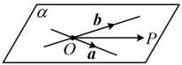

图1

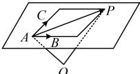

图2

#### 左侧知识点｜`1.4-k2` 平面的法向量

**知识点2：平面的法向量**

**1. 平面法向量的定义**

如图，直线  \(l \perp \alpha\)，取直线  \(l\) 的方向向量  \(\boldsymbol{a}\)，我们称向量  \(\boldsymbol{a}\) 为平面  \(\alpha\) 的法向量。给定一个点  \(A\) 和一个向量  \(\boldsymbol{a}\)，那么过点  \(A\)，且以向量  \(\boldsymbol{a}\) 为法向量的平面完全确定，可以表示为集合  \(\{P \mid \boldsymbol{a} \cdot \overrightarrow{AP} = 0\}\)。

2. 平面法向量的性质

①平面 \(\alpha\)的一个法向量垂直于平面 \(\alpha\)内的所有向量；

②一个平面的法向量有无数个，这些法向量互相平行.

注：由于零向量的方向不确定，因此零向量不能作为直线的方向向量和平面的法向量.

3. 平面法向量的求法

①直接寻找：可以看看有没有已知直线与要求法向量的平面是互相垂直的，若有，则任取该直线的一个方向向量，即为平面的一个法向量；

②待定系数法：

##

> 对应教材例题：例3

#### 任务 03｜例3

【例3】正方体 \(ABCD-A_{1}B_{1}C_{1}D_{1}\)的棱长为1，以A为坐标原点，建立如图所示的空间直角坐标系，分别求平面ABCD与平面 \(BDA_{1}\)的一个法向量.

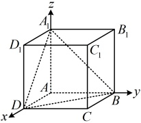

解：（由正方体的性质容易找到平面ABCD的垂线，所以该平面的法向量无需计算，可直接写出）
由题意， \(AA_1 \perp\) 平面ABCD，所以 \(\overrightarrow{AA_1} = (0,0,1)\)是平面ABCD的一个法向量，（再求平面 \(BDA_1\)的法向量m，需先写出该平面内两个不共线的向量，不妨选取 \(\overrightarrow{BD}\)和 \(\overrightarrow{A_1D}\)，由 \(\begin{cases} m \cdot \overrightarrow{BD} = 0 \\ m \cdot \overrightarrow{A_1D} = 0 \end{cases}\)求m）
由图可知， \(B(0,1,0)\)， \(D(1,0,0)\)， \(A_1(0,0,1)\)，所以 \(\overrightarrow{BD} = (1,-1,0)\)， \(\overrightarrow{A_1D} = (1,0,-1)\)，
设平面 \(BDA_1\)的法向量为 \(m = (x,y,z)\)，
则 \(\begin{cases} m \cdot \overrightarrow{BD} = x - y = 0 \\ m \cdot \overrightarrow{A_1D} = x - z = 0 \end{cases}\)，令 \(x=1\)，则 \(\begin{cases} y = 1 \\ z = 1 \end{cases}\)，
所以 \(m = (1,1,1)\)是平面 \(BDA_1\)的一个法向量。
【反思】求平面法向量时，先写出该平面内两个不共线的向量，再由法向量与此二向量数量积分别为0建立方程组，最后通过对法向量的一个未知数赋非零值，求出所得方程组的一组非零解，即得平面的一个法向量。

- 本批例题没有直属变式，按路线进入对应配套题。

#### 方法检查｜`1.4-direction-normal-check-1` 方向向量与法向量选用检查（不计入教材题量）

给定一条直线 l 和一个平面 α。请只用方法链回答：要判断 l∥α、l⊥α 以及点 P 是否在 α 内，各应取哪些向量（方向向量或法向量），每一步需要核验什么非零或垂直条件；再自取一组坐标构造一个线面平行的例子，口述判定式的来源。

> 独立作答，不提供答案；未通过时停在本循环。

### 当前动作 3：做本批对应 A/B/C 习题（无答案）

> 本批配套题承接：1.4-k1, 1.4-k2

#### A组

##### 任务 04｜A2

2.（2025·福建厦门期中）

如图，正方体  \(ABCD-A_{1}B_{1}C_{1}D_{1}\) 的棱长为 2，E，F，G 分别为  \(BB_{1}\)， \(B_{1}D_{1}\)，AB 的中点.

（1）求证： \(EF \perp A_{1}D\)；

（2）求证：EF//平面 \(A_{1}DG\)

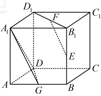

#### B组

##### 任务 05｜B5

5. （2025·浙江温州期末）

如图，在平行六面体  \(ABCD-A_{1}B_{1}C_{1}D_{1}\) 中，\(AB=AD=AA_{1}=1，\angle A_{1}AB=\angle A_{1}AD=\angle BAD=60^{\circ}\)． 

（1）求 \(AC_{1}\)的长；

（2）求证： \(A_{1}C\perp\) 平面 \(BDD_{1}B_{1}\)

### 当前动作 4：本批验收

- [ ] 能闭卷复述本批方法及适用条件。
- [ ] 教学例题能解释关键步骤，不只是记住结论。
- [ ] 直属变式和对应习题有独立过程。
- [ ] 若使用过提示或答案，已用未见题或延迟闭卷复测补证。
- [ ] 当前循环没有未解决的第一断点。

> **推进门：** 本批例题理解、直属变式、对应习题和独立复测证据齐全后才可进入下一批；提示或看答案的题必须以未见题或延迟闭卷复测补证。
> **失败处理：** 只报告第一处断点并给最小提示；不得提前展示下一批或当前题答案。
> 未满足推进门时停在本循环，不展示下一循环的当前动作。

---

## 循环 2/7：向量方法在立体几何中的应用

### 当前动作 1：看本批视频

- `3.1.4.1` 3.1.4.1平行垂直证明
  - 文件：`C:\Users\poyi\Downloads\课程合集\3.1 空间向量与立体几何\3.1.4.1平行垂直证明.mp4`
- `3.1.4.2` 3.1.4.2 证明共面
  - 文件：`C:\Users\poyi\Downloads\课程合集\3.1 空间向量与立体几何\3.1.4.2 证明共面.mp4`
- `3.1.4.3` 3.1.4.3 向量夹角与直线夹角
  - 文件：`C:\Users\poyi\Downloads\课程合集\3.1 空间向量与立体几何\3.1.4.3 向量夹角与直线夹角.mp4`
- `3.1.4.4` 3.1.4.4 直线与平面的夹角
  - 文件：`C:\Users\poyi\Downloads\课程合集\3.1 空间向量与立体几何\3.1.4.4 直线与平面的夹角.mp4`
- `3.1.4.5` 3.1.4.5 平面与平面的夹角
  - 文件：`C:\Users\poyi\Downloads\课程合集\3.1 空间向量与立体几何\3.1.4.5 平面与平面的夹角.mp4`
- `3.1.4.7` 3.1.4.7 距离问题
  - 文件：`C:\Users\poyi\Downloads\课程合集\3.1 空间向量与立体几何\3.1.4.7 距离问题.mp4`
- 前置方法必须已通过：`direction_normal`

> 看完本批视频后停下来，不要提前观看下一循环。

### 当前动作 2：按本批做题路径推进

本批知识点：
- `1.4-k3` 向量法应用、平行垂直、空间角、距离与位置关系

#### 左侧知识点｜`1.4-k3` 向量法应用、平行垂直、空间角、距离与位置关系

**知识点 3：向量方法在立体几何中的应用**

1\. 利用向量方法判断立体几何中的位置关系

直线的方向向量和平面的法向量对于确定空间中的直线和平面起了关键作用，所以我们可以利用直线的方向向量和平面的法向量来表示空间中直线、平面间的平行、垂直等位置关系.

<table border=1 style='margin: auto; word-wrap: break-word;'><tr><td style='text-align: center; word-wrap: break-word;'>位置关系</td><td style='text-align: center; word-wrap: break-word;'>符号表示</td><td style='text-align: center; word-wrap: break-word;'>图形表示</td></tr><tr><td style='text-align: center; word-wrap: break-word;'>线线平行</td><td style='text-align: center; word-wrap: break-word;'>\(l_1 \parallel l_2 \Leftrightarrow m_1 \parallel m_2 \Leftrightarrow \exists \lambda \in \mathbb{R}\)，使得 \(m_1 = \lambda m_2\)</td><td style='text-align: center; word-wrap: break-word;'></td></tr><tr><td style='text-align: center; word-wrap: break-word;'>线面平行</td><td style='text-align: center; word-wrap: break-word;'>若 \(l \subset \alpha\)，则 \(l \parallel \alpha \Leftrightarrow m \perp n \Leftrightarrow m \cdot n = 0\)</td><td style='text-align: center; word-wrap: break-word;'></td></tr><tr><td style='text-align: center; word-wrap: break-word;'>面面平行</td><td style='text-align: center; word-wrap: break-word;'>\(\alpha \parallel \beta \Leftrightarrow n_1 \parallel n_2 \Leftrightarrow \exists \lambda \in \mathbb{R}\)，使得 \(n_1 = \lambda n_2\)</td><td style='text-align: center; word-wrap: break-word;'></td></tr><tr><td style='text-align: center; word-wrap: break-word;'>线线垂直</td><td style='text-align: center; word-wrap: break-word;'>\(l_1 \perp l_2 \Leftrightarrow m_1 \perp m_2 \Leftrightarrow m_1 \cdot m_2 = 0\)</td><td style='text-align: center; word-wrap: break-word;'></td></tr><tr><td style='text-align: center; word-wrap: break-word;'>线面垂直</td><td style='text-align: center; word-wrap: break-word;'>\(l \perp \alpha \Leftrightarrow m \parallel n \Leftrightarrow \exists \lambda \in \mathbb{R}\)，使得 \(m = \lambda n\)</td><td style='text-align: center; word-wrap: break-word;'></td></tr><tr><td style='text-align: center; word-wrap: break-word;'>面面垂直</td><td style='text-align: center; word-wrap: break-word;'>\(\alpha \perp \beta \Leftrightarrow n_1 \perp n_2 \Leftrightarrow n_1 \cdot n_2 = 0\)</td><td style='text-align: center; word-wrap: break-word;'></td></tr></table>

类型 I：利用空间向量研究平行关系

**类型Ⅱ：利用空间向量研究垂直关系**

**类型Ⅲ：利用空间向量求空间角**

类型IV：利用空间向量求空间距离

类型V：用向量方法判断点、直线是否在平面内

> 对应教材例题：例4, 例5, 例6, 例7, 例8, 例9, 例10

#### 任务 06｜例4

【例4】设平面 \(\alpha\)和平面 \(\beta\)的法向量分别为 \(\boldsymbol{m}=(1,2,-3)\)， \(\boldsymbol{n}=(-2,k,6)\)，若 \(\alpha\parallel\beta\)，则 \(k=\)（ ）
A. 4  B. -4
C. 10  D. -10
解析：因为 \(\alpha\parallel\beta\)，所以 \(m\parallel n\)，故 \(\frac{1}{-2}=\frac{2}{k}=\frac{-3}{6}\)，解得：\(k=-4\)。
答案：B

#### 任务 07｜例5

【例 5】（多选）已知直线  \(l\) 的一个方向向量为  \(\boldsymbol{a} = (m, 1, 3)\)，平面  \(\alpha\) 的一个法向量为  \(\boldsymbol{b} = (-2, n, 1)\)，则（ ）
A. 若  \(l \parallel \alpha\)，则  \(2m - n = 3\)
B. 若  \(l \perp \alpha\)，则  \(2m - n = 3\)
C. 若  \(l \parallel \alpha\)，则  \(mn + 2 = 0\)
D. 若  \(l \perp \alpha\)，则  \(mn + 2 = 0\)
解析：若  \(l \parallel \alpha\)，则  \(a \perp b\)，
所以  \(a \cdot b = m \times (-2) + 1 \times n + 3 \times 1 = 0\)，
整理得： \(2m - n = 3\)，
故 A 项正确，C 项错误；
若  \(l \perp \alpha\)，则  \(a \parallel b\)，所以  \(\frac{m}{-2} = \frac{1}{n} = \frac{3}{1}\)，
解得： \(m = -6\)， \(n = \frac{1}{3}\)，
所以  \(mn + 2 = 0\)，故 B 项错误，D 项正确。
答案：AD

#### 任务 08｜例6

【例 6】已知直线  \(l_{1}\) 的方向向量  \(\vec{s_{1}} = (1,0,1)\)，直线  \(l_{2}\) 的方向向量  \(\vec{s_{2}} = (-1,2,-2)\)，则  \(l_{1}\) 和  \(l_{2}\) 夹角的余弦值为（）
A.  \(\frac{\sqrt{2}}{4}\) B.  \(\frac{1}{2}\)
C.  \(\frac{\sqrt{2}}{2}\) D.  \(\frac{\sqrt{3}}{2}\)
解析：设 \(l_1\)与 \(l_2\)所成角为 \(\theta\)，则 \(\cos\theta = \frac{|\vec{s}_1 \cdot \vec{s}_2|}{|\vec{s}_1| \cdot |\vec{s}_2|} = \frac{|1 \times (-1) + 0 \times 2 + 1 \times (-2)|}{\sqrt{1^2 + 0^2 + 1^2} \cdot \sqrt{(-1)^2 + 2^2 + (-2)^2}} = \frac{\sqrt{2}}{2}\)，所以 \(l_1\)和 \(l_2\)夹角的余弦值为 \(\frac{\sqrt{2}}{2}\)。
2. 利用向量方法解决立体几何中的求距离问题
①点到直线的距离
①点到直线的距离
如图，\(\overrightarrow{AP}\) 在直线 \(l\) 上的投影向量为 \(\overrightarrow{AQ}\)，则 \(\triangle APQ\) 为直角三角形，直线 \(l\) 的方向向量为 \(\boldsymbol{a}\)，单位方向向量为 \(\boldsymbol{u}\)，则向量 \(\overrightarrow{AP}\) 在直线 \(l\) 上的投影向量为 \(\overrightarrow{AQ} = \frac{\boldsymbol{a} \cdot \overrightarrow{AP}}{|\boldsymbol{a}|^2} \boldsymbol{a}\)，所以
\(\left|\overrightarrow{AQ}\right|^2 = \left(\frac{\boldsymbol{a} \cdot \overrightarrow{AP}}{|\boldsymbol{a}|^2} \boldsymbol{a}\right)^2 = \frac{(\boldsymbol{a} \cdot \overrightarrow{AP})^2}{|\boldsymbol{a}|^4} \left|\boldsymbol{a}^2\right| = \left(\frac{\boldsymbol{a} \cdot \overrightarrow{AP}}{|\boldsymbol{a}|}\right)^2 = \left(\frac{\boldsymbol{a}}{|\boldsymbol{a}|} \cdot \overrightarrow{AP}\right)^2\)
\(= (\boldsymbol{u} \cdot \overrightarrow{AP})^2\)，由勾股定理可得点 \(P\) 到直线 \(l\) 的距离 \(d = PQ\)
\(= \sqrt{|\overrightarrow{AP}|^2 - |\overrightarrow{AQ}|^2} = \sqrt{\overrightarrow{AP}^2 - (\boldsymbol{u} \cdot \overrightarrow{AP})^2}\)。

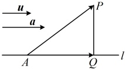

②点到平面的距离
如图，设平面\(\alpha\)的法向量为\(\boldsymbol{n}\)，\(A\)是平面\(\alpha\)内的任意一点，\(P\)是平面\(\alpha\)外一点，过点\(P\)作平面\(\alpha\)的垂线交平面\(\alpha\)于点\(Q\)，则\(\boldsymbol{n}\)是直线\(PQ\)的方向向量，且点\(P\)到平面\(\alpha\)的距离就是\(\overrightarrow{AP}\)在直线\(PQ\)上的投影向量的长度，该投影向量为\(\frac{\overrightarrow{AP}\cdot\boldsymbol{n}}{|\boldsymbol{n}|^2}\boldsymbol{n}\)，故\(P\)到\(\alpha\)的距离\(d=\left|\frac{\overrightarrow{AP}\cdot\boldsymbol{n}}{|\boldsymbol{n}|^2}\boldsymbol{n}\right|=\frac{\left|\overrightarrow{AP}\cdot\boldsymbol{n}\right|}{|\boldsymbol{n}|}\)。

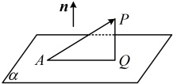

③直线到平面、平面到平面的距离
若直线与平面平行，平面与平面平行，则直线到平面、平面到平面的距离可转化为点到平面的距离来计算.
3. 利用向量方法求立体几何中的空间角
①异面直线所成角

#### 任务 09｜例7

【例7】若平面 \(\alpha\)的一个法向量为 \(\boldsymbol{n}=(1,2,1)\)，已知 \(\overrightarrow{AB}=(-1,-1,2)\)， \(A \notin \alpha\)， \(B \in \alpha\)，则点 \(A\)到平面 \(\alpha\)的距离为（ ）
A. 1 \quad B.  \(\frac{\sqrt{6}}{6}\)
C.  \(\frac{\sqrt{3}}{3}\) \quad D.  \(\frac{\sqrt{2}}{3}\)
解析：求点到平面的距离，可代知识点3第2点②的公式计算，这里已有 \(\alpha\)的法向量 \(n\)和 \(\overrightarrow{AB}\)的坐标，可直接代公式，
由题意，点 \(A\)到平面 \(\alpha\)的距离 \(d=\frac{|\overrightarrow{BA}\cdot\boldsymbol{n}|}{|\boldsymbol{n}|}\)
 \(=\frac{|\overrightarrow{AB}\cdot\boldsymbol{n}|}{|\boldsymbol{n}|}=\frac{|-1\times1+(-1)\times2+2\times1|}{\sqrt{1^2+2^2+1^2}}=\frac{\sqrt{6}}{6}\).
答案：B

#### 任务 10｜例8

【例8】已知直线 \(l\) 的一个方向向量为 \(\boldsymbol{m}=(1,1,0)\)，平面 \(\alpha\) 的一个法向量为 \(\boldsymbol{n}=(0,-\sqrt{2},\sqrt{2})\)，则直线 \(l\) 与平面 \(\alpha\) 所成的角为（ ）
A. \(\frac{\pi}{6}\)  B. \(\frac{\pi}{4}\)  
C. \(\frac{\pi}{6}\) 或 \(\frac{5\pi}{6}\)  D. \(\frac{\pi}{4}\) 或 \(\frac{3\pi}{4}\)
解析：设直线 \(l\) 与平面 \(\alpha\) 所成角为 \(\theta\)，其中 \(0 \leq \theta \leq \frac{\pi}{2}\)，则 \(\sin \theta = |\cos < m, n>| = \frac{|m \cdot n|}{|m| \cdot |n|}\)
\(= \frac{|1 \times 0 + 1 \times (-\sqrt{2}) + 0 \times \sqrt{2}|}{\sqrt{1^2 + 1^2 + 0^2} \cdot \sqrt{0^2 + (-\sqrt{2})^2 + (\sqrt{2})^2}}\)
\(= \frac{1}{2}\)，结合 \(0 \leq \theta \leq \frac{\pi}{2}\) 可得 \(\theta = \frac{\pi}{6}\)。
答案：A
答案：A

#### 任务 11｜例9

【例9】在空间直角坐标系中，已知平面 \(\alpha\)， \(\beta\)的一个法向量分别为 \(m=\)
若异面直线  \(l_1\)， \(l_2\) 所成的角为  \(\theta\) ( \(0 < \theta \leq \frac{\pi}{2}\))，其方向向量分别是  \(\boldsymbol{u}\)， \(\boldsymbol{v}\)，则  \(\cos \theta = |\cos \langle \boldsymbol{u}, \boldsymbol{v} \rangle| = \frac{|\boldsymbol{u} \cdot \boldsymbol{v}|}{|\boldsymbol{u}| \cdot |\boldsymbol{v}|}\)。
如图，直线 \(l\) 与平面 \(\alpha\) 相交于点 \(B\)，\(A\) 为 \(l\) 上的另外一点，过 \(A\) 作 \(\alpha\) 的垂线，垂足为 \(P\)，设直线 \(l\) 与平面 \(\alpha\) 所成的角为 \(\theta\left(0 < \theta \leq \frac{\pi}{2}\right)\)，平面 \(\alpha\) 的法向量为 \(\boldsymbol{n}\)，则由图可知，\(\theta = \frac{\pi}{2} - \angle BAP\)，而 \(\cos \angle BAP = \left|\cos \langle \overrightarrow{AB}, \boldsymbol{n} \rangle\right| = \frac{\left|\overrightarrow{AB} \cdot \boldsymbol{n}\right|}{\left|\overrightarrow{AB}\right| \cdot \left|\boldsymbol{n}\right|}\)，所以 \(\sin \theta = \sin\left(\frac{\pi}{2} - \angle BAP\right) = \cos \angle BAP = \frac{\left|\overrightarrow{AB} \cdot \boldsymbol{n}\right|}{\left|\overrightarrow{AB}\right| \cdot \left|\boldsymbol{n}\right|}\)。

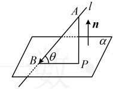

③平面与平面的夹角
平面  \(\alpha\) 与平面  \(\beta\) 相交，形成四个二面角，我们把这四个二面角中不大于  \(90^{\circ}\) 的二面角称为平面  \(\alpha\) 与平面  \(\beta\) 的夹角.
类似于两条异面直线所成的角，若平面  \(\alpha\)， \(\beta\) 的法向量分别是  \(m_1\)， \(m_2\)，则平面  \(\alpha\) 与平面  \(\beta\) 的夹角即为向量  \(m_1\) 和  \(m_2\) 的夹角或其补角。设平面  \(\alpha\) 与平面  \(\beta\) 的夹角为  \(\theta\)，则  \(\cos\theta = |\cos\langle m_1, m_2 \rangle| = \frac{|m_1 \cdot m_2|}{|m_1| \cdot |m_2|}\)。
注：①平面与平面的夹角的取值范围是  \(\left[0, \frac{\pi}{2}\right]\)，二面角的取值范围是  \([0, \pi]\)；
②如图 1，二面角  \(\alpha - l - \beta\) 的余弦值  \(\cos\theta = \pm\cos\langle m_1, (0, -1, -1), n = (-2, 1, 2)\)，则  \(\alpha\) 与  \(\beta\) 的夹角的余弦值为（ ）
A.  \(\frac{2}{3}\)
B.  \(\frac{\sqrt{2}}{3}\)
C.  \(-\frac{\sqrt{2}}{2}\)
D.  \(\frac{\sqrt{2}}{2}\)
解析：已知两个平面的法向量，可直接代公式  \(\cos\theta = |\cos\langle\mathbf{m}, \mathbf{n}\rangle| = \frac{|\mathbf{m} \cdot \mathbf{n}|}{|\mathbf{m}| \cdot |\mathbf{n}|}\) 来求平面  \(\alpha\) 与平面  \(\beta\) 的夹角的余弦值，设平面  \(\alpha\) 与平面  \(\beta\) 的夹角为  \(\theta\)，则  \(\cos\theta = |\cos\langle\mathbf{m}, \mathbf{n}\rangle| = \frac{|\mathbf{m} \cdot \mathbf{n}|}{|\mathbf{m}| \cdot |\mathbf{n}|}\)
 \(= \frac{|0 \times (-2) + (-1) \times 1 + (-1) \times 2|}{\sqrt{(-1)^2 + (-1)^2} \cdot \sqrt{(-2)^2 + 1^2 + 2^2}} = \frac{\sqrt{2}}{2}\)，所以平面  \(\alpha\) 与  \(\beta\) 的夹角的余弦值为  \(\frac{\sqrt{2}}{2}\)。
答案：D

#### 任务 12｜例10

【例 10】如图，四棱锥  \(P-ABCD\) 中，底面  \(ABCD\) 为矩形， \(PA \perp\) 平面  \(ABCD\)， \(PA = AB = 1\)， \(AD = \sqrt{3}\)， \(E\) 为  \(PD\) 的中点，求二面角  \(D-AE-C\) 的余弦值.

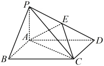

解：（求二面角，考虑建系，用向量法来处理，这里已有PA，AB，AD两两垂直，可直接建系）以A为原点建立如图所示的空间直角坐标系，则 \(A(0,0,0)\)， \(D(0,\sqrt{3},0)\)， \(C(1,\sqrt{3},0)\)， \(P(0,0,1)\)，
因为 E 为 PD 的中点，所以  \(E\left(0,\frac{\sqrt{3}}{2},\frac{1}{2}\right)\)
（求二面角 D-AE-C 的余弦值需要平面 DAE 和平面 AEC 的法向量，前者可直接写出，后者需要计算，故先写出平面 ACE 内两个不共线的向量，用于求它的法向量）
 \(m_2 \geq \pm \frac{m_1 \cdot m_2}{|m_1| \cdot |m_2|}\)，若是求  \(\sin \theta\)，则可由  \(\sin \theta = \sqrt{1 - \cos^2 \theta}\) 来算， \(\cos \theta\) 取正取负不影响结果；若是求  \(\cos \theta\)，则最终结果取正还是取负，需考虑二面角的锐钝，一般可通过观察图形，直观想象来判断，若图形不易判断，则可通过法向量的指向来判断。若两个法向量都朝内或朝外，如图1，则  \(\cos \theta = -\cos < m_1, m_2>\)；若一个朝内，一个朝外，如图2，则  \(\cos \theta = \cos < m_1, m_2>\)。

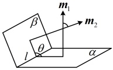

图1

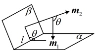

图2

4. 利用空间向量解决立体几何问题的一般步骤
①转化：将立体几何问题中涉及的距离、角度等利用空间向量进行表示，把立体几何问题转化为向量问题；
②运算：将向量问题的结果运算出来；
③翻译：把向量问题的结果“翻译”成对应的几何结论。
 \(\overrightarrow{AC} = (1, \sqrt{3}, 0)\)， \(\overrightarrow{AE} = \left(0, \frac{\sqrt{3}}{2}, \frac{1}{2}\right)\)，
设平面  \(ACE\) 的法向量为  \(\boldsymbol{m} = (x, y, z)\)，
则  \(\begin{cases} \boldsymbol{m} \cdot \overrightarrow{AC} = x + \sqrt{3}y = 0 \\ \boldsymbol{m} \cdot \overrightarrow{AE} = \frac{\sqrt{3}}{2}y + \frac{1}{2}z = 0 \end{cases}\)，
令  \(x = \sqrt{3}\)，则  \(y = -1\)， \(z = \sqrt{3}\)，
所以  \(\boldsymbol{m} = (\sqrt{3}, -1, \sqrt{3})\) 是平面  \(ACE\) 的一个法向量，又  \(x\) 轴perp 平面  \(DAE\)，所以  \(\boldsymbol{n} = (1, 0, 0)\) 是平面  \(DAE\) 的一个法向量，
所以  \(\cos \langle \boldsymbol{m}, \boldsymbol{n} \rangle = \frac{\boldsymbol{m} \cdot \boldsymbol{n}}{|\boldsymbol{m}| \cdot |\boldsymbol{n}|}\)
 \(= \frac{\sqrt{3} \times 1 + (-1) \times 0 + \sqrt{3} \times 0}{\sqrt{(\sqrt{3})^2 + (-1)^2 + (\sqrt{3})^2} \times 1} = \frac{\sqrt{21}}{7}\)，
（最终答案是  \(\frac{\sqrt{21}}{7}\)，还是  \(-\frac{\sqrt{21}}{7}\)？这由二面角  \(D-AE-C\) 的锐钝决定，可直接观察图形，通过直观想象作出判断）
由图可知，二面角  \(D-AE-C\) 为锐角，所以其余弦值为  \(\frac{\sqrt{21}}{7}\)。

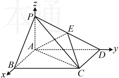

## 本节核心题型
空间向量作为非常强大的工具，可以解决立体几何中的诸多问题。本节我们通过四组题来为同学们梳理一些立体几何常见题型的向量处理方法，包括用空间向量研究平行关系、垂直关系、求空间角和求空间距离，请大家跟着例题和反思去学习、总结每种题型的向量处理方法吧。

- 本批例题没有直属变式，按路线进入对应配套题。

#### 方法检查｜`1.4-application-check-1` 向量方法归类检查（不计入教材题量）

面对一道立体几何题，请口述归类方法链：先判断题问的是平行/垂直、角（线线/线面/面面）还是距离，再写出各自第一步取什么向量（方向向量、法向量还是两者）；并说明“先建系还是先选基底”的判断依据。

> 独立作答，不提供答案；未通过时停在本循环。

### 当前动作 3：做本批对应 A/B/C 习题（无答案）

> 本批配套题承接：1.4-k3

- 当前覆盖账本没有为本批单独分配 A/B/C 题；用本批例题过程与未见变式验收，不从题名猜题。

### 当前动作 4：本批验收

- [ ] 能闭卷复述本批方法及适用条件。
- [ ] 教学例题能解释关键步骤，不只是记住结论。
- [ ] 直属变式和对应习题有独立过程。
- [ ] 若使用过提示或答案，已用未见题或延迟闭卷复测补证。
- [ ] 当前循环没有未解决的第一断点。

> **推进门：** 本批例题理解、直属变式、对应习题和独立复测证据齐全后才可进入下一批；提示或看答案的题必须以未见题或延迟闭卷复测补证。
> **失败处理：** 只报告第一处断点并给最小提示；不得提前展示下一批或当前题答案。
> 未满足推进门时停在本循环，不展示下一循环的当前动作。

---

## 循环 3/7：类型ⅠⅡ 平行与垂直证明

### 当前动作 1：看本批视频

- 本循环没有新增视频，复用已通过的前置方法。
- 前置方法必须已通过：`parallel_perpendicular, coplanar`

> 看完本批视频后停下来，不要提前观看下一循环。

### 当前动作 2：按本批做题路径推进

本批类型：
- 类型Ⅰ 研究平行关系：方向向量/法向量并核验线是否在面内
- 类型Ⅱ 研究垂直关系：线面、面面垂直的向量翻译

#### 方法类型｜类型Ⅰ 研究平行关系：方向向量/法向量并核验线是否在面内

#### 任务 13｜例11

【例 11】如图，在长方体  \(ABCD-A_1B_1C_1D_1\) 中， \(AB = 4\)， \(BC = CC_1 = 2\)，线段  \(B_1C\) 的中点为  \(P\)，证明： \(A_1P \parallel\) 平面  \(ACD_1\)。
证法1：（怎样证  \(A_1P \parallel\) 平面  \(ACD_1\)？只需证  \(\overrightarrow{A_1P}\) 是平面  \(ACD_1\) 内的向量，即证存在实数  \(\lambda\)， \(\mu\)，使  \(\overrightarrow{A_1P} = \lambda \overrightarrow{AD_1} + \mu \overrightarrow{AC}\)，下面我们按此建立方程组，求解  \(\lambda\) 和  \(\mu\)）
由题意， \(A_1(2,0,2)\)， \(P(1,4,1)\)， \(A(2,0,0)\)， \(C(0,4,0)\)， \(D_1(0,0,2)\)，
所以  \(\overrightarrow{A_1P} = (-1,4,-1)\)， \(\overrightarrow{AD_1} = (-2,0,2)\)， \(\overrightarrow{AC} = (-2,4,0)\)，设  \(\overrightarrow{A_1P} = \lambda \overrightarrow{AD_1} + \mu \overrightarrow{AC}\)，

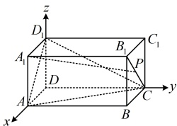

则  \((-1,4,-1)=\lambda(-2,0,2)+\mu(-2,4,0)\)，所以  \(\begin{cases} 4\mu=4 \\ 2\lambda=-1 \end{cases}\)，解得： \(\lambda=-\frac{1}{2}\)， \(\mu=1\)，
所以  \(\overrightarrow{A_1P}=-\frac{1}{2}\overrightarrow{AD_1}+\overrightarrow{AC}\)，故  \(\overrightarrow{A_1P}\) 是平面  \(ACD_1\) 内的向量，又  \(A_1P\not\subset\) 平面  \(ACD_1\)，所以  \(A_1P\parallel\) 平面  \(ACD_1\)。
证法 2：（由知识点 3 第 1 点的表格，要证  \(A_1P\parallel\) 平面  \(ACD_1\)，也可转化为证  \(\overrightarrow{A_1P}\) 与平面  \(ACD_1\) 的法向量垂直）
求  \(\overrightarrow{A_1P}\)， \(\overrightarrow{AD_1}\)， \(\overrightarrow{AC}\) 坐标的过程同解法 1，此处不再赘述，设平面  \(ACD_1\) 的法向量为  \(\boldsymbol{m}=(x,y,z)\)，
则  \(\begin{cases} \boldsymbol{m}\cdot\overrightarrow{AD_1}=-2x+2z=0 \\ \boldsymbol{m}\cdot\overrightarrow{AC}=-2x+4y=0 \end{cases}\)，令  \(x=2\) 得  \(y=1\)， \(z=2\)，所以  \(\boldsymbol{m}=(2,1,2)\) 是平面  \(ACD_1\) 的一个法向量，
因为  \(\overrightarrow{A_1P}\cdot\boldsymbol{m}=-1\times2+4\times1+(-1)\times2=0\)，所以  \(\overrightarrow{A_1P}\perp\boldsymbol{m}\)，结合  \(A_1P\not\subset\) 平面  \(ACD_1\) 可得  \(A_1P\parallel\) 平面  \(ACD_1\)。
【反思】上面的两个证法都能证明线面平行，但证法2通过证明直线上的一个向量与平面的法向量垂直来证线面平行，计算量稍小一些，所以后续有关问题中，我们都采用证法2来证线面平行。

#### 任务 14｜例12

【例12】在直四棱柱 \(ABCD-A_1B_1C_1D_1\) 中，底面 \(ABCD\) 为等腰梯形，\(AB\)
\(\parallel CD\)，\(AB=4\)，\(BC=CD=AA_1=2\)，\(F\) 是棱 \(AB\) 的中点，用向量的方法
证明：平面 \(ADD_1A_1\) // 平面 \(FCC_1\)。

证明：（既然要求用向量的方法证明平面  \(ADD_1A_1\) // 平面  \(FCC_1\)，那么先建系）
由题意可知， \(CD = AF = 2\)，且  \(CD \parallel AF\)，所以四边形 AFCD 是平行四边形，故  \(CF = AD = 2\)，
又  \(BC = BF = 2\)，所以  \(\triangle BCF\) 是正三角形，取 BF 中点  \(E\)，连接  \(CE\)，则  \(CE \perp BF\)，
因为  \(CD \parallel AB\)，所以  \(CE \perp CD\)，因为  \(ABCD - A_1B_1C_1D_1\) 是直四棱柱，所以  \(CC_1 \perp\) 平面  \(ABCD\)，
又  \(CD\)， \(CE \subset\) 平面  \(ABCD\)，所以  \(CC_1 \perp CD\)， \(CC_1 \perp CE\)，
故  \(CC_1\)， \(CD\)， \(CE\) 两两垂直，以  \(C\) 为原点建立如图 1 所示的空间直角坐标系，
（怎样用向量的方法证明平面  \(ADD_1A_1\) // 平面  \(FCC_1\)？如图 2，可以想象，若两个平面互相平行，则其中一个平面  \(\alpha\) 的法向量应与另一个平面  \(\beta\) 垂直，即它也是平面  \(\beta\) 的法向量，故按此证明）
由图 1 可知， \(CE = BC \cdot \sin \angle CBE = 2\sin 60^\circ = \sqrt{3}\)， \(BE = \frac{1}{2}BF = 1\)， \(AE = AB - BE = 3\)，
所以  \(A(3, \sqrt{3}, 0)\)， \(D(2, 0, 0)\)， \(D_1(2, 0, 2)\)， \(F(1, \sqrt{3}, 0)\)， \(C(0, 0, 0)\)， \(C_1(0, 0, 2)\)，
故  \(\overrightarrow{DA} = (1, \sqrt{3}, 0)\)， \(\overrightarrow{DD_1} = (0, 0, 2)\)， \(\overrightarrow{CF} = (1, \sqrt{3}, 0)\)， \(\overrightarrow{CC_1} = (0, 0, 2)\)，
设平面  \(ADD_1A_1\) 的法向量为  \(\boldsymbol{m} = (x, y, z)\)，则  \(\begin{cases} \boldsymbol{m} \cdot \overrightarrow{DA} = x + \sqrt{3}y = 0 \\ \boldsymbol{m} \cdot \overrightarrow{DD_1} = 2z = 0 \end{cases}\)，
令  \(x = \sqrt{3}\)，则  \(y = -1\)， \(z = 0\)，所以  \(\boldsymbol{m} = (\sqrt{3}, -1, 0)\) 是平面  \(ADD_1A_1\) 的一个法向量，
因为  \(\begin{cases} \boldsymbol{m} \cdot \overrightarrow{CF} = \sqrt{3} \times 1 + (-1) \times \sqrt{3} + 0 \times 0 = 0 \\ \boldsymbol{m} \cdot \overrightarrow{CC_1} = \sqrt{3} \times 0 + (-1) \times 0 + 0 \times 2 = 0 \end{cases}\)，所以  \(\boldsymbol{m}\) 也是平面  \(FCC_1\) 的一个法向量，故平面  \(ADD_1A_1\) // 平面  \(FCC_1\)。

图1

图2

【反思】用向量法证明两个平面平行，只需求出其中一个平面的法向量，再证明它也是另一个平面的法向量.

#### 方法类型｜类型Ⅱ 研究垂直关系：线面、面面垂直的向量翻译

#### 任务 15｜例13

【例 13】如图，在四棱锥  \(P-ABCD\) 中， \(PA \perp\) 平面  \(ABCD\)， \(AD \perp AB\)， \(AB \parallel DC\)， \(AD = DC = AP = 2\)， \(AB = 1\)，求证：平面  \(PCD \perp\) 平面 PBC。
证明：（不难发现图中本身有 3 条两两垂直的直线，故可考虑建系处理）
因为  \(PA \perp\) 平面  \(ABCD\)， \(AB\)， \(AD \subset\) 平面  \(ABCD\)，所以  \(PA \perp AB\)， \(PA \perp AD\)，
又  \(AD \perp AB\)，所以  \(PA\)， \(AB\)， \(AD\) 两两垂直，以  \(A\) 为原点建立如

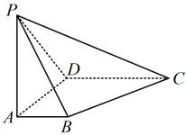

（怎样证平面 \(PCD \perp\) 平面 \(PBC\)？如图2，可以想象，互相垂直的两个平面 \(\alpha\)，\(\beta\) 的法向量 \(m\)，\(n\) 也互相垂直故可通过证明两个平面的法向量垂直来证明这两个平面垂直）
由图1可知，\(P(0,0,2)\)，\(C(2,2,0)\)，\(D(0,2,0)\)，\(B(1,0,0)\)，所以 \(\overrightarrow{DC}=(2,0,0)\)，\(\overrightarrow{PC}=(2,2,-2)\)，\(\overrightarrow{BC}=(1,2,0)\)，设平面 \(PCD\) 和平面 \(PBC\) 的法向量分别为 \(\boldsymbol{m}=(x_1,y_1,z_1)\)，\(\boldsymbol{n}=(x_2,y_2,z_2)\)，
则 \(\begin{cases} \boldsymbol{m} \cdot \overrightarrow{DC} = 2x_1 = 0 \\ \boldsymbol{m} \cdot \overrightarrow{PC} = 2x_1 + 2y_1 - 2z_1 = 0 \end{cases}\)，令 \(y_1 = 1\)，则 \(\begin{cases} x_1 = 0 \\ z_1 = 1 \end{cases}\)，所以 \(\boldsymbol{m} = (0,1,1)\) 是平面 \(PCD\) 的一个法向量，
同理，\(\begin{cases} \boldsymbol{n} \cdot \overrightarrow{PC} = 2x_2 + 2y_2 - 2z_2 = 0 \\ \boldsymbol{n} \cdot \overrightarrow{BC} = x_2 + 2y_2 = 0 \end{cases}\)，令 \(x_2 = 2\)，则 \(\begin{cases} y_2 = -1 \\ z_2 = 1 \end{cases}\)，所以 \(\boldsymbol{n} = (2,-1,1)\) 是平面 \(PBC\) 的一个法向量，
因为 \(\boldsymbol{m} \cdot \boldsymbol{n} = 0 \times 2 + 1 \times (-1) + 1 \times 1 = 0\)，所以 \(\boldsymbol{m} \perp \boldsymbol{n}\)，故平面 \(PCD\) ⊥ 平面 \(PBC\)。

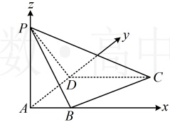

图1

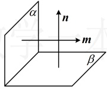

图2

【反思】用向量法证面面垂直，只需求出两个平面的法向量，再证明两个法向量垂直。但有的题不方便建系，这种情况下证明垂直关系，可以不建系，直接使用拆解法，我们来看下面的例14。

#### 任务 16｜例14

【例14】如图，平行六面体  \(ABCD-A_1B_1C_1D_1\) 的底面  \(ABCD\) 是菱形，且  \(CD=CC_1=2\)， \(\angle C_1CB=\angle C_1CD=\angle BCD=60^\circ\)，证明： \(CA_1 \perp\) 平面  \(C_1BD\)。
证明：（要证结论成立，只需证  \(\overrightarrow{CA_1}\) 是平面  \(C_1BD\) 的法向量，即证  \(\overrightarrow{CA_1} \cdot \overrightarrow{BC_1}=0\) 和  \(\overrightarrow{CA_1} \cdot \overrightarrow{BD}=0\)，怎么证？图中没有三条两两垂直的直线，建系比较麻烦，但注意到  \(\overrightarrow{CB}\)， \(\overrightarrow{CD}\)， \(\overrightarrow{CC_1}\) 这三个向量既知道长度，又知道两两夹角，故可用它们表示上述有关向量，再求数量积）

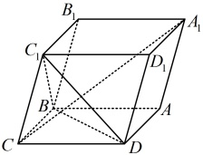

由图可知，\(\overrightarrow{CA_1}=\overrightarrow{CB}+\overrightarrow{CD}+\overrightarrow{CC_1}\)，\(\overrightarrow{BC_1}=\overrightarrow{CC_1}-\overrightarrow{CB}\)，\(\overrightarrow{BD}=\overrightarrow{CD}-\overrightarrow{CB}\)。因此\(\overrightarrow{CA_1}\cdot\overrightarrow{BC_1}=(\overrightarrow{CB}+\overrightarrow{CD}+\overrightarrow{CC_1})\cdot(\overrightarrow{CC_1}-\overrightarrow{CB})=|\overrightarrow{CC_1}|^2-|\overrightarrow{CB}|^2+\overrightarrow{CD}\cdot\overrightarrow{CC_1}-\overrightarrow{CD}\cdot\overrightarrow{CB}=2^2-2^2+2\times2\times\cos60^\circ-2\times2\times\cos60^\circ=0\)；\(\overrightarrow{CA_1}\cdot\overrightarrow{BD}=(\overrightarrow{CB}+\overrightarrow{CD}+\overrightarrow{CC_1})\cdot(\overrightarrow{CD}-\overrightarrow{CB})=|\overrightarrow{CD}|^2-|\overrightarrow{CB}|^2+\overrightarrow{CC_1}\cdot\overrightarrow{CD}-\overrightarrow{CC_1}\cdot\overrightarrow{CB}=2^2-2^2+2\times2\times\cos60^\circ-2\times2\times\cos60^\circ=0\)。从而  \(\overrightarrow{CA_{1}}\) 是平面  \(C_{1}BD\) 的法向量，故  \(CA_{1}\perp\) 平面  \(C_{1}BD\)
【反思】用向量法证明直线与平面垂直，只需证直线上的一个向量u是平面的法向量，即证u与该平面内两个
不共线的向量数量积为0.

- 本批例题没有直属变式，按路线进入对应配套题。

#### 方法检查｜`1.4-parallel-perp-check-1` 线在面内与线面平行区分（不计入教材题量）

在正方体中自选一条直线 l 与一个平面 α（l 不平行 α 的边）。请写出用向量判断 l∥α 与 l⊂α 的完整步骤，指出两种判断在“公共点核验”和“方向向量与法向量垂直”上的区别；再说明为什么只证方向向量垂直法向量时不能直接得出 l⊂α。

> 独立作答，不提供答案；未通过时停在本循环。

### 当前动作 3：做本批对应 A/B/C 习题（无答案）

> 本批配套题承接：类型Ⅰ 研究平行关系, 类型Ⅱ 研究垂直关系

#### B组

##### 任务 17｜B4

4. （2025·新疆模拟）

如图，在四棱锥  \(P-ABCD\) 中， \(PD \perp\) 平面  \(ABCD\)，底面  \(ABCD\) 为菱形，且  \(\angle ABC = 60^\circ\)

（1）求证： \(AC \perp PB\)；

（2）若 AB = 2，当平面  \(PAB \perp\) 平面 PBC 时，求 PD 的长.

### 当前动作 4：本批验收

- [ ] 能闭卷复述本批方法及适用条件。
- [ ] 教学例题能解释关键步骤，不只是记住结论。
- [ ] 直属变式和对应习题有独立过程。
- [ ] 若使用过提示或答案，已用未见题或延迟闭卷复测补证。
- [ ] 当前循环没有未解决的第一断点。

> **推进门：** 本批例题理解、直属变式、对应习题和独立复测证据齐全后才可进入下一批；提示或看答案的题必须以未见题或延迟闭卷复测补证。
> **失败处理：** 只报告第一处断点并给最小提示；不得提前展示下一批或当前题答案。
> 未满足推进门时停在本循环，不展示下一循环的当前动作。

---

## 循环 4/7：类型Ⅲ 求空间角

### 当前动作 1：看本批视频

- 本循环没有新增视频，复用已通过的前置方法。
- 前置方法必须已通过：`line_line_angle, line_plane_angle, plane_plane_angle`

> 看完本批视频后停下来，不要提前观看下一循环。

### 当前动作 2：按本批做题路径推进

本批类型：
- 类型Ⅲ 求空间角：线线角、线面角、二面角锐钝

#### 方法类型｜类型Ⅲ 求空间角：线线角、线面角、二面角锐钝

#### 任务 18｜例15

【例 15】如图，在空间直角坐标系中有直三棱柱  \(ABC-A_1B_1C_1\)， \(CA=CC_1=2CB=2\)，则直线  \(BC_1\) 与  \(AB_1\) 所成角的正弦值为（ ）
A.  \(\frac{\sqrt{5}}{5}\) B.  \(\frac{\sqrt{5}}{3}\) C.  \(\frac{2\sqrt{5}}{5}\) D.  \(\frac{3}{5}\)
解析：求线线角，可在两条直线上各取一个向量，计算它们的夹角余弦，进而得到线线角的正弦值，由图可知， \(B(0,0,1)\)， \(C_1(0,2,0)\)， \(A(2,0,0)\)， \(B_1(0,2,1)\)，所以  \(\overrightarrow{BC_1} = (0,2,-1)\)， \(\overrightarrow{AB_1} = (-2,2,1)\)，

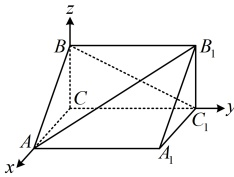

设直线 \(BC_1\) 与 \(AB_1\) 所成的角为 \(\theta\)，则 \(\cos\theta = \left|\cos<\overrightarrow{BC_1},\overrightarrow{AB_1}>\right| = \frac{\left|\overrightarrow{BC_1}\cdot\overrightarrow{AB_1}\right|}{\left|\overrightarrow{BC_1}\right|\cdot\left|\overrightarrow{AB_1}\right|} = \frac{\left|0\times(-2)+2\times2+(-1)\times1\right|}{\sqrt{0^2+2^2+(-1)^2}\times\sqrt{(-2)^2+2^2+1^2}} = \frac{\sqrt{5}}{5}\)，所以直线 \(BC_1\) 与 \(AB_1\) 所成角的正弦值为 \(\sin\theta = \sqrt{1-\cos^2\theta} = \sqrt{1-\left(\frac{\sqrt{5}}{5}\right)^2} = \frac{2\sqrt{5}}{5}\)。
答案：C
【反思】对于两条异面直线所成的角\(\theta\)，可在两直线上各取一个向量\(a\)，\(b\)，按\(\cos\theta=\left|\cos\langle a,b\rangle\right|\)求\(\cos\theta\)。

#### 任务 19｜例16

【例16】（2021·天津卷（节选））如图，在棱长为2的正方体 \(ABCD-A_1B_1C_1D_1\) 中，\(E\)，\(F\) 分别为棱 \(BC\)，\(CD\) 的中点，求直线 \(AC_1\) 与平面 \(A_1EC_1\) 所成角的正弦值。

解：（正方体容易建系，可考虑建系处理，那建系后怎样用向量法求线面角？需要先求
直线上的一个向量，以及平面的法向量，再求二者的夹角余弦值）
以  \(A\) 为原点建立如图所示的空间直角坐标系，则  \(A(0,0,0)\)， \(A_1(0,0,2)\)， \(E(2,1,0)\)， \(C_1(2,2,2)\)，
所以  \(\overrightarrow{AC_1} = (2,2,2)\)， \(\overrightarrow{A_1C_1} = (2,2,0)\)， \(\overrightarrow{EC_1} = (0,1,2)\)，
设平面  \(A_1EC_1\) 的法向量为  \(\boldsymbol{n} = (x,y,z)\)，则  \(\begin{cases} \boldsymbol{n} \cdot \overrightarrow{A_1C_1} = 2x + 2y = 0 \\ \boldsymbol{n} \cdot \overrightarrow{EC_1} = y + 2z = 0 \end{cases}\)，令  \(x = 2\)，则  \(y = -2\)， \(z = 1\)，
所以  \(\boldsymbol{n} = (2,-2,1)\) 是平面  \(A_1EC_1\) 的一个法向量，

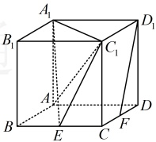

设直线  \(AC_1\) 与平面  \(A_1EC_1\) 所成的角为  \(\theta\)，则  \(\sin \theta = |\cos < \overrightarrow{AC_1}, \boldsymbol{n} > |\) =  \(\frac{|AC_1 \cdot \boldsymbol{n}|}{|AC_1| \cdot |\boldsymbol{n}|}\)
 \(= \frac{|2 \times 2 + 2 \times (-2) + 2 \times 1|}{\sqrt{2^2 + 2^2 + 2^2} \times \sqrt{2^2 + (-2)^2 + 1^2}} = \frac{\sqrt{3}}{9}\)，
所以直线  \(AC_1\) 与平面  \(A_1EC_1\) 所成角的正弦值为  \(\frac{\sqrt{3}}{9}\)。
【反思】设直线  \(l\) 与平面  \(\alpha\) 所成的角为  \(\theta\)，则可按以下步骤用向量法求  \(\sin \theta\)：先在直线  \(l\) 上取一个向量  \(\boldsymbol{u}\)，再求出平面  \(\alpha\) 的法向量  \(\boldsymbol{n}\)，则  \(\sin \theta = |\cos < \boldsymbol{u}, \boldsymbol{n} > |\)。

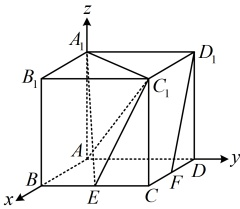

#### 任务 20｜例17

【例 17】如图，在四棱锥 P-ABCD 中，平面  \(PAD \perp\) 平面 ABCD，底面

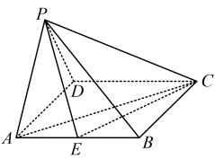

ABCD 是菱形， \(\triangle PAD\) 是正三角形， \(\angle ABC = \frac{2\pi}{3}\)，E 是 AB 的中点.
（1）证明： \(AC \perp PE\)；
（2）求平面 ACE 与平面 PCE 的夹角的余弦值.
解：（1）证法1：（证线线垂直，需找线面垂直，若无思路，可尝试逆推．假设AC⊥PE，若能再找一个与AC或PE有关的线线垂直与之组合，就能得到线面垂直，找谁呢？看到面PAD⊥面ABCD，想到最常见的辅助线：过P作AD的垂线PO，得到PO⊥底面ABCD，于是PO⊥该面内所有直线，哪条有用呢？显然是AC，故可通过证AC⊥面POE来证本题的结论）
如图，取  \(AD\) 中点  \(O\)，连接  \(PO\)， \(OE\)， \(BD\)，因为  \(\triangle PAD\) 是正三角形， \(O\) 是  \(AD\) 的中点，所以  \(PO \perp AD\)，因为平面  \(PAD \perp\) 平面  \(ABCD\)，且平面  \(PAD \cap\) 平面  \(ABCD = AD\)， \(PO \subset\) 平面  \(PAD\)，所以  \(PO \perp\) 平面  \(ABCD\)，因为  \(AC \subset\) 平面  \(ABCD\)，所以  \(AC \perp PO\) ①，
因为  \(ABCD\) 是菱形，所以  \(AC \perp BD\)，又因为  \(O\)， \(E\) 分别为  \(AD\)， \(AB\) 的中点，所以  \(OE \parallel BD\)，故  \(AC \perp OE\)，结合①以及  \(PO\)， \(OE \subset\) 平面  \(POE\)， \(PO \cap OE = O\) 可得  \(AC \perp\) 平面  \(POE\)，因为  \(PE \subset\) 平面  \(POE\)，所以  \(AC \perp PE\)。
证法2：（由题设条件容易找到三条两两垂直的直线，故也可建系，通过证明  \(\overrightarrow{AC} \cdot \overrightarrow{PE} = 0\) 来证  \(AC \perp PE\)）
证明  \(PO \perp\) 平面  \(ABCD\) 的过程同证法1，此处不再赘述，因为  \(ABCD\) 是菱形，所以  \(AB = AD\)，
又  \(\angle ABC = \frac{2\pi}{3}\)，所以  \(\angle BAD = \frac{\pi}{3}\)，从而  \(\triangle ABD\) 是正三角形，故  \(OB \perp AD\)，
以 \(O\) 为原点建立如图所示的空间直角坐标系，不妨设 \(AD=4\)，则 \(OA=OD=2\)，\(OP=OB=2\sqrt{3}\)，所以 \(A(2,0,0)\)，\(C(-4,2\sqrt{3},0)\)，\(P(0,0,2\sqrt{3})\)，\(E(1,\sqrt{3},0)\)，从而 \(\overrightarrow{AC}=(-6,2\sqrt{3},0)\)，\(\overrightarrow{PE}=(1,\sqrt{3},-2\sqrt{3})\)，故 \(\overrightarrow{AC}\cdot\overrightarrow{PE}=-6\times1+2\sqrt{3}\times\sqrt{3}+0\times(-2\sqrt{3})=0\)，所以 \(\overrightarrow{AC}\perp\overrightarrow{PE}\)，故 \(AC\perp PE\)。
（2）（求二面角可用向量法，需要先求两个平面的法向量，我们沿用第（1）问证法2建立的坐标系，观察图形可发现平面ACE的法向量可直接获得，故只需求平面PCE的法向量）
由（1）可得  \(\overrightarrow{PE}=(1,\sqrt{3},-2\sqrt{3})\)， \(\overrightarrow{CE}=(5,-\sqrt{3},0)\)，
由 (1) 可得  \(PE = (1, \sqrt{3}, -2\sqrt{3})\)， \(CE = (5, -\sqrt{3}, 0)\)，
设平面 PCE 的法向量为  \(\boldsymbol{m} = (x, y, z)\)，则  \(\begin{cases} \boldsymbol{m} \cdot \overrightarrow{PE} = x + \sqrt{3}y - 2\sqrt{3}z = 0 \\ \boldsymbol{m} \cdot \overrightarrow{CE} = 5x - \sqrt{3}y = 0 \end{cases}\)，
令  \(x = \sqrt{3}\)，则  \(\begin{cases} y = 5 \\ z = 3 \end{cases}\)，所以  \(\boldsymbol{m} = (\sqrt{3}, 5, 3)\) 是平面 PCE 的一个法向量，
由图可知， \(\boldsymbol{n} = (0, 0, 1)\) 是平面 ACE 的一个法向量，
设平面 ACE 与平面 PCE 的夹角为  \(\theta\)，则  \(\cos\theta = |\cos\langle \boldsymbol{m}, \boldsymbol{n} \rangle| = \frac{|\boldsymbol{m} \cdot \boldsymbol{n}|}{|\boldsymbol{m}| \cdot |\boldsymbol{n}|} = \frac{3\sqrt{37}}{37}\)，
所以平面 ACE 与平面 PCE 的夹角的余弦值为  \(\frac{3\sqrt{37}}{37}\)。

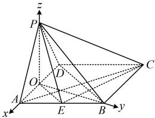

所以平面 ACE 与平面 PCE 的夹角的余弦值为  \(\frac{3\sqrt{37}}{37}\).
【反思】①不平行的平面 \(\alpha\)与平面 \(\beta\)的夹角 \(\theta\in\left(0,\frac{\pi}{2}\right]\)，要求其余弦值，可先求出两个平面的法向量 \(m,n\)，再按 \(\cos\theta=\left|\cos\langle m,n\rangle\right|\)求 \(\alpha\)与 \(\beta\)的夹角余弦；
②对于二面角  \(\alpha-l-\beta\)，其大小的取值范围是  \([0,\pi]\)，且它与  \(\alpha\)， \(\beta\) 的夹角  \(\theta\) 要么相等，要么互补，故若是让求二面角  \(\alpha-l-\beta\) 的余弦值，则我们常先求  \(\cos <m,n>\)，再结合图形观察二面角  \(\alpha-l-\beta\) 的锐钝，决定该取正还是取负。比如下面的变式 1：
③若由图不易看出二面角 \(\alpha-l-\beta\)的锐钝，还可通过法向量的指向来判断法向量的夹角与二面角 \(\alpha-l-\beta\)的大小关系。如图1，若两个法向量一个朝内，一个朝外，则它们的夹角等于二面角 \(\alpha-l-\beta\)；如图2，若两个法向量均朝内（或均朝外），则它们的夹角等于二面角 \(\alpha-l-\beta\)的补角，比如后面的变式2.

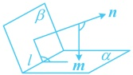

图1

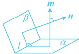

图2

##### 任务 21｜紧跟：变式1（对应例17，无解答）

【变式1】如图1，在直角梯形EFBC中，BF∥CE，EC⊥EF，EF=1，FB=2，EC=3，现沿平行于EF的AD折叠，使得 \(ED \perp DC\)且BC⊥平面BDE，如图2所示.
（1）求AB的长度；
（2）求二面角 F-EB-C 的大小.

图1

图2

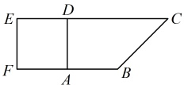

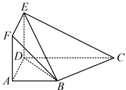

##### 任务 22｜紧跟：变式2（对应例17，无解答）

【变式2】如图，四面体ABCD的顶点都在以AB为直径的球面上，底面BCD是边长为 \(\sqrt{3}\)的等边三角形，球心O到底面的距离为1.
（1）求球O的表面积；
（2）求二面角 B-AC-D 的余弦值.

#### 方法检查｜`1.4-line-plane-angle-check-1` 线面角正弦公式检查（不计入教材题量）

设直线 l 的方向向量为 s，平面 α 的法向量为 n。请口述线面角 θ 与 ⟨s,n⟩ 的关系：为什么 sinθ=|cos⟨s,n⟩|，线线角公式为何要取绝对值而线面角公式为何也要取绝对值；并列出 |cos⟨s,n⟩| 取 1 时对应的几何位置。

> 独立作答，不提供答案；未通过时停在本循环。

#### 方法检查｜`1.4-dihedral-check-1` 二面角锐钝判断检查（不计入教材题量）

给定二面角 α-l-β，两个面的法向量为 m、n。请说明二面角的大小与 ⟨m,n⟩ 何时相等、何时互为补角，列出必须核验锐钝才能定号的几何条件；再自选一个正方体中的二面角，口述如何通过观察确定符号。

> 独立作答，不提供答案；未通过时停在本循环。

### 当前动作 3：做本批对应 A/B/C 习题（无答案）

> 本批配套题承接：类型Ⅲ 求空间角

#### A组

##### 任务 23｜A1

已知直线  \(l_{1}\) 的方向向量  \(\boldsymbol{\bar{s}}_{1}=(1,0,1)\) 与直线  \(l_{2}\) 的方向向量  \(\boldsymbol{\bar{s}}_{2}=(-1,2,-2)\)，则  \(l_{1}\) 和  \(l_{2}\) 夹角的余弦值为（）

A.  \(\frac{\sqrt{2}}{4}\) B.  \(\frac{1}{2}\) C.  \(\frac{\sqrt{2}}{2}\) D.  \(\frac{\sqrt{3}}{2}\)

#### B组

##### 任务 24｜B3

3.（2025·广东深圳期末）

长方体  \(ABCD-A_{1}B_{1}C_{1}D_{1}\) 中，底面 ABCD 是边长为 2 的正方形，若直线  \(AB_{1}\) 与  \(BD_{1}\) 所成角的余弦值为  \(\frac{\sqrt{5}}{5}\)，则  \(AA_{1}\) 的长为（）

A.  \(2\sqrt{3}\) B. 1 或  \(2\sqrt{3}\)

C. 12 D. 1 或 12

##### 任务 25｜B6

6. （2025·天津期末）

如图，在四棱锥  \(P-ABCD\) 中，平面  \(PAD \perp\) 平面  \(ABCD\)， \(\triangle PAD\) 是以  \(AD\) 为斜边的等腰直角三角形，底面  \(ABCD\) 为直角梯形， \(BC \parallel AD\)， \(CD \perp AD\)，且  \(2BC = AD = 4\)， \(CD = 1\)， \(E\)， \(O\) 分别是  \(PD\)， \(AD\) 的中点。

（1）求证： \(PO \perp\) 平面 ABCD；

（2）求平面 PAB 与平面 PBC 夹角的余弦值；

（3）求点E到平面PAB的距离.

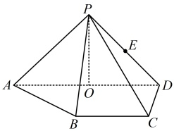

##### 任务 26｜B7

7. （2024·安徽合肥二模）

如图，在四棱锥 P-ABCD 中，底面 ABCD 是边长为 2 的菱形， \(\angle BAD = 60^{\circ}\)，M 是侧棱 PC 的中点，侧面 PAD 为正三角形，侧面  \(PAD \perp\) 底面 ABCD.

（1）求三棱锥 M-ABC 的体积；

（2）求 AM 与平面 PBC 所成角的正弦值.

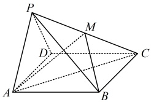

### 当前动作 4：本批验收

- [ ] 能闭卷复述本批方法及适用条件。
- [ ] 教学例题能解释关键步骤，不只是记住结论。
- [ ] 直属变式和对应习题有独立过程。
- [ ] 若使用过提示或答案，已用未见题或延迟闭卷复测补证。
- [ ] 当前循环没有未解决的第一断点。

> **推进门：** 本批例题理解、直属变式、对应习题和独立复测证据齐全后才可进入下一批；提示或看答案的题必须以未见题或延迟闭卷复测补证。
> **失败处理：** 只报告第一处断点并给最小提示；不得提前展示下一批或当前题答案。
> 未满足推进门时停在本循环，不展示下一循环的当前动作。

---

## 循环 5/7：类型Ⅳ 距离问题

### 当前动作 1：看本批视频

- `3.1.4.6.a` 3.1.4.6.a 平面方程与法向量（上）
  - 文件：`C:\Users\poyi\Downloads\课程合集\3.1 空间向量与立体几何\3.1.4.6.a 平面方程与法向量（上）.mp4`
- `3.1.4.6.b` 3.1.4.6.b 平面方程与法向量（下）
  - 文件：`C:\Users\poyi\Downloads\课程合集\3.1 空间向量与立体几何\3.1.4.6.b 平面方程与法向量（下）.mp4`
- 前置方法必须已通过：`distance, direction_normal, line_plane_angle`

> 看完本批视频后停下来，不要提前观看下一循环。

### 当前动作 2：按本批做题路径推进

本批类型：
- 类型Ⅳ 求距离：点线距、点面距、异面直线距离转化

本批补充桥接：
- **异面直线距离** (`micro-skew-distance`)
  - 先判断两直线是否异面，再选择公垂线法、转化为点面距离或坐标距离法。
  - 为两条直线分别取方向向量，写出公垂方向必须同时垂直的条件。
  - 求出距离表达式后，用题设中的平行、垂直或对称关系做一次几何复核。
  - 先练一组方向向量简单的自造题，再处理带图形的题面。

#### 方法类型｜类型Ⅳ 求距离：点线距、点面距、异面直线距离转化

#### 任务 27｜例18

【例 18】已知点  \(A(2,1,1)\)，若点  \(B(1,0,0)\) 和点  \(C(1,1,1)\) 在直线 l 上，则点 A 到直线 l 的距离为 ___.
解析：求点  \(A\) 到直线  \(l\) 的距离，考虑代公式  \(d = \sqrt{AB}^2 - (AB \cdot u)^2\)，下面先求直线  \(l\) 的单位方向向量  \(\boldsymbol{u}\)，由题意， \(\overrightarrow{BC} = (0, 1, 1)\)，所以直线  \(l\) 的一个单位方向量为  \(\boldsymbol{u} = \frac{\overrightarrow{BC}}{\left|\overrightarrow{BC}\right|} = \frac{\overrightarrow{BC}}{\sqrt{0^2 + 1^2 + 1^2}} = \frac{\overrightarrow{BC}}{\sqrt{2}} = \left(0, \frac{\sqrt{2}}{2}, \frac{\sqrt{2}}{2}\right)\)，又因为  \(\overrightarrow{AB} = (-1, -1, -1)\)，所以由点到直线的距离公式，点 \(A\) 到直线 \(l\) 的距离 \(d=\sqrt{|\overrightarrow{AB}|^2-(\overrightarrow{AB}\cdot\boldsymbol{u})^2}=\sqrt{3-2}=1\)。

答案：1
【反思】设 \(A\) 为直线 \(l\) 外一点，\(B\) 为直线 \(l\) 上任意一点，\(u\) 为直线 \(l\) 的一个单位方向向量，则点 \(A\) 到直线 \(l\) 的距离 \(d=\sqrt{|\overrightarrow{AB}|^2-(\overrightarrow{AB}\cdot u)^2}\)。

#### 任务 28｜例19

【例 19】如图，在三棱锥  \(P-ABC\) 中， \(PA \perp\) 底面  \(ABC\)， \(\angle BAC = 90^\circ\)。点  \(D\)， \(E\)， \(N\) 分别为棱  \(PA\)， \(PC\)， \(BC\) 的中点， \(M\) 是线段  \(AD\) 的中点， \(PA = AC = 2\)， \(AB = 1\)。
（1）求证：MN//平面BDE；
（2）求点N到直线ME的距离.

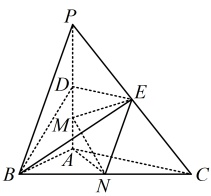

解：（1）证法1：（若用几何法证线面平行，需先找线线平行，怎么找？若无思路，可尝试逆推，假设\(MN//\)平面\(BDE\)，则经过直线\(MN\)的某平面与平面\(BDE\)相交，交线应与\(MN\)平行，观察发现\(MN\)和点\(P\)位于平面\(BDE\)的两侧，平面\(PMN\)与平面\(BDE\)的交线容易作出，于是先作出该交线，它就是我们要找的与\(MN\)平行的直线）如图，连接\(PN\)交\(BE\)于点\(G\)，连接\(DG\)，因为\(E\)，\(N\)分别为\(PC\)，\(BC\)的中点，所以\(G\)为\(\triangle PBC\)的重心，故\(\frac{PG}{PN}=\frac{2}{3}\)，又由题意，\(PD=\frac{1}{2}PA=1\)，\(PM=\frac{3}{4}PA=\frac{3}{2}\)，所以\(\frac{PD}{PM}=\frac{2}{3}=\frac{PG}{PN}\)，故\(DG\parallel MN\)，结合\(DG\subset\)平面\(BDE\)，\(MN\not\subset\)平面\(BDE\)可得\(MN//\)平面\(BDE\)。
证法2：（三棱锥中本身就有三条两两垂直的直线，故也可考虑建立坐标系，用向量法证 \(MN \parallel\) 平面 \(BDE\)）
以 \(A\) 为原点建立如图所示的空间直角坐标系，则 \(M\left(0,0,\frac{1}{2}\right)\)，\(N\left(\frac{1}{2},1,0\right)\)，\(B(1,0,0)\)，\(D(0,0,1)\)，\(E(0,1,1)\)，
所以 \(\overrightarrow{MN}=\left(\frac{1}{2},1,-\frac{1}{2}\right)\)，\(\overrightarrow{BD}=(-1,0,1)\)，\(\overrightarrow{DE}=(0,1,0)\)，设平面 \(BDE\) 的法向量为 \(\boldsymbol{m}=(x,y,z)\)，
则 \(\begin{cases}\boldsymbol{m}\cdot\overrightarrow{BD}=-x+z=0\\ \boldsymbol{m}\cdot\overrightarrow{DE}=y=0\end{cases}\)，令 \(x=1\)，则 \(y=0\)，\(z=1\)，所以 \(\boldsymbol{m}=(1,0,1)\) 是平面 \(BDE\) 的一个法向量，
因为 \(\overrightarrow{MN}\cdot\boldsymbol{m}=\frac{1}{2}\times1+1\times0+\left(-\frac{1}{2}\right)\times1=0\)，所以 \(\overrightarrow{MN}\perp\boldsymbol{m}\)，又 \(MN\not\subset\) 平面 \(BDE\)，所以 \(MN\parallel\) 平面 \(BDE\)。
（2）（求点 \(N\) 到直线 \(ME\) 的距离，考虑代公式 \(d=\sqrt{MN}^2-(\overrightarrow{MN}\cdot\boldsymbol{u})^2\)，下面先求直线 \(ME\) 的单位方向向量 \(\boldsymbol{u}\)）
由（1）可得 \(\overrightarrow{ME}=\left(0,1,\frac{1}{2}\right)\)，所以直线 \(ME\) 的一个单位方向向量为
 \[\boldsymbol{u}=\frac{\overrightarrow{ME}}{\left|\overrightarrow{ME}\right|}=\frac{\overrightarrow{ME}}{\sqrt{1^{2}+\left(\frac{1}{2}\right)^{2}}}=\frac{2}{\sqrt{5}}\overrightarrow{ME}=\left(0,\frac{2}{\sqrt{5}},\frac{1}{\sqrt{5}}\right),\] 
由点到直线的距离公式，点 \(N\) 到直线 \(ME\) 的距离 \(d = \sqrt{\overrightarrow{MN}^2 - (\overrightarrow{MN} \cdot \boldsymbol{u})^2}\)

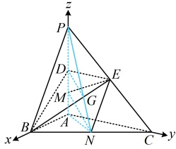

 \[=\sqrt{\left(\frac{1}{2}\right)^{2}+1^{2}+\left(-\frac{1}{2}\right)^{2}-\left[\frac{1}{2}\times0+1\times\frac{2}{\sqrt{5}}+\left(-\frac{1}{2}\right)\times\frac{1}{\sqrt{5}}\right]^{2}}=\frac{\sqrt{105}}{10}.\] 
【反思】设 \(N\) 为直线 \(l\) 外一点，\(M\) 为直线 \(l\) 上任意一点，\(u\) 为直线 \(l\) 的一个单位方向向量，则点 \(N\) 到直线 \(l\) 的距离 \(d = \sqrt{\overrightarrow{MN}^2 - (\overrightarrow{MN} \cdot \boldsymbol{u})^2}\)。

#### 任务 29｜例20

【例 20】在四棱柱 \(ABCD - A_1B_1C_1D_1\) 中，底面 \(ABCD\) 为梯形，\(AB \parallel CD\)，\(A_1A\) ⊥ 平面 \(ABCD\)，\(AD \perp AB\)，且 \(AB = AA_1 = 2\)，\(AD = DC = 1\)，\(M\)，\(N\) 分别是 \(DD_1\)，\(B_1C_1\) 的中点。
（1）求证： \(D_{1}N\) //平面 \(CB_{1}M\)；

（2）求点B到平面 \(CB_{1}M\)的距离.
解：（1）证法1：（证线面平行，先找线线平行．观察图形可发现过M容易作 \(D_1N\)的平行线，且作出来的D像平行四边形，且G像 \(B_1C\)的中点，思路就有了）
如图，取 \(B_1C\)中点G，连接NG，MG，因为N为 \(B_1C_1\)的中点，所以 \(NG \parallel CC_1\)且 \(NG = \frac{1}{2}CC_1\)，
又M为 \(DD_1\)的中点，所以由棱柱的性质， \(D_1M \parallel CC_1\)且 \(D_1M = \frac{1}{2}CC_1\)，从而 \(NG \parallel D_1M\)且 \(NG = D_1M\)，
故四边形 \(D_1MGN\)是平行四边形，所以 \(D_1N \parallel MG\)，
结合 \(D_1N \not\subset\)平面 \(CB_1M\)， \(MG \subset\)平面 \(CB_1M\)可得 \(D_1N \parallel\)平面 \(CB_1M\)。
 \[D_{1}NGM\] 
证法2：（由题设条件可发现，图中本身就有三条两两垂直的直线，故也可考虑建系，用向量法处理）
以  \(A\) 为原点建立如图所示的空间直角坐标系，则  \(D_1(0,1,2)\)， \(B_1(2,0,2)\)， \(C_1(1,1,2)\)， \(C(1,1,0)\)， \(M(0,1,1)\)，
因为  \(N\) 是  \(B_1C_1\) 的中点，所以  \(N\left(\frac{3}{2},\frac{1}{2},2\right)\)，
故  \(\overrightarrow{D_1N} = \left(\frac{3}{2},-\frac{1}{2},0\right)\)， \(\overrightarrow{B_1C} = (-1,1,-2)\)， \(\overrightarrow{MC} = (1,0,-1)\)，
设平面 \(CB_1M\) 的法向量为 \(\boldsymbol{m} = (x, y, z)\)，则 \(\begin{cases} \boldsymbol{m} \cdot \overrightarrow{B_1C} = -x + y - 2z = 0 \\ \boldsymbol{m} \cdot \overrightarrow{MC} = x - z = 0 \end{cases}\)，
令 \(x=1\)，则 \(y=3\)，\(z=1\)，所以 \(\boldsymbol{m} = (1, 3, 1)\) 是平面 \(CB_1M\) 的一个法向量，
因为 \(\overrightarrow{D_1N} \cdot \boldsymbol{m} = \frac{3}{2} \times 1 + \left(-\frac{1}{2}\right) \times 3 + 0 \times 1 = 0\)，所以 \(\overrightarrow{D_1N} \perp \boldsymbol{m}\)，
又 \(D_1N \not\subset\) 平面 \(CB_1M\)，所以 \(D_1N \parallel\) 平面 \(CB_1M\)。
（2）（求点 \(B\) 到平面 \(CB_1M\) 的距离，可以套用公式 \(d = \frac{|BC \cdot m|}{|m|}\)，已有 \(m\) 的坐标，下面先求 \(\overrightarrow{BC}\)）
由图可知，\(B(2,0,0)\)，所以 \(\overrightarrow{BC} = (-1,1,0)\)，由（1）的证法 2 可知平面 \(CB_1M\) 的一个法向量为 \(\boldsymbol{m} = (1,3,1)\)，
所以由点到平面的距离公式，点 \(B\) 到平面 \(CB_1M\) 的距离 \(d = \frac{| \overrightarrow{BC} \cdot \boldsymbol{m} |}{| \boldsymbol{m} |} = \frac{| -1 \times 1 + 1 \times 3 + 0 \times 1 |}{\sqrt{1^2 + 3^2 + 1^2}} = \frac{2\sqrt{11}}{11}\)。

【反思】设 \(P\) 在平面 \(\alpha\) 外，\(Q\) 在 \(\alpha\) 内，\(n\) 为 \(\alpha\) 的法向量，则 \(P\) 到 \(\alpha\) 的距离 \(d = \frac{|PQ \cdot n|}{|n}\)，我们常用此公式来求点到平面的距离。除此之外，异面直线的距离（公垂线段的长）也可用此公式计算，我们来看下面的变式。

##### 任务 30｜紧跟：变式（对应例20，无解答）

【变式】在长方体 \(ABCD-A_1B_1C_1D_1\) 中，\(AA_1=1\)，\(AB=2\)，\(AD=3\)，\(E\) 为 \(AB\) 的中点，则异面直线
DE 与  \(D_{1}C\) 的距离为 ___.

#### 方法检查｜`1.4-distance-check-1` 异面直线距离转化检查（不计入教材题量）

设 a、b 为异面直线。请只写方法链：怎样把 a、b 的距离转化为“b 上一点到过 a 且平行 b 的平面”的距离，公垂线段的方向如何取；再说明为什么不能直接套点到直线距离公式。

> 独立作答，不提供答案；未通过时停在本循环。

### 当前动作 3：做本批对应 A/B/C 习题（无答案）

> 本批配套题承接：类型Ⅳ 求距离

#### B组

##### 任务 31｜B8

8.（2025 · 重庆模拟）

如图，在三棱柱  \(ABC-A_{1}B_{1}C_{1}\) 中，平面  \(A_{1}B_{1}BA\) ⊥ 平面 ABC，侧面  \(A_{1}B_{1}BA\) 为菱形， \(\angle ABB_{1}=\frac{\pi}{3}\)， \(AB_{1}\perp AC\)，AB=AC=2。

（1）求证： \(A_{1}B\perp\) 平面 \(AB_{1}C\)

（2）求直线 \(BB_{1}\)与 \(CC_{1}\)的距离；

（3）求平面 \(CC_{1}B_{1}\)与平面 \(AA_{1}B_{1}\)所成二面角的平面角的正弦值.

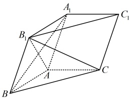

#### C组

##### 任务 32｜C9

9. （2024·陕西模拟）

正四棱锥 S-ABCD 中，O 为顶点 S 在底面 ABCD 内的射影，P 为侧棱 SD 的中点，且  \(SO = OD = \sqrt{2}\)，则异面直线 PC 与 BD 的距离为（ ）

A.  \(\frac{\sqrt{10}}{10}\) B.  \(\frac{\sqrt{10}}{5}\) C.  \(\frac{\sqrt{5}}{10}\) D.  \(\frac{\sqrt{5}}{5}\)

### 当前动作 4：本批验收

- [ ] 能闭卷复述本批方法及适用条件。
- [ ] 教学例题能解释关键步骤，不只是记住结论。
- [ ] 直属变式和对应习题有独立过程。
- [ ] 若使用过提示或答案，已用未见题或延迟闭卷复测补证。
- [ ] 当前循环没有未解决的第一断点。

> **推进门：** 本批例题理解、直属变式、对应习题和独立复测证据齐全后才可进入下一批；提示或看答案的题必须以未见题或延迟闭卷复测补证。
> **失败处理：** 只报告第一处断点并给最小提示；不得提前展示下一批或当前题答案。
> 未满足推进门时停在本循环，不展示下一循环的当前动作。

---

## 循环 6/7：类型Ⅴ 动点与点线在面内判断

### 当前动作 1：看本批视频

- `3.1.4.8` 3.1.4.8 动点问题
  - 文件：`C:\Users\poyi\Downloads\课程合集\3.1 空间向量与立体几何\3.1.4.8 动点问题.mp4`
- 前置方法必须已通过：`direction_normal, line_plane_angle, plane_plane_angle, distance`

> 看完本批视频后停下来，不要提前观看下一循环。

### 当前动作 2：按本批做题路径推进

本批类型：
- 类型Ⅴ 点线在面内判断：点线位置关系与共面判断

本批补充桥接：
- **动态二面角三角参数化** (`bridge-1.4-dihedral-trig`)
  - 固定公共棱，选取垂直于公共棱的截面，把动态位置用角参数或长度参数表示。
  - 分别写出两个平面在截面中的方向，明确所求是锐二面角还是有向夹角。
  - 用正弦、余弦或点积得到参数方程，保留参数的几何定义域。
  - 对可能出现的多解做位置筛选，并用一条原始几何关系回代。
- **补形与辅助平行体** (`bridge-micro-completion`)
  - 识别题目中缺少的平行边、平行面或公共顶点，先写出补形目标。
  - 证明补出的线或面确实存在，再把新增关系写成向量等式或比例关系。
  - 用补形后的平行体统一处理长度、角度或法向量，标注哪些量来自原图。
  - 删除辅助线后复述一次，确认结论没有依赖虚构的额外条件。

#### 方法类型｜类型Ⅴ 点线在面内判断：点线位置关系与共面判断

#### 任务 33｜例21

【例 21】（2020·新课标Ⅲ卷（节选））如图，在长方体 \(ABCD-A_1B_1C_1D_1\) 中，点 \(E\)，\(F\) 分别在棱 \(DD_1\)，\(BB_1\) 上，且 \(2DE = ED_1\)，\(BF = 2FB_1\)，证明：点 \(C_1\) 在平面 \(AEF\) 内。
证法1：（观察图形发现  \(EC_1 \parallel AF\)，故可通过证明这一平行关系来证结论成立）
如图，在  \(AA_1\) 上取点  \(G\)，使得  \(A_1G = 2AG\)，连接  \(B_1G\)， \(EG\)， \(EC_1\)，

则  \(AG \parallel B_{1}F\) 且  \(AG = B_{1}F\)，所以四边形  \(AGB_{1}F\) 为平行四边形，故  \(AF \parallel B_{1}G\)，
又  \(2DE = ED_{1}\)，所以  \(EG \parallel A_{1}D_{1} \parallel B_{1}C_{1}\) 且  \(EG = A_{1}D_{1} = B_{1}C_{1}\)，故  \(EGB_{1}C_{1}\) 为平行四边形，
所以  \(EC_{1} \parallel B_{1}G\) ，从而  \(EC_{1} \parallel AF\) ，故 A，E， \(C_{1}\)，F 四点共面，
所以点  \(C_{1}\) 在平面 AEF 内.
证法2：（点 \(C_1\)在平面 \(AEF\)内 \(\Leftrightarrow C_1\overrightarrow{A}\)是平面 \(AEF\)内的向量 \(\Leftrightarrow \overrightarrow{C_1A}\perp\)平面 \(AEF\)的法向量，故也可通过证明 \(\overrightarrow{C_1A}\perp\)平面 \(AEF\)的法向量来证点 \(C_1\)在平面 \(AEF\)内）
以 \(C_1\)为原点建立如图所示的空间直角坐标系，设 \(AD=1\)， \(CD=a\)， \(CC_1=3b\)，
则 \(A(a,1,3b)\)， \(E(a,0,2b)\)， \(F(0,1,b)\)， \(C_1(0,0,0)\)，
所以 \(\overrightarrow{C_1A}=(a,1,3b)\)， \(\overrightarrow{EA}=(0,1,b)\)， \(\overrightarrow{FA}=(a,0,2b)\)，
设平面 \(AEF\)的法向量为 \(\boldsymbol{m}=(x,y,z)\)，则 \(\begin{cases}\boldsymbol{m}\cdot\overrightarrow{EA}=y+bz=0\\\boldsymbol{m}\cdot\overrightarrow{FA}=ax+2bz=0\end{cases}\)，
令 \(x=2b\)，则 \(\begin{cases}y=ab\\z=-a\end{cases}\)，所以 \(\boldsymbol{m}=(2b,ab,-a)\)是平面 \(AEF\)的一个法向量，
从而 \(\overrightarrow{C_1A}\cdot\boldsymbol{m}=a\cdot2b+1\cdot ab+3b\cdot(-a)=0\)，故点 \(C_1\)在平面 \(AEF\)内.

【反思】判断空间中的点 \(P\) 是否在平面 \(\alpha\) 内，可在 \(\alpha\) 内另取一点 \(Q\)，看看 \(\overrightarrow{PQ}\) 是不是 \(x\) 是 \(\alpha\) 内的向量。若是，则应有 \(\overrightarrow{PQ} \cdot n = 0\)；否则，\(\overrightarrow{PQ} \cdot n \neq 0\)，其中 \(n\) 为平面 \(\alpha\) 的法向量。

#### 任务 34｜例22

【例 22】（2018·北京卷）如图，三棱柱 \(ABC-A_1B_1C_1\) 中，\(CC_1 \perp\) 平面 \(ABC\)，\(D\)，\(E\)，\(F\)，\(G\) 分别为 \(AA_1\)，\(AC\)，\(A_1C_1\)，\(BB_1\) 的中点，\(AB = BC = \sqrt{5}\)，\(AC = AA_1 = 2\)。
（1）求证： \(AC \perp\) 平面 BEF；
（2）求二面角 B-CD-C_{1} 的余弦值：
（3）证明：直线FG与平面BCD相交.

解：(1)（证 \(AC \perp\) 面 \(BEF\)，需要证明 \(AC\) 垂直于面 \(BEF\) 内的两条相交直线，选哪两条？
结合图形和已知条件可发现，容易证明 \(AC \perp EF\) 和 \(AC \perp BE\)，故选 \(EF\) 和 \(BE\)）
在三棱柱 \(ABC-A_1B_1C_1\) 中，\(E\)，\(F\) 分别为 \(AC\)，\(A_1C_1\) 的中点，所以 \(EF \parallel CC_1\)，
因为 \(CC_1 \perp\) 平面 \(ABC\)，所以 \(EF \perp\) 平面 \(ABC\)，又 \(AC \subset\) 平面 \(ABC\)，所以 \(AC \perp EF\)，
因为 \(AB = BC = \sqrt{5}\)，所以 \(AC \perp BE\)，因为 \(BE\)，\(EF \subset\) 平面 \(BEF\) 且 \(BE \cap EF = E\)，所以 \(AC \perp\) 平面 \(BEF\)
（2）（求二面角，考虑建系。已有 \(EA\)，\(EB\)，\(EF\) 两两垂直，可直接建系处理）
以 \(E\) 为原点建立如图所示的空间直角坐标系，则 \(C(-1,0,0)\)，\(D(1,0,1)\)，
在 \(\triangle AEB\) 中，\(EB = \sqrt{AB^2 - AE^2} = \sqrt{(\sqrt{5})^2 - 1^2} = 2\)，所以 \(B(0,2,0)\)，故 \(\overrightarrow{CB} = (1,2,0)\)，\(\overrightarrow{CD} = (2,0,1)\)，
设平面 \(BCD\) 的法向量为 \(\boldsymbol{m} = (x,y,z)\)，则 \(\begin{cases} \boldsymbol{m} \cdot \overrightarrow{CB} = x + 2y = 0 \\ \boldsymbol{m} \cdot \overrightarrow{CD} = 2x + z = 0 \end{cases}\)，令 \(x = 2\)，则 \(y = -1\)，\(z = -4\)，
所以 \(\boldsymbol{m} = (2, -1, -4)\) 是平面 \(BCD\) 的一个法向量，由图可知 \(\boldsymbol{n} = (0,1,0)\) 是平面 \(CDC_1\) 的一个法向量，
 \[\cos<\boldsymbol{m},\boldsymbol{n}>=\frac{\boldsymbol{m}\cdot\boldsymbol{n}}{\left|\boldsymbol{m}\right|\cdot\left|\boldsymbol{n}\right|}=\frac{2\times0+(-1)\times1+(-4)\times0}{\sqrt{2^{2}+(-1)^{2}+(-4)^{2}}\times1}=-\frac{\sqrt{21}}{21}.\] 
由图可知，二面角 B-CD-C_{1} 为钝角，故其余弦值为  \(-\frac{\sqrt{21}}{21}\)
（3）（怎样证直线与平面相交？直线与平面相交意味着直线上的向量不在平面内，那么它与平面的法向量不垂直，故可按此证明直线与平面相交）

由图可知， \(F(0,0,2)\)， \(G(0,2,1)\)，所以 \(\overrightarrow{FG}=(0,2,-1)\)，
由（2）可知 \(m=(2,-1,-4)\)是平面 \(BCD\)的一个法向量，
因为 \(\overrightarrow{FG}\cdot m=2\neq0\)，所以 \(\overrightarrow{FG}\)与 \(m\)不垂直，故 \(FG\)与平面 \(BCD\)相交.
【反思】直线与平面有线在面内、线面平行、线面相交三种位置关系，可通过计算直线的方向向量  \(\boldsymbol{s}\) 与平面法向量  \(\boldsymbol{n}\) 的数量积来判断二者的位置关系， \(\boldsymbol{s} \cdot \boldsymbol{n} = 0 \Leftrightarrow\) 线面平行或线在面内， \(\boldsymbol{s} \cdot \boldsymbol{n} \neq 0 \Leftrightarrow\) 线面相交。

- 本批例题没有直属变式，按路线进入对应配套题。

#### 方法检查｜`1.4-in-plane-check-1` 点线在面内判断方法链（不计入教材题量）

设点 G 在平面 AEF 内，且由两个参数 λ、μ 表示为位置向量分解。请写出判断“点是否在面内”的三步：取面内两不共线向量作基、位置向量唯一分解、比较系数；再说明参数的定义域从哪里来，以及共线情形为什么要单独检查。

> 独立作答，不提供答案；未通过时停在本循环。

### 当前动作 3：做本批对应 A/B/C 习题（无答案）

> 本批配套题承接：类型Ⅴ 点线在面内判断

#### C组

##### 任务 35｜C11

11. (2019 · 北京卷)

如图，在四棱锥 P-ABCD 中， \(PA \perp\) 平面 ABCD， \(AD \perp CD\)， \(AD \parallel BC\)，PA = AD = CD = 2，BC = 3，E 为 PD 的中点，点 F 在 PC 上，且  \(\frac{PF}{PC} = \frac{1}{3}\).

（1）求证： \(CD \perp\) 平面 PAD；

（2）求二面角 F-AE-P 的余弦值；

（3）设点 G 在 PB 上，且  \(\frac{PG}{PB} = \frac{2}{3}\)，判断直线 AG 是否在平面 AEF 内，说明理由.

### 当前动作 4：本批验收

- [ ] 能闭卷复述本批方法及适用条件。
- [ ] 教学例题能解释关键步骤，不只是记住结论。
- [ ] 直属变式和对应习题有独立过程。
- [ ] 若使用过提示或答案，已用未见题或延迟闭卷复测补证。
- [ ] 当前循环没有未解决的第一断点。

> **推进门：** 本批例题理解、直属变式、对应习题和独立复测证据齐全后才可进入下一批；提示或看答案的题必须以未见题或延迟闭卷复测补证。
> **失败处理：** 只报告第一处断点并给最小提示；不得提前展示下一批或当前题答案。
> 未满足推进门时停在本循环，不展示下一循环的当前动作。

---

## 循环 7/7：翻折守恒与存在性综合

### 当前动作 1：看本批视频

- 本循环没有新增视频，复用已通过的前置方法。
- 前置方法必须已通过：`moving_point, plane_plane_angle, distance`

> 看完本批视频后停下来，不要提前观看下一循环。

### 当前动作 2：按本批做题路径推进

本批补充桥接：
- **翻折守恒与折后平面角** (`bridge-1.4-folding`)
  - 把折痕、折前平面和折后平面分别标清，先列出翻折保持的长度和角度。
  - 在过折痕且垂直于折痕的截面中构造平面角，避免直接把空间角当平面角。
  - 把折后条件翻译为向量点积、法向量或三角关系，并保留参数范围。
  - 用一个只改变折叠位置的变式检查：哪些量守恒、哪些量会改变。
- **动态二面角三角参数化** (`bridge-1.4-dihedral-trig`)
  - 固定公共棱，选取垂直于公共棱的截面，把动态位置用角参数或长度参数表示。
  - 分别写出两个平面在截面中的方向，明确所求是锐二面角还是有向夹角。
  - 用正弦、余弦或点积得到参数方程，保留参数的几何定义域。
  - 对可能出现的多解做位置筛选，并用一条原始几何关系回代。
- **存在性双参数化** (`bridge-micro-existence`)
  - 分别给两个动点设参数 λ、μ，并在第一行写出各自的几何范围。
  - 把共线、距离、角度或垂直条件逐项变成方程，保持每个参数的来源可追踪。
  - 先解代数候选，再逐个筛选线段范围、非退化和图形位置条件。
  - 用一个只含两个参数的自造存在性问题练习‘候选—筛选—回代’。

- 本批例题没有直属变式，按路线进入对应配套题。

#### 方法检查｜`1.4-folding-check-1` 翻折守恒检查（不计入教材题量）

菱形沿对角线折叠成三棱锥。请列出折前折后仍保持的几何量（长度、角度、共线关系）与会改变的量；再口述为什么折后证明 BD 与某线的垂直关系时，必须先从折前图形确认 BD 与折痕的垂直关系。

> 独立作答，不提供答案；未通过时停在本循环。

#### 方法检查｜`1.4-existence-check-1` 存在性双参数化检查（不计入教材题量）

设 G 是截面 AEF 内一点（双参数表示），要求 DG 垂直于平面 AEF。请写出方法链：参数表示 G → 垂直条件化为方程 → 判断解是否落在截面内；再列出判断“存在且唯一/不存在”时分别需要核验什么。

> 独立作答，不提供答案；未通过时停在本循环。

### 当前动作 3：做本批对应 A/B/C 习题（无答案）

#### C组

##### 任务 36｜C10

10. （2024·陕西模拟）

已知边长为4的菱形 \(ABCD\)（如图1），\(\angle BAD=\frac{\pi}{3}\)，\(AC\) 与 \(BD\) 相交于点 \(O\)，\(E\) 为线段 \(AO\) 上一点，将 \(\triangle ABD\) 沿 \(BD\) 折叠成三棱锥 \(A-BCD\)（如图2）。

图1

图2

（1）证明： \(BD \perp CE\)；

（2）若三棱锥 A-BCD 的体积为 8，二面角 B-CE-O 的余弦值为  \(\frac{\sqrt{15}}{10}\)，求 OE 的长.

##### 任务 37｜C12

12. （2024·新疆乌鲁木齐一模）

如图，在四棱锥 P-ABCD 中，底面 ABCD 为正方形， \(PA \perp\) 平面 ABCD，PA = AB，点 E，F 分别是棱 PB，BC 的中点.

（1）求直线 AF 与平面 PBC 所成角的正弦值；

（2）在截面 AEF 内是否存在点 G，使 DG ⊥ 平面 AEF？说明理由.

### 当前动作 4：本批验收

- [ ] 能闭卷复述本批方法及适用条件。
- [ ] 教学例题能解释关键步骤，不只是记住结论。
- [ ] 直属变式和对应习题有独立过程。
- [ ] 若使用过提示或答案，已用未见题或延迟闭卷复测补证。
- [ ] 当前循环没有未解决的第一断点。

> **推进门：** 本批例题理解、直属变式、对应习题和独立复测证据齐全后才可进入下一批；提示或看答案的题必须以未见题或延迟闭卷复测补证。
> **失败处理：** 只报告第一处断点并给最小提示；不得提前展示下一批或当前题答案。
> 未满足推进门时停在本循环，不展示下一循环的当前动作。

---

## 小节收尾

所有循环通过后，再做未见近迁移；至少间隔 24 小时后执行闭卷复测。
课程看完、题包可消费或同会话提示后答对，都不能单独替代掌握证据。
