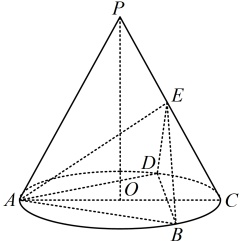
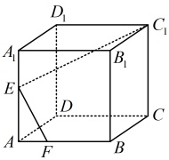
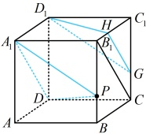
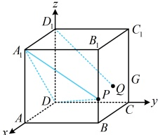
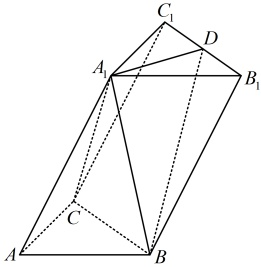
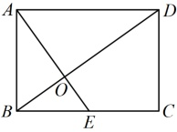
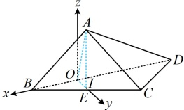
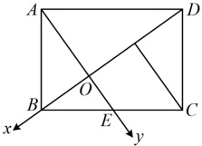
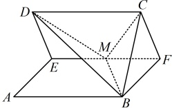

# 第4节 微专题1：立体几何综合题：按课程循环学习路径

> 状态：`VERIFIED`  
> 共 6 个学习循环；教学例题 7 道、直接变式 1 道、A/B/C 习题 8 道。  
> 这是一张完整路线图。实际学习时一次只执行“当前循环”的一个动作，本批未通过不得进入下一批。
> `任务 01` 起为整节连续学习序号；例题、变式和 A/B/C 标签保留教材原编号，教材例号跳跃不代表漏题。

## 执行规则

1. 用户报出要学的小节后，先给当前循环需要看的视频，不一次性倾倒整节任务。
2. 视频看完，立即学习本批知识点和右侧例题；例题教学阶段允许看完整解法。
3. 随后独立完成本批直属变式和对应 A/B/C 习题，作答阶段隐藏答案。
4. 只检查第一处断点并给最小提示；蒙对、提示后答对或看答案不算本批独立通过。
5. 本批例题、直属变式、配套题和独立复测证据齐全后，才进入下一循环。

---

## 循环 1/6：线上动点

### 当前动作 1：看本批视频

- `3.1.4.8` 3.1.4.8 动点问题
  - 文件：`C:\Users\poyi\Downloads\课程合集\3.1 空间向量与立体几何\3.1.4.8 动点问题.mp4`

> 看完本批视频后停下来，不要提前观看下一循环。

### 当前动作 2：按本批做题路径推进

本批类型：
- 类型Ⅰ 线上动点：共线设参、距离和线面角

本批补充桥接：
- **空间动点单变量化配方** (`bridge-1.2-single-variable`)
  - 先判断动点所在的线段或直线，再用 P=A+λv 表示并写出 λ 的几何定义域。
  - 把距离、数量积或夹角条件逐一化成 λ 的表达式，保留原始几何约束。
  - 对得到的函数先看定义域，再做配方、判别式或单调性判断。
  - 若有两个动点，先只固定其中一个练习单变量流程，再升级到双参数化。

#### 方法类型｜类型Ⅰ 线上动点：共线设参、距离和线面角

#### 任务 01｜例1

【例 1】如图，P 为圆锥的顶点，O 是圆锥底面的圆心，AC 为底面直径， \(\triangle ABD\) 为底面圆 O 的内接正三角形，且边长为  \(\sqrt{3}\)，点 E 在母线 PC 上，且  \(AE = \sqrt{3}\)，CE = 1。
（1）求证：直线PO∥平面BDE；
（2）求证：平面 \(BED \perp\)平面 \(ABD\);
（3）已知 \(M\) 为线段 \(PO\) 上的一点，当直线 \(DM\) 与平面 \(ABE\) 所成角的正弦值为 \(\frac{2\sqrt{7}}{7}\) 时，求点 \(M\) 到平面 \(ABE\) 的距离。
解：（1）(要证线面平行，先找线线平行，由图可猜想 \(EF \parallel PO\)（点 \(F\) 的位置如下图所示），故尝试找设直线 \(AC\) 与 \(BD\) 交于点 \(F\)，连接 \(EF\)，由题意，\(\triangle ABD\) 是边长为 \(\sqrt{3}\) 的正三角形，\(O\) 是其外心，所以 \(F\) 是 \(BD\) 的中点，且 \(OA = \frac{2}{3}AF = \frac{2}{3} \times \frac{\sqrt{3}}{2} \times \sqrt{3} = 1\)，\(OF = \frac{1}{2}OA = \frac{1}{2}\)，

所以 OC = 1，AC = 2，且 F 是 OC 的中点，又  \(AE = \sqrt{3}\)，CE = 1，所以  \(AE^2 + CE^2 = 4 = AC^2\)，故  \(AE \perp PC\)，且  \(\cos \angle ACE = \frac{CE}{AC} = \frac{1}{2}\)，所以  \(\angle ACE = 60^\circ\)，结合 PA = PC 可得  \(\triangle PAC\) 是正三角形，因为  \(AE \perp PC\)，所以 E 为 PC 中点，结合 F 为 OC 中点可得  \(EF \parallel PO\)，
因为  \(AE \perp PC\)，所以 E 为 PC 中点，结合 F 为 OC 中点可得  \(EF \parallel PO\)，因为  \(PO \not\subset\) 平面 BDE， \(EF \subset\) 平面 BDE，所以  \(PO \parallel\) 平面 BDE。
（2）由（1）得 EF∥PO，因为 PO⊥平面 ABD，所以 EF⊥平面 ABD，又 EF⊂平面 BED，所以平面 BED⊥平面 ABD.
（3）（条件涉及线面角，考虑建系，用向量法来翻译. 在圆锥中，常以圆锥的高为 z 轴建系）
以 O 为原点建立如图所示的空间直角坐标系，则  \(D\left(-\frac{\sqrt{3}}{2},\frac{1}{2},0\right)\)， \(A(0,-1,0)\)， \(B\left(\frac{\sqrt{3}}{2},\frac{1}{2},0\right)\)，
因为  \(\triangle PAC\) 是正三角形，所以  \(PO = PA \cdot \sin \angle PAO = 2 \sin 60^\circ = \sqrt{3}\)，故  \(E\left(0, \frac{1}{2}, \frac{\sqrt{3}}{2}\right)\)，
所以  \(\overrightarrow{AB} = \left( \frac{\sqrt{3}}{2}, \frac{3}{2}, 0 \right)\)， \(\overrightarrow{AE} = \left( 0, \frac{3}{2}, \frac{\sqrt{3}}{2} \right)\)，设平面  \(ABE\) 的法向量为  \(\boldsymbol{m} = (x, y, z)\)，则  \(\left\{ \begin{array}{l} \boldsymbol{m} \cdot \overrightarrow{AB} = \frac{\sqrt{3}}{2} x + \frac{3}{2} y = 0 \\ \boldsymbol{m} \cdot \overrightarrow{AE} = \frac{3}{2} y + \frac{\sqrt{3}}{2} z = 0 \end{array} \right.\)，令  \(x = \sqrt{3}\)，则  \(y = -1\)， \(z = \sqrt{3}\)，所以  \(\boldsymbol{m} = (\sqrt{3}, -1, \sqrt{3})\) 是平面  \(ABE\) 的一个法向量，
（求 DM 与平面 ABE 所成的角还差 M 的坐标，M 在线段 PO 上运动，只有 z 坐标会变，故可直接设 M 的坐标）
设  \(M(0,0,a)(0 \leq a \leq \sqrt{3})\)，则  \(\overrightarrow{DM} = \left( \frac{\sqrt{3}}{2}, -\frac{1}{2}, a \right)\)，设直线 DM 与平面 ABE 所成的角为  \(\theta\)，
则  \(\sin \theta = \left| \cos < \overrightarrow{DM}, \boldsymbol{m} > \right| = \frac{\left| \overrightarrow{DM} \cdot \boldsymbol{m} \right|}{\left| \overrightarrow{DM} \right| \cdot \left| \boldsymbol{m} \right|} = \frac{\left| 2 + \sqrt{3}a \right|}{\sqrt{1 + a^2} \times \sqrt{7}}\)，由题意， \(\sin \theta = \frac{2\sqrt{7}}{7}\)，
所以  \(\frac{\left| 2 + \sqrt{3}a \right|}{\sqrt{1 + a^2} \times \sqrt{7}} = \frac{2\sqrt{7}}{7}\)，解得： \(a = 0\) 或  \(4\sqrt{3}\)（不满足  \(0 \leq a \leq \sqrt{3}\)，舍去）
从而点  \(M\) 的坐标为  \((0, 0, 0)\)，故  \(\overrightarrow{AM} = (0, 1, 0)\)，
由点到平面的距离公式，点  \(M\) 到平面  \(ABE\) 的距离  \(d = \frac{\left| \overrightarrow{AM} \cdot \boldsymbol{m} \right|}{\left| \boldsymbol{m} \right|} = \frac{\sqrt{7}}{7}\)。
【反思】当点在直线上运动时，若直线较特殊（如本题的  \(M\) 在  \(z\) 轴上），则可直接设动点的坐标；若直线不特殊，那么就需要用共线向量定理，把动点的坐标化为单变量形式，方便后续计算，我们来看下面的变式。

##### 任务 02｜紧跟：变式（对应例1，无解答）

【变式】已知正四棱柱 \(ABCD-A_1B_1C_1D_1\) 中，\(AB=1\)，\(AA_1=\sqrt{3}\)，\(E\) 为棱 \(A_1B_1\) 的中点，\(P\) 为直线 \(EC\) 上一动点，求当点 \(P\) 到直线 \(BB_1\) 距离最短时，线段 \(EP\) 的长。

#### 方法检查｜`micro-moving-point-check-1` 线上动点共线设参检查（不计入教材题量）

设点 P 在直线 EC 上运动。请写出“共线设参”的一般写法：位置向量写成 E 加 t 倍方向向量的形式，并说明 t 的定义域、所求量（距离、线面角、最值）如何变成 t 的函数；只写方法链，不代入具体题目。

> 独立作答，不提供答案；未通过时停在本循环。

### 当前动作 3：做本批对应 A/B/C 习题（无答案）

> 本批配套题承接：类型Ⅰ 线上动点

#### B组

##### 任务 03｜B1

如图，在棱长为4的正方体  \(ABCD-A_{1}B_{1}C_{1}D_{1}\) 中，点 E，F 分别在棱  \(AA_{1}\) 和 AB 上，且  \(C_{1}E \perp EF\)，则 AF 的最大值为（ ）

A.  \(\frac{1}{2}\) B. 1 C.  \(\frac{3}{2}\) D. 2

### 当前动作 4：本批验收

- [ ] 能闭卷复述本批方法及适用条件。
- [ ] 教学例题能解释关键步骤，不只是记住结论。
- [ ] 直属变式和对应习题有独立过程。
- [ ] 若使用过提示或答案，已用未见题或延迟闭卷复测补证。
- [ ] 当前循环没有未解决的第一断点。

> **推进门：** 本批例题理解、直属变式、对应习题和独立复测证据齐全后才可进入下一批；提示或看答案的题必须以未见题或延迟闭卷复测补证。
> **失败处理：** 只报告第一处断点并给最小提示；不得提前展示下一批或当前题答案。
> 未满足推进门时停在本循环，不展示下一循环的当前动作。

---

## 循环 2/6：向量线性回避坐标

### 当前动作 1：看本批视频

- `3.1.3.3` 3.1.3.3 直线的方向向量与平面的法向量
  - 文件：`C:\Users\poyi\Downloads\课程合集\3.1 空间向量与立体几何\3.1.3.3 直线的方向向量与平面的法向量.mp4`
- `3.1.4.1` 3.1.4.1平行垂直证明
  - 文件：`C:\Users\poyi\Downloads\课程合集\3.1 空间向量与立体几何\3.1.4.1平行垂直证明.mp4`

> 看完本批视频后停下来，不要提前观看下一循环。

### 当前动作 2：按本批做题路径推进

本批类型：
- 类型Ⅱ 向量线性回避坐标：斜棱柱/四棱锥中用向量线性式避免硬写坐标

#### 方法类型｜类型Ⅱ 向量线性回避坐标：斜棱柱/四棱锥中用向量线性式避免硬写坐标

#### 任务 04｜例2

【例 2】（2019·浙江卷）如图，已知三棱柱  \(ABC-A_1B_1C_1\) 中，平面  \(AA_1C_1C \perp\) 平面  \(ABC\)， \(\angle ABC = 90^\circ\)， \(\angle BAC = 30^\circ\)， \(A_1A = A_1C = AC\)， \(E\)， \(F\) 分别是  \(AC\)， \(A_1B_1\) 的中点。
（1）证明： \(EF \perp BC\)；

（2）求直线 EF 与平面  \(A_{1}BC\) 所成角的余弦值.
解法1：（1）（条件中有面  \(AA_1C_1C \perp\) 面  \(ABC\)，容易用面垂直的性质定理构造出面  \(ABC\) 的垂线，又有  \(\angle ABC = 90^\circ\)，所以建系比较方便，故可考虑建立空间直角坐标系，通过证明  \(\overrightarrow{EF} \cdot \overrightarrow{BC} = 0\) 来证明  \(EF \perp BC\)）连接  \(A_1E\)，因为  \(A_1A = A_1C = AC\)， \(E\) 为  \(AC\) 的中点，所以  \(A_1E \perp AC\)，又因为平面  \(AA_1C_1C \perp\) 平面  \(ABC\)， \(A_1E \subset\) 平面  \(AA_1C_1C\)，平面  \(AA_1C_1C \cap\) 平面  \(ABC = AC\)，所以  \(A_1E \perp\) 平面  \(ABC\)，以  \(A\) 为原点建立如图1所示的空间直角坐标系，其中  \(\overrightarrow{AE} = \overrightarrow{AC}\)
不妨设 \(AC=2\)，则 \(B\left(\frac{\sqrt{3}}{2},\frac{3}{2},0\right)\)，\(C(0,2,0)\)，\(E(0,1,0)\)，所以 \(\overrightarrow{BC}=\left(-\frac{\sqrt{3}}{2},\frac{1}{2},0\right)\)，
（要求 \(\overrightarrow{EF}\) 的坐标，还差 \(F\) 的坐标，\(F\) 是 \(A_1B_1\) 的中点，要写出 \(A_1\)，\(B_1\) 的坐标，再用中点公式写 \(F\) 的坐标吗？这样做可行，但写 \(B_1\) 的坐标偏麻烦，注意到斜棱柱中 \(\overrightarrow{A_1F}=\frac{1}{2}\overrightarrow{AB}\)，所以 \(\overrightarrow{EF}=\overrightarrow{EA_1}+\overrightarrow{A_1F}=\overrightarrow{EA_1}+\frac{1}{2}\overrightarrow{AB}\)，按此可回避写 \(B_1\) 的坐标，转化为用 \(E\)，\(A_1\)，\(A\)，\(B\) 的坐标直接求得 \(\overrightarrow{EF}\) 的坐标）
由图可知，\(A(0,0,0)\)，\(A_1(0,1,\sqrt{3})\)，所以 \(\overrightarrow{EF}=\overrightarrow{EA_1}+\overrightarrow{A_1F}=\overrightarrow{EA_1}+\frac{1}{2}\overrightarrow{AB}=(0,0,\sqrt{3})+\frac{1}{2}\left(\frac{\sqrt{3}}{2},\frac{3}{2},0\right)=\left(\frac{\sqrt{3}}{4},\frac{3}{4},\sqrt{3}\right)\)，
从而 \(\overrightarrow{EF}\cdot\overrightarrow{BC}=\frac{\sqrt{3}}{4}\times\left(-\frac{\sqrt{3}}{2}\right)+\frac{3}{4}\times\frac{1}{2}+\sqrt{3}\times0=0\)，故 \(\overrightarrow{EF}\perp\overrightarrow{BC}\)，所以 \(EF\perp BC\)。
(2) (已有 \(\overrightarrow{EF}\)，求直线EF与平面 \(A_{1}BC\)所成的角只差平面 \(A_{1}BC\)的法向量，下面先求此法向量)
由（1）可得  \(\overrightarrow{A_1B} = \left( \frac{\sqrt{3}}{2}, \frac{1}{2}, -\sqrt{3} \right)\)，设平面  \(A_1BC\) 的法向量  \(\boldsymbol{m} = (x, y, z)\)，则  \(\begin{cases} \boldsymbol{m} \cdot \overrightarrow{A_1B} = \frac{\sqrt{3}}{2}x + \frac{1}{2}y - \sqrt{3}z = 0 \\ \boldsymbol{m} \cdot \overrightarrow{BC} = -\frac{\sqrt{3}}{2}x + \frac{1}{2}y = 0 \end{cases}\)，
令  \(x = 1\)，则  \(\begin{cases} y = \sqrt{3} \\ z = 1 \end{cases}\)，所以  \(\boldsymbol{m} = (1, \sqrt{3}, 1)\) 是平面  \(A_1BC\) 的一个法向量，设直线  \(EF\) 与平面  \(A_1BC\) 所成的角为  \(\theta\)，
则  \(\sin \theta = \left| \cos < \overrightarrow{EF}, \boldsymbol{m} > \right| = \frac{\left| \overrightarrow{EF} \cdot \boldsymbol{m} \right|}{\left| \overrightarrow{EF} \right| \cdot \left| \boldsymbol{m} \right|} = \frac{\left| \frac{\sqrt{3}}{4} \times 1 + \frac{3}{4} \times \sqrt{3} + \sqrt{3} \times 1 \right|}{\sqrt{\left( \frac{\sqrt{3}}{4} \right)^2 + \left( \frac{3}{4} \right)^2 + (\sqrt{3})^2} \times \sqrt{1^2 + (\sqrt{3})^2 + 1^2}} = \frac{4}{5}\)，
所以直线  \(EF\) 与平面  \(A_1BC\) 所成角的余弦值  \(\cos \theta = \sqrt{1 - \sin^2 \theta} = \sqrt{1 - \left( \frac{4}{5} \right)^2} = \frac{3}{5}\)。
解法2：（1）（EF和BC是异面直线，证异面直线垂直，常考虑找线面垂直，怎么找？若无思路，可尝试逆推假设EF⊥BC，条件还给出面 \(AA_1C_1C\)⊥面ABC，由此不难证明 \(BC \perp A_1E\)，两者结合可得出BC⊥平面 \(A_1EF\)，故可通过证此线面垂直来证明 \(EF \perp BC\)）
如图2，连接 \(A_1E\)，因为 \(A_1A = A_1C = AC\)，且E为AC的中点，所以 \(A_1E \perp AC\)，
又平面 \(AA_1C_1C \perp\)平面 \(ABC\)， \(A_1E \subset\)平面 \(AA_1C_1C\)，平面 \(AA_1C_1C \cap\)平面 \(ABC = AC\)，所以 \(A_1E \perp\)平面 \(ABC\)，
因为 \(BC \subset\)平面 \(ABC\)，所以 \(BC \perp A_1E\)，由题意， \(\angle ABC = 90^\circ\)，所以 \(AB \perp BC\)，又 \(A_1B_1 \parallel AB\)，所以 \(BC \perp A_1B_1\)
结合  \(A_1B_1\)， \(A_1E \subset\) 平面  \(A_1EF\)， \(A_1B_1 \cap A_1E = A_1\) 可得  \(BC \perp\) 平面  \(A_1EF\)，因为  \(EF \subset\) 平面  \(A_1EF\)，所以  \(EF \perp BC\)。
（2）（第（1）问已证  \(BC \perp\) 面  \(A_1EF\)，故面  \(A_1BC \perp\) 面  \(A_1EF\)，由此容易结合面面垂直的性质定理过  \(E\) 作面  \(A_1BC\) 的垂线，故也可考虑用几何法处理。要对面  \(A_1BC \perp\) 面  \(A_1EF\) 用面面垂直的性质定理，需先找到交线，观察图形发现只要过  \(E\) 作  \(A_1F\) 的平行线，就能把面  \(A_1EF\) 扩大，从而看出它与面  \(A_1BC\) 的交线）
如图2，取  \(BC\) 中点  \(G\)，连接  \(EG\)， \(FG\)，因为  \(E\) 为  \(AC\) 中点，所以  \(EG \parallel AB\) 且  \(EG = \frac{1}{2}AB\)，
又  \(F\) 为  \(A_1B_1\) 中点，所以  \(A_1F \parallel AB\) 且  \(A_1F = \frac{1}{2}AB\)，从而  \(A_1F \parallel EG\) 且  \(A_1F = EG\)，故  \(A_1EGF\) 为平行四边形，
由（1）知  \(A_1E \perp\) 平面  \(ABC\)，又  \(EG \subset\) 平面  \(ABC\)，所以  \(A_1E \perp EG\)，故  \(A_1EGF\) 为矩形，
连接  \(A_1G\) 交  \(EF\) 于  \(O\)，过  \(E\) 作  \(ES \perp A_1G\) 于点  \(S\)，由（1）知  \(BC \perp\) 平面  \(A_1EG\)，又  \(ES \subset\) 平面  \(A_1EG\)，
所以  \(ES \perp BC\)，结合  \(ES \perp A_1G\)，且  \(BC\)， \(A_1G \subset\) 平面  \(A_1BC\)， \(BC \cap A_1G = G\) 可得  \(ES \perp\) 平面  \(A_1BC\)，
所以  \(\angle EOS\) 即为直线  \(EF\) 与平面  \(A_1BC\) 所成角，
（故只需求\(\cos\angle EOS\)，需要\(OS\)和\(OE\)的长，可到矩形\(A_1EGF\)中来分析几何关系，计算它们）
不妨设\(AA_1=A_1C=AC=2\)，则\(A_1E=\sqrt{3}\)，\(AB=AC\cdot\cos\angle BAC=2\cos30^\circ=\sqrt{3}\)，\(EG=\frac{1}{2}AB=\frac{\sqrt{3}}{2}\)，\(EF=A_1G=\sqrt{A_1E^2+EG^2}=\sqrt{(\sqrt{3})^2+\left(\frac{\sqrt{3}}{2}\right)^2}=\frac{\sqrt{15}}{2}\)，\(OE=\frac{1}{2}EF=\frac{\sqrt{15}}{4}\)，
由  \(S_{\triangle A_1EG} = \frac{1}{2} A_1E \cdot EG = \frac{1}{2} A_1G \cdot ES\) 可得  \(ES = \frac{A_1E \cdot EG}{A_1G} = \frac{\sqrt{3} \times \frac{\sqrt{3}}{2}}{\frac{\sqrt{15}}{2}} = \frac{\sqrt{15}}{5}\)，所以  \(OS = \sqrt{OE^2 - ES^2} = \frac{3\sqrt{3}}{4\sqrt{5}}\)，从而  \(\cos \angle EOS = \frac{OS}{OE} = \frac{3}{5}\)，故直线 EF 与平面  \(A_1BC\) 所成角的余弦值为  \(\frac{3}{5}\)。

图1

图2

【反思】在斜棱柱中，由于侧棱与底面不垂直，所以往往存在着一些顶点在另一底面上的射影不好找，导致这些点的坐标不好写（例如本题的 \(B_1\)），此时常不写这些点的坐标，而利用向量的共线以及线性运算直接求与之相关的向量的坐标，从而化繁为简（例如本题的 \(\overrightarrow{EF}\)就是按 \(\overrightarrow{EF} = \overrightarrow{EA_1} + \frac{1}{2}\overrightarrow{AB}\)求出的，而不是通过写 \(B_1\)的坐标来得到 \(F\)的坐标，再求 \(\overrightarrow{EF}\)的坐标）。若图形不是斜棱柱，不方便用上述方法解决点的坐标不好写的问题，又怎么办呢？我们来看下面的例3。

#### 任务 05｜例3

【例3】如图，已知四棱锥 \(P-ABCE\)中， \(AB=1\)， \(BC=2\)， \(BE=2\sqrt{2}\)， \(PA\perp\)平面 \(ABCE\)，平面 \(PAB\perp\)平面 \(PBC\)。
（1）证明： \(AB \perp BC\)
（2）若  \(PA = 2\sqrt{2}\)，且 AC = AE，G 为  \(\triangle PCE\) 的重心，求直线 CG 与平面 PBC 所成角的正弦值.

解：（1）（证线线垂直，往往先找线面垂直，若无思路，可尝试逆推. 假设  \(AB \perp BC\)，由  \(PA \perp\) 平面  \(ABCE\) 可得出  \(BC \perp PA\)，两者结合可得到  \(BC \perp\) 面  \(PAB\)，故可通过证此线面垂直来证  \(AB \perp BC\)）
如图，作  \(AD \perp PB\) 于  \(D\)，因为平面  \(PAB \perp\) 平面  \(PBC\)， \(AD \subset\) 平面  \(PAB\)，平面  \(PAB \cap\) 平面  \(PBC = PB\)，
所以  \(AD \perp\) 平面  \(PBC\)，因为  \(BC \subset\) 平面  \(PBC\)，所以  \(BC \perp AD\) ①，
又  \(PA \perp\) 平面  \(ABCE\)， \(BC \subset\) 平面  \(ABCE\)，所以  \(BC \perp PA\) ②，
由①②结合  \(AD\)， \(PA \subset\) 平面  \(PAB\)， \(AD \cap PA = A\) 可得  \(BC \perp\) 平面  \(PAB\)，因为  \(AB \subset\) 平面  \(PAB\)，所以  \(AB \perp BC\)。
（2）以 \(B\) 为原点建立如图所示的空间直角坐标系，则 \(B(0,0,0)\)，\(C(2,0,0)\)，\(P(0,1,2\sqrt{2})\)，
所以 \(\overrightarrow{BC} = (2,0,0)\)，\(\overrightarrow{BP} = (0,1,2\sqrt{2})\)，设平面 \(PBC\) 的法向量为 \(\boldsymbol{m} = (x,y,z)\)，则 \(\begin{cases} \boldsymbol{m} \cdot \overrightarrow{BC} = 2x = 0 \\ \boldsymbol{m} \cdot \overrightarrow{BP} = y + 2\sqrt{2}z = 0 \end{cases}\)，
令 \(y = 2\sqrt{2}\)，则 \(x = 0\)，\(z = -1\)，所以 \(\boldsymbol{m} = (0,2\sqrt{2},-1)\) 是平面 \(PBC\) 的一个法向量，
（还需 \(G\) 的坐标，\(G\) 为 \(\triangle PCE\) 的重心，可由 \(P, C, E\) 的坐标求出，故先找 \(E\) 的坐标，怎么找？含 \(E\) 的条件是 \(AC = AE\) 和 \(BE = 2\sqrt{2}\)，不易由此通过分析几何关系找 \(E\) 的坐标，可考虑直接设 \(E\) 的坐标，用它们建立关于所设坐标的方程组并求解）
由图可知，\(A(0,1,0)\)，\(AC = \sqrt{AB^2 + BC^2} = \sqrt{5}\)，设 \(E(a,b,0) (a > 0, b > 0)\)，
因为 \(\begin{cases} AC = AE \\ BE = 2\sqrt{2} \end{cases}\)，所以 \(\begin{cases} \sqrt{5} = \sqrt{a^2 + (b-1)^2} \\ \sqrt{a^2 + b^2} = 2\sqrt{2} \end{cases}\)，解得：\(\begin{cases} a = 2 \\ b = 2 \end{cases}\)，故 \(E(2,2,0)\)，
由重心坐标公式，\(x_G = \frac{x_P + x_C + x_E}{3} = \frac{4}{3}\)，\(y_G = \frac{y_P + y_C + y_E}{3} = 1\)，\(z_G = \frac{z_P + z_C + z_E}{3} = \frac{2\sqrt{2}}{3}\)，
所以 \(G\left(\frac{4}{3},1,\frac{2\sqrt{2}}{3}\right)\)，故 \(\overrightarrow{CG} = \left(-\frac{2}{3},1,\frac{2\sqrt{2}}{3}\right)\)，设直线 \(CG\) 与平面 \(PBC\) 所成的角为 \(\theta\)，
则 \(\sin \theta = \left|\cos < \boldsymbol{m}, \overrightarrow{CG} > \right| = \frac{\left|\boldsymbol{m} \cdot \overrightarrow{CG}\right|}{\left|\boldsymbol{m}\right| \cdot \left|\overrightarrow{CG}\right|} = \frac{4\sqrt{42}}{63}\)，所以直线 \(CG\) 与平面 \(PBC\) 所成角的正弦值为 \(\frac{4\sqrt{42}}{63}\)。

【反思】①通过本题我们给出了另一种找不好写的点的坐标的思路，即当建系后有点坐标不好找且无法像上面例2解法1的处理方法那样回避时，可直接设该点的坐标，翻译已知的各种条件（本题是长度）建立方程组，求解所设坐标；②在空间中，若 \(G\)为 \(\triangle ABC\)的重心，则点 \(G\)的坐标为 \(\left(\frac{x_A+x_B+x_C}{3},\frac{y_A+y_B+y_C}{3},\frac{z_A+z_B+z_C}{3}\right)\)。

- 本批例题没有直属变式，按路线进入对应配套题。

#### 方法检查｜`micro-vector-linear-check-1` 向量线性回避坐标检查（不计入教材题量）

点的坐标难以写出时（斜棱柱、非正交底面），请写出改用基向量线性运算的步骤：选基底 → 目标向量线性表示 → 用数量积把条件翻译成方程；再说明与直接建系相比，这种写法需要额外核验基底的什么条件。

> 独立作答，不提供答案；未通过时停在本循环。

### 当前动作 3：做本批对应 A/B/C 习题（无答案）

> 本批配套题承接：类型Ⅱ 向量线性回避坐标

#### B组

##### 任务 06｜B3

3.（2025·福建泉州期中）

如图，四棱锥 P-ABCD 的底面为正方形，PA⊥平面 ABCD，M 是 PC 的中点，PA=AB.

（1）求证： \(AM \perp\) 平面 PBD；

（2）设直线 AM 与平面 PBD 交于 O，求证： \(AO = 2OM\)

### 当前动作 4：本批验收

- [ ] 能闭卷复述本批方法及适用条件。
- [ ] 教学例题能解释关键步骤，不只是记住结论。
- [ ] 直属变式和对应习题有独立过程。
- [ ] 若使用过提示或答案，已用未见题或延迟闭卷复测补证。
- [ ] 当前循环没有未解决的第一断点。

> **推进门：** 本批例题理解、直属变式、对应习题和独立复测证据齐全后才可进入下一批；提示或看答案的题必须以未见题或延迟闭卷复测补证。
> **失败处理：** 只报告第一处断点并给最小提示；不得提前展示下一批或当前题答案。
> 未满足推进门时停在本循环，不展示下一循环的当前动作。

---

## 循环 3/6：立体几何综合题

### 当前动作 1：看本批视频

- `3.1.4.3` 3.1.4.3 向量夹角与直线夹角
  - 文件：`C:\Users\poyi\Downloads\课程合集\3.1 空间向量与立体几何\3.1.4.3 向量夹角与直线夹角.mp4`
- `3.1.4.4` 3.1.4.4 直线与平面的夹角
  - 文件：`C:\Users\poyi\Downloads\课程合集\3.1 空间向量与立体几何\3.1.4.4 直线与平面的夹角.mp4`
- `3.1.4.5` 3.1.4.5 平面与平面的夹角
  - 文件：`C:\Users\poyi\Downloads\课程合集\3.1 空间向量与立体几何\3.1.4.5 平面与平面的夹角.mp4`
- 前置方法必须已通过：`parallel_perpendicular, direction_normal`

> 看完本批视频后停下来，不要提前观看下一循环。

### 当前动作 2：按本批做题路径推进

本批类型：
- 类型Ⅲ 立体几何综合题：建系、翻译、最值和多问联动

#### 方法类型｜类型Ⅲ 立体几何综合题：建系、翻译、最值和多问联动

#### 任务 07｜例4

【例4】（2015·四川卷）如图，四边形ABCD和ADPQ均为正方形，它们所在的平面互相垂直，动点M在线段PQ上，E，F分别为AB，BC的中点.设异面直线EM与AF所成的角为 \(\theta\)，则 \(\cos\theta\)的最大值为___.
解析：图中本身就有  \(AB\)， \(AD\)， \(AQ\) 两两垂直，故可考虑建系，用向量法计算  \(\cos\theta\)，以  \(A\) 为原点建立如图所示的空间直角坐标系，设  \(AB = 2\)，则  \(A(0,0,0)\)， \(F(2,1,0)\)， \(E(1,0,0)\)，
M是线段  \(PQ\) 上的动点，由图可知其坐标只有  \(y\) 分量会变，故可直接设坐标，设  \(M(0,a,2)(0 \leq a \leq 2)\)，则  \(\overrightarrow{EM} = (-1,a,2)\)， \(\overrightarrow{AF} = (2,1,0)\)，
 \[\cos\theta=\left|\cos<\overrightarrow{E M},\overrightarrow{A F}>\right|=\frac{\left|\overrightarrow{E M}\cdot\overrightarrow{A F}\right|}{\left|\overrightarrow{E M}\right|\cdot\left|\overrightarrow{A F}\right|}=\frac{\left|-2+a\right|}{\sqrt{a^{2}+5}\cdot\sqrt{5}}=\frac{2-a}{\sqrt{5(a^{2}+5)}}\] 
上式结构较复杂，怎样分析其最大值？仔细观察会发现当 \(0 \leq a \leq 2\)时，分子和分母都非负，且二者都是单调的，故可尝试直接分析单调性，看能否得出最大值，

当\(0 \leq a \leq 2\)时，\(2 - a \geq 0\)，\(\sqrt{5(a^2 + 5)} > 0\)，且若\(a\)增大，则\(2 - a\)减小，\(\sqrt{5(a^2 + 5)}\)增大，所以\(\cos \theta = \frac{2 - a}{\sqrt{5(a^2 + 5)}}\)}减小，故当\(a = 0\)时，\(\cos \theta\)取得最大值\(\frac{2}{5}\)。
答案：\(\frac{2}{5}\)
【反思】在立体几何的小题中，一般首先考虑几何法，但若几何法较难，则也可以考虑建系，用向量法解决问题。在一些综合性问题中，向量法具有思维量小、流程化操作的特点，可以作为几何法以外的兜底方案。

#### 任务 08｜例5

【例5】（多选）在棱长为1的正方体\(ABCD-A_1B_1C_1D_1\)中，\(P\)为棱\(BB_1\)上一点，且\(B_1P=2PB\)，\(Q\)为正方形\(BB_1C_1C\)内一动点（含边界），则下列说法正确的是（ ）
A. 若\(D_1Q\parallel\)平面\(A_1PD\)，则动点\(Q\)的轨迹是一条长为\(\frac{2\sqrt{2}}{3}\)的线段
B. 存在点\(Q\)，使得\(D_1Q\perp\)平面\(A_1PD\)
C. 三棱锥\(Q-A_1PD\)的最大体积为\(\frac{5}{18}\)
D. 若\(D_1Q=\frac{\sqrt{6}}{2}\)，且\(D_1Q\)与平面\(A_1PD\)所成的角为\(\theta\)，则\(\sin\theta\)的最大值为\(\frac{\sqrt{33}}{33}\)
解析：A 项， \(D_1Q \parallel\) 平面  \(A_1PD\) 意味着  \(D_1Q\) 在过  \(D_1\) 且与平面  \(A_1PD\) 平行的平面内，故要找点  \(Q\) 的轨迹，只需作出该平面，再看它与正方形  \(BB_1C_1C\) 的交线，
如图 1，过  \(D_1\) 作  \(A_1P\) 的平行线交  \(CC_1\) 于点  \(G\)，则由  \(B_1P = 2PB\) 可知  \(C_1G = 2GC\)，
在正方体中， \(B_1C \parallel A_1D\)，过  \(G\) 作  \(B_1C\) 的平行线交  \(B_1C_1\) 于点  \(H\)，则  \(GH \parallel A_1D\)，
结合  \(D_1G \parallel A_1P\) 可得平面  \(D_1GH \parallel\) 平面  \(A_1PD\)，所以当  \(Q\) 在线段  \(HG\) 上运动时， \(D_1Q \parallel\) 平面  \(A_1PD\)，
由图 1 可知  \(\triangle C_1HG \sim \triangle C_1B_1C\)，所以  \(\frac{HG}{B_1C} = \frac{C_1H}{C_1B_1} = \frac{2}{3}\)，从而  \(HG = \frac{2}{3}CB_1 = \frac{2\sqrt{2}}{3}\)，
故点  \(Q\) 的轨迹是一条长为  \(\frac{2\sqrt{2}}{3}\) 的线段，故 A 项正确；
B 项， \(D_1Q \perp\) 平面  \(A_1PD\) 可翻译为  \(\overrightarrow{D_1Q}\) 与该平面的法向量平行，故可考虑建系处理，
如图 2 建系，则  \(A_1(1,0,1)\)， \(D(0,0,0)\)， \(P\left(1,1,\frac{1}{3}\right)\)， \(D_1(0,0,1)\)，设  \(Q(a,1,b)\)，其中  \(0 \leq a \leq 1\)， \(0 \leq b \leq 1\)，

图1

图2

 \(\overrightarrow{DA_1} = (1, 0, 1)\)， \(\overrightarrow{DP} = \left(1, 1, \frac{1}{3}\right)\)， \(\overrightarrow{D_1Q} = (a, 1, b-1)\)，设平面  \(A_1PD\) 的法向量为  \(\boldsymbol{m} = (x, y, z)\)，
则 \(\begin{cases} \boldsymbol{m} \cdot \overrightarrow{DA_1} = x + z = 0 \\ \boldsymbol{m} \cdot \overrightarrow{DP} = x + y + \frac{1}{3}z = 0 \end{cases}\)，令x=3，则y=-2，z=-3，所以 \(\boldsymbol{m} = (3, -2, -3)\)是平面 \(A_1PD\)的一个法向量，
\(D_1Q \perp\) 平面 \(A_1PD\) 等价于 \(\overrightarrow{D_1Q}\parallel m\)，即存在常数 \(\lambda\) 使 \(\overrightarrow{DQ} = \lambda m\)，也即 \(\begin{cases} a = 3\lambda \\ 1 = -2\lambda \\ b - 1 = -3\lambda \end{cases}\)，解得：\(a = -\frac{3}{2}\)，\(b = \frac{5}{2}\)，
不满足 \(0 \leq a \leq 1\)，\(0 \leq b \leq 1\)，所以不存在点 \(Q\) 使 \(D_1Q \perp\) 平面 \(A_1PD\)，故 B 项错误；
C 项，\(\triangle A_1PD\) 不变，要使 \(V_{Q-APD}\) 最大，只需点 \(Q\) 到平面 \(A_1PD\) 的距离最大，下面先用向量法求该距离，再分析最值，由 B 项的分析过程可知 \(\overrightarrow{DQ} = (a, 1, b)\)，\(m = (3, -2, -3)\) 是平面 \(A_1PD\) 的一个法向量，
所以点 \(Q\) 到平面 \(A_1PD\) 的距离 \(d = \frac{|\overrightarrow{DQ} \cdot m|}{|\boldsymbol{m}|} = \frac{|a \times 3 + 1 \times (-2) + b \times (-3)|}{\sqrt{3^2 + (-2)^2 + (-3)^2}} = \frac{|3(a - b) - 2|}{\sqrt{22}}\)，
因为 \(a, b \in [0,1]\)，所以 \(-1 \leq a - b \leq 1\)，从而 \(-5 \leq 3(a - b) - 2 \leq 1\)，故 \(d_{\max} = \frac{|-5|}{\sqrt{22}} = \frac{5}{\sqrt{22}}\)，
再算 \(S_{\triangle APD}\)，已有 \(\overrightarrow{DA_1}\) 和 \(\overrightarrow{DP}\) 的坐标，故可通过求模得到两边长，用夹角余弦公式求得夹角，进而算 \(S_{\triangle APD}\)，
\(DA_1 = |\overrightarrow{DA_1}| = \sqrt{1^2 + 1^2} = \sqrt{2}\)，\(DP = |\overrightarrow{DP}| = \sqrt{1^2 + 1^2 + \left(\frac{1}{3}\right)^2} = \frac{\sqrt{19}}{3}\)，\(\cos \angle A_1DP = \cos \langle \overrightarrow{DA_1}, \overrightarrow{DP} \rangle = \frac{\overrightarrow{DA_1} \cdot \overrightarrow{DP}}{|\overrightarrow{DA_1}| \cdot |\overrightarrow{DP}|}\)
\(= \frac{1 \times 1 + 0 \times 1 + 1 \times \frac{1}{3}}{\sqrt{2} \times \frac{\sqrt{19}}{3}} = \frac{2\sqrt{2}}{\sqrt{19}}\)，所以 \(\sin \angle A_1DP = \sqrt{1 - \cos^2 \angle A_1DP} = \frac{\sqrt{11}}{\sqrt{19}}\)，故 \(S_{\triangle A_1PD} = \frac{1}{2} DA_1 \cdot DP \cdot \sin \angle A_1DP\)
\(= \frac{1}{2} \times \sqrt{2} \times \frac{\sqrt{19}}{3} \times \frac{\sqrt{11}}{\sqrt{19}} = \frac{\sqrt{22}}{6}\)，所以 \((V_{Q-APD})_{\max} = \frac{1}{3} S_{\triangle A_1PD} \cdot d_{\max} = \frac{1}{3} \times \frac{\sqrt{22}}{6} \times \frac{5}{\sqrt{22}} = \frac{5}{18}\)，故 C 项正确；
D 项，已有 \(\overrightarrow{DQ}\) 和平面 \(A_1PD\) 法向量的坐标，可直接计算 \(\sin \theta\)，由前面的分析过程可知，\(\sin \theta = |\cos < m, \overrightarrow{DQ} >|\)
\(= \frac{|\boldsymbol{m} \cdot \overrightarrow{D_1Q}|}{|\boldsymbol{m}| \cdot |\overrightarrow{D_1Q}|} = \frac{|3 \times a + (-2) \times 1 + (-3) \times (b - 1)|}{\sqrt{22} \times \sqrt{a^2 + 1^2 + (b - 1)^2}} = \frac{|3(a - b) + 1|}{\sqrt{22} \times \sqrt{a^2 + (b - 1)^2} + 1}\) ①，
上式中有 \(a, b\) 两个变量，求最值前应先消元，还有 \(D_1Q = \frac{\sqrt{6}}{2}\) 没有翻译，故先翻译它，再看如何消元，
因为 \(D_1Q = \sqrt{a^2 + 1^2 + (b - 1)^2} = \frac{\sqrt{6}}{2}\)，所以式①即为 \(\sin \theta = \frac{|3(a - b) + 1|}{\sqrt{22} \times \frac{\sqrt{6}}{2}} = \frac{|3(a - b) + 1|}{\sqrt{33}}\)，且 \(a^2 + (b - 1)^2 = \frac{1}{2}\) ②，
故核心是由式②求 \(|3(a - b) + 1|_{\max}\)，不易由式②反解出 \(a\) 或 \(b\)，再代入 \(|3(a - b) + 1|\) 消元，怎么办呢？由式②的平方和为常数结构可联想到 \(\cos^2 \alpha + \sin^2 \alpha = 1\)，由此进行三角换元，可将变量统一成 \(\alpha\)，但式②的右边不是常数 \(1\)，怎么办呢？可先将其变形成 \((\sqrt{2}a)^2 + (\sqrt{2}b - \sqrt{2})^2 = 1\)，再把 \(\sqrt{2}a\) 和 \(\sqrt{2}b - \sqrt{2}\) 分别换成 \(\cos \alpha\) 和 \(\sin \alpha\) 即可，
设 \(\begin{cases} a = \frac{\sqrt{2}}{2} \cos \alpha \\ b = 1 + \frac{\sqrt{2}}{2} \sin \alpha \end{cases}\)，则 \(3(a - b) + 1 = 3\left(\frac{\sqrt{2}}{2} \cos \alpha - 1 - \frac{\sqrt{2}}{2} \sin \alpha\right) + 1 = 3\left[\cos\left(\alpha + \frac{\pi}{4}\right) - 1\right] + 1 = 3\cos\left(\alpha + \frac{\pi}{4}\right) - 2\)，
求上式的最值需要先分析\(\alpha\)的范围，怎样分析？可结合\(0\leq a\leq1\)和\(0\leq b\leq1\)来看，
由\(\begin{cases}0\leq a\leq1\\0\leq b\leq1\end{cases}\)可得\(\begin{cases}0\leq\frac{\sqrt{2}}{2}\cos\alpha\leq1\\0\leq1+\frac{\sqrt{2}}{2}\sin\alpha\leq1\end{cases}\)，所以\(\begin{cases}0\leq\cos\alpha\leq\sqrt{2}\\-\sqrt{2}\leq\sin\alpha\leq0\end{cases}\)，即\(\begin{cases}\cos\alpha\geq0\\\sin\alpha\leq0\end{cases}\)，故不妨取\(\alpha\in\left[-\frac{\pi}{2},0\right]\)，
此时\(\alpha+\frac{\pi}{4}\in\left[-\frac{\pi}{4},\frac{\pi}{4}\right]\)，所以\(\cos\left(\alpha+\frac{\pi}{4}\right)\in\left[\frac{\sqrt{2}}{2},1\right]\)，故\(3(a-b)+1=3\cos\left(\alpha+\frac{\pi}{4}\right)-2\in\left[\frac{3\sqrt{2}}{2}-2,1\right]\)，
所以\(|3(a-b)+1|_{\max}=1\)，结合\(\sin\theta=\frac{|3(a-b)+1|}{\sqrt{33}}\)可得\((\sin\theta)_{\max}=\frac{1}{\sqrt{33}}=\frac{\sqrt{33}}{33}\)，故D项正确。
答案：ACD
【反思】遇到平方和为常数的双变量式子  \([f(a)]^2 + [g(b)]^2 = M^2\)，可尝试将其变形成  \(\left[\frac{f(a)}{M}\right]^2 + \left[\frac{g(b)}{M}\right]^2 = 1\)，再令  \(\frac{f(a)}{M} = \cos\alpha\)， \(\frac{g(b)}{M} = \sin\alpha\)，若由此二式能反解出  \(a\) 和  \(b\)，就能将变量统一成  \(\alpha\)，便于后续分析。

- 本批例题没有直属变式，按路线进入对应配套题。

#### 方法检查｜`micro-comprehensive-check-1` 综合题拆解检查（不计入教材题量）

立体几何综合题（线线角、线面角、最值多问联动）：请口述拆解顺序——先识别每小问的方法族，再按“选基底或建系→翻译条件→列式→回代”推进；说明为什么参数范围必须先于最值计算确定。

> 独立作答，不提供答案；未通过时停在本循环。

### 当前动作 3：做本批对应 A/B/C 习题（无答案）

> 本批配套题承接：类型Ⅲ 立体几何综合题

#### B组

##### 任务 09｜B4

4.（2015·浙江卷）

如图，在三棱柱  \(ABC-A_1B_1C_1\) 中， \(\angle BAC=90^\circ\)， \(AB=AC=2\)， \(A_1A=4\)， \(A_1\) 在底面  \(ABC\) 的射影为  \(BC\) 的中点， \(D\) 是  \(B_1C_1\) 的中点。

（1）证明： \(A_{1}D\perp\) 平面 \(A_{1}BC\)；

（2）求二面角  \(A_{1}-BD-B_{1}\) 的平面角的余弦值.

### 当前动作 4：本批验收

- [ ] 能闭卷复述本批方法及适用条件。
- [ ] 教学例题能解释关键步骤，不只是记住结论。
- [ ] 直属变式和对应习题有独立过程。
- [ ] 若使用过提示或答案，已用未见题或延迟闭卷复测补证。
- [ ] 当前循环没有未解决的第一断点。

> **推进门：** 本批例题理解、直属变式、对应习题和独立复测证据齐全后才可进入下一批；提示或看答案的题必须以未见题或延迟闭卷复测补证。
> **失败处理：** 只报告第一处断点并给最小提示；不得提前展示下一批或当前题答案。
> 未满足推进门时停在本循环，不展示下一循环的当前动作。

---

## 循环 4/6：动态二面角三角方法

### 当前动作 1：看本批视频

- 本循环没有新增视频，复用已通过的前置方法。
- 前置方法必须已通过：`moving_point, plane_plane_angle, direction_normal`

> 看完本批视频后停下来，不要提前观看下一循环。

### 当前动作 2：按本批做题路径推进

本批类型：
- 类型Ⅳ 动态二面角三角方法：作平面角、三角参数化和锐二面角

本批补充桥接：
- **翻折守恒与折后平面角** (`bridge-1.4-folding`)
  - 把折痕、折前平面和折后平面分别标清，先列出翻折保持的长度和角度。
  - 在过折痕且垂直于折痕的截面中构造平面角，避免直接把空间角当平面角。
  - 把折后条件翻译为向量点积、法向量或三角关系，并保留参数范围。
  - 用一个只改变折叠位置的变式检查：哪些量守恒、哪些量会改变。
- **动态二面角三角参数化** (`bridge-1.4-dihedral-trig`)
  - 固定公共棱，选取垂直于公共棱的截面，把动态位置用角参数或长度参数表示。
  - 分别写出两个平面在截面中的方向，明确所求是锐二面角还是有向夹角。
  - 用正弦、余弦或点积得到参数方程，保留参数的几何定义域。
  - 对可能出现的多解做位置筛选，并用一条原始几何关系回代。

#### 方法类型｜类型Ⅳ 动态二面角三角方法：作平面角、三角参数化和锐二面角

#### 任务 10｜例6

【例 6】（2012·浙江卷）已知矩形  \(ABCD\) 中， \(AB=1\)， \(BC=\sqrt{2}\)，将  \(\triangle ABD\) 沿对角线  \(BD\) 所在的直线翻折，在翻折过程中（ ）
A. 存在某个位置，使得直线  \(AC\) 与直线  \(BD\) 垂直
B. 存在某个位置，使得直线  \(AB\) 与直线  \(CD\) 垂直
C. 存在某个位置，使得直线  \(AD\) 与直线  \(BC\) 垂直
D. 对任意位置，直线 “ \(AC\) 与  \(BD\)”，“ \(AB\) 与  \(CD\)”，“ \(AD\) 与  \(BC\)” 均不垂直
解：由角  \(A-BD-C\) 的大小确定，故先作出该二面角的平面角，再作观察，
如图1，在矩形  \(ABCD\) 中，过  \(A\) 作  \(AE \perp BD\) 于  \(O\) 交  \(BC\) 于  \(E\)，由题意， \(BD = \sqrt{3}\)，
由  \(S_{\triangle ABD} = \frac{1}{2}AB \cdot AD = \frac{1}{2}BD \cdot AO\) 可得  \(AO = \frac{AB \cdot AD}{BD} = \frac{\sqrt{6}}{3}\)，所以  \(BO = \sqrt{AB^2 - AO^2} = \frac{\sqrt{3}}{3} = \frac{1}{3}BD\)，
故  \(O\) 为  \(BD\) 的一个三等分点， \(OD = \frac{2\sqrt{3}}{3}\)，在如图2所示的三棱锥  \(A-BCD\) 中， \(BD \perp OA\)， \(BD \perp OE\)，
所以  \(BD \perp\) 平面  \(AOE\)，怎样建系比较方便？观察图2可发现，核心是要让点  \(A\) 的坐标好写，注意到点  \(A\) 的位置
由  \(\angle AOE\) 确定，故可考虑以  \(O\) 为原点建系，并设  \(\angle AOE\) 为变量，用该变量表示点  \(A\) 的坐标，
以  \(O\) 为原点建立如图2所示的空间直角坐标系，设  \(\angle AOE = \theta\)，其中  \(0^\circ \leq \theta < 180^\circ\)，

图1

图2

图3

为了找到点  \(A\) 的坐标，需先作  \(A\) 在平面  \(BCD\) 内的射影，再分析几何关系。方便起见，先看  \(\theta\) 为锐角的情形当  \(\theta\) 为锐角时，如图2，作  \(AI \perp OE\) 于点  \(I\)，由  \(BD \perp\) 平面  \(AOE\) 可知， \(AI \perp BD\)，所以  \(AI \perp\) 平面  \(BCD\)，在  \(\triangle AOI\) 中， \(OI = AO \cdot \cos \angle AOI = \frac{\sqrt{6}}{3} \cos \theta\)， \(AI = AO \cdot \sin \angle AOI = \frac{\sqrt{6}}{3} \sin \theta\)，所以  \(A\left(0, \frac{\sqrt{6}}{3} \cos \theta, \frac{\sqrt{6}}{3} \sin \theta\right)\)，可以想象，上述点  \(A\) 的坐标对  \(\theta = 0^\circ\) 或  \(\theta\) 为直角、钝角时也成立，于是所有情况下点  \(A\) 的坐标就都有了，由图2和图3可知， \(B\left(\frac{\sqrt{3}}{3}, 0, 0\right)\)， \(C\left(-\frac{\sqrt{3}}{3}, \frac{\sqrt{6}}{3}, 0\right)\)， \(D\left(-\frac{2\sqrt{3}}{3}, 0, 0\right)\)，
需要的点的坐标都有了，下面来看选项，四个选项均涉及线线垂直，可用数量积来翻译。
A 项， \(\overrightarrow{AC}=\left(-\frac{\sqrt{3}}{3},\frac{\sqrt{6}}{3}(1-\cos\theta),-\frac{\sqrt{6}}{3}\sin\theta\right)\)， \(\overrightarrow{BD}=(-\sqrt{3},0,0)\)，所以  \(\overrightarrow{AC}\cdot\overrightarrow{BD}=1\neq0\)，
从而直线 AC 与直线 BD 始终不垂直，故 A 项错误；
B 项， \(\overrightarrow{AB}=\left(\frac{\sqrt{3}}{3},-\frac{\sqrt{6}}{3}\cos\theta,-\frac{\sqrt{6}}{3}\sin\theta\right)\)， \(\overrightarrow{CD}=\left(-\frac{\sqrt{3}}{3},-\frac{\sqrt{6}}{3},0\right)\)，所以  \(\overrightarrow{AB}\cdot\overrightarrow{CD}=\frac{2\cos\theta-1}{3}\)，
从而当  \(\theta=60^\circ\) 时， \(\overrightarrow{AB}\cdot\overrightarrow{CD}=0\)，此时  \(AB\perp CD\)，故 B 项正确；
C 项， \(\overrightarrow{AD}=\left(-\frac{2\sqrt{3}}{3},-\frac{\sqrt{6}}{3}\cos\theta,-\frac{\sqrt{6}}{3}\sin\theta\right)\)， \(\overrightarrow{BC}=\left(-\frac{2\sqrt{3}}{3},\frac{\sqrt{6}}{3},0\right)\)，所以  \(\overrightarrow{AD}\cdot\overrightarrow{BC}=\frac{2(2-\cos\theta)}{3}>0\)，
从而直线  \(AD\) 与直线  \(BC\) 始终不垂直，故 C 项错误；
D 项，由前面的分析过程可知 D 项错误，故选 B.
答案：B
【反思】作出二面角的平面角，并将其设为变量，再以该角的顶点为原点建系，从而把动点坐标表示成关于所设变量的三角形式，参与后续运算，这是动态二面角问题的常用处理方法，此法大题小题都能用，我们再来看一个例题.

#### 任务 11｜例7

【例 7】正方形 ABCD 的边长为 2，E，F 分别为边 AD，BC 的中点，M 为线段 EF 的中点，将正方形 ABCD 沿 EF 折起，得到如图所示的二面角 A-EF-D.
（1）直线 AM 与平面 BCF 相交于点 O，试确定点 O 的位置，并证明 OC∥平面 BDM;
（2）若平面 BDM 与平面 BCM 所成的锐二面角的余弦值为  \(\frac{1}{3}\)，求二面

角 A-EF-D 的大小.
解：（1）（观察发现 AM 和 BF 是平面 ABFE 内的相交直线，故它们的交点就是直线 AM 与平面 BCF 的交点，于是把 AM 和 BF 延长，再作分析）如图，延长 AM 和 BF 交于点 O，则点 O 即为直线 AM 与平面 BCF 的交点，由题意，MF∥AB，且 AB = 2MF，所以 MF 是 △OAB 的中位线，故 OF = BF = 1，OM = AM，
（怎样证 OC∥平面 BDM？证线面平行，先找线线平行，怎么找？若无思路，可尝试逆推。假设 OC∥平面 BDM，则如图，由线面平行的性质定理，OC∥GM，故可通过证明 OC∥GM 来证 OC∥平面 BDM，已有 M 为 OA 的中点，于是只需证 G 为 AC 的中点）因为折叠前 E，F 分别是 AD，BC 的中点，所以 AB，EF，CD 平行且相等，折叠后，AB∥EF 且 AB = EF，CD∥EF 且 CD = EF，所以 AB∥CD 且 AB = CD，故四边形 ABCD 是平行四边形，又 M 是 OA 中点，所以 GM∥OC，中点可知 OC⊂平面 BDM，GM = 平面 BDM，所以 OC∥平面 BDM。
又 M 是 OA 中点，所以 GM∥OC，由图可知 OC ⊂ 平面 BDM，GM ⊂ 平面 BDM，所以 OC∥平面 BDM.
（2）（观察发现 ∠AED 是二面角 A−EF−D 的平面角，只要设出该角，就能方便地以 E 为原点建系，写出有关点的坐标，故按此处理，用向量法翻译条件所给的锐二面角的余弦值，建立方程求所设二面角的大小）
由题意可知，EF ⊥ AE，EF ⊥ DE，所以 ∠AED 是二面角 A−EF−D 的平面角，
以 \(E\) 为原点建立如图所示的空间直角坐标系，设 \(\angle AED = \theta (0 < \theta < \pi)\)，则 \(D(\cos \theta, 0, \sin \theta)\)，\(M(0, 1, 0)\)，\(B(1, 2, 0)\)，\(C(\cos \theta, 2, \sin \theta)\)，所以 \(\overrightarrow{MD} = (\cos \theta, -1, \sin \theta)\)，\(\overrightarrow{MB} = (1, 1, 0)\)，\(\overrightarrow{MC} = (\cos \theta, 1, \sin \theta)\)，
 \[\boldsymbol{m}=(x_{1},y_{1},z_{1})\] 
 \[\boldsymbol{n}=(x_{2},y_{2},z_{2})\] 
则\(\begin{cases} \boldsymbol{m} \cdot \overrightarrow{MD} = x_1 \cos \theta - y_1 + z_1 \sin \theta = 0 \textcircled{1} \\ \boldsymbol{m} \cdot \overrightarrow{MB} = x_1 + y_1 = 0 \textcircled{2} \end{cases}\)，（怎样由此求 \(m\) 的坐标？由式②不妨先令 \(x_1 = 1\)，则 \(y_1 = -1\)，代入①得 \(z_1 = \frac{-\cos \theta - 1}{\sin \theta}\)，于是 \(m = \left(1, -1, \frac{-\cos \theta - 1}{\sin \theta}\right)\)，为了后续计算方便，我们将各分量同时乘以 \(\sin \theta\)，去掉分母）令 \(x_1 = \sin \theta\)，则 \(y_1 = -\sin \theta\)，\(z_1 = -\cos \theta - 1\)，所以 \(m = (\sin \theta, -\sin \theta, -\cos \theta - 1)\) 是平面 \(BDM\) 的一个法向量，
同理， \(\begin{cases} \boldsymbol{n} \cdot \overrightarrow{MB} = x_2 + y_2 = 0 \\ \boldsymbol{n} \cdot \overrightarrow{MC} = x_2 \cos \theta + y_2 + z_2 \sin \theta = 0 \end{cases}\)，
令  \(x_{2}=\sin\theta\)，则  \(y_{2}=-\sin\theta\)， \(z_{2}=1-\cos\theta\)，
所以  \(\boldsymbol{n} = (\sin\theta, -\sin\theta, 1 - \cos\theta)\) 是平面 BCM 的一个法向量，
 由两平面的法向量可得 \(\left|\cos\langle\boldsymbol{m},\boldsymbol{n}\rangle\right|=\frac{\sin\theta}{\sqrt{\sin^2\theta+8}}\)。

因为平面 BDM 与平面 BCM 所成的锐二面角的余弦值为  \(\frac{1}{3}\)，所以  \(\frac{\sin\theta}{\sqrt{\sin^2\theta+8}} = \frac{1}{3}\)，解得： \(\sin\theta = 1\)，结合  \(0 < \theta < \pi\) 可得  \(\theta = \frac{\pi}{2}\)，所以二面角 A-EF-D 的大小为 \(\frac{\pi}{2}\)。

- 本批例题没有直属变式，按路线进入对应配套题。

#### 方法检查｜`micro-dihedral-trig-check-1` 动态二面角截面选择（不计入教材题量）

翻折过程中二面角连续变化：请说明为什么要在垂直于公共棱的截面内观察两平面的夹角，并写出用截面内三角函数参数化该二面角的方法链；指出两个半平面内垂直于棱的射线必须满足什么条件。

> 独立作答，不提供答案；未通过时停在本循环。

#### 方法检查｜`micro-dihedral-trig-check-2` 折前折后守恒与参数范围（不计入教材题量）

矩形沿对角线翻折：请列出折前折后守恒的量（边长、角度、共线、垂直）与随翻折变化的量，说明用三角函数参数化时角度的取值范围如何确定，以及何时需要分锐二面角与钝二面角讨论。

> 独立作答，不提供答案；未通过时停在本循环。

### 当前动作 3：做本批对应 A/B/C 习题（无答案）

> 本批配套题承接：类型Ⅳ 动态二面角三角方法

#### B组

##### 任务 12｜B2

2.（2024·山东模拟）（多选）

如图所示，在菱形  \(ABCD\) 中， \(\angle BAD = \frac{\pi}{3}\)， \(E\)， \(F\)， \(G\) 分别是线段  \(AD\)， \(CD\)， \(BC\) 的中点，将  \(\triangle ABD\) 沿直线  \(BD\) 折起得到三棱锥  \(A-BCD\)，则在该三棱锥中，下列说法正确的是（ ）

A. 直线  \(EF \parallel\) 平面  \(ABC\)

B. 直线  \(BE\) 与  \(DG\) 是异面直线

C. 直线  \(BE\) 与  \(DG\) 可能垂直

D. 若  \(EG = \frac{\sqrt{7}}{4}AB\)，则二面角  \(A-BD-C\) 的大小为  \(\frac{\pi}{3}\)

### 当前动作 4：本批验收

- [ ] 能闭卷复述本批方法及适用条件。
- [ ] 教学例题能解释关键步骤，不只是记住结论。
- [ ] 直属变式和对应习题有独立过程。
- [ ] 若使用过提示或答案，已用未见题或延迟闭卷复测补证。
- [ ] 当前循环没有未解决的第一断点。

> **推进门：** 本批例题理解、直属变式、对应习题和独立复测证据齐全后才可进入下一批；提示或看答案的题必须以未见题或延迟闭卷复测补证。
> **失败处理：** 只报告第一处断点并给最小提示；不得提前展示下一批或当前题答案。
> 未满足推进门时停在本循环，不展示下一循环的当前动作。

---

## 循环 5/6：动点轨迹与存在性综合

### 当前动作 1：看本批视频

- 本循环没有新增视频，复用已通过的前置方法。
- 前置方法必须已通过：`moving_point, distance, plane_plane_angle`

> 看完本批视频后停下来，不要提前观看下一循环。

### 当前动作 2：按本批做题路径推进

本批补充桥接：
- **阿波罗尼斯球与等距轨迹** (`bridge-1.2-apollonius`)
  - 把两个距离的比例或等式平方，移项并完成平方，先判断轨迹类型。
  - 从整理后的表达式读出球心、半径或空集条件，不代入原题答案。
  - 把动点所在的线段、平面或球面限制与轨迹求交，单独记录可行性。
  - 使用自造的两点和一个参数比例做练习，只核对轨迹类型和检查步骤。
- **空间动点单变量化配方** (`bridge-1.2-single-variable`)
  - 先判断动点所在的线段或直线，再用 P=A+λv 表示并写出 λ 的几何定义域。
  - 把距离、数量积或夹角条件逐一化成 λ 的表达式，保留原始几何约束。
  - 对得到的函数先看定义域，再做配方、判别式或单调性判断。
  - 若有两个动点，先只固定其中一个练习单变量流程，再升级到双参数化。
- **外接球球心的垂直平分面法** (`bridge-micro-sphere`)
  - 先找具有对称性的顶点或棱，把球心坐标的部分分量由对称性确定。
  - 对三个或更多不共线顶点写等距平方关系，消去半径得到球心约束。
  - 解出球心候选后回代全部关键顶点，最后才讨论半径或距离。
  - 用不带数字的长方体或棱柱变式练习‘选约束—消元—回代’。
- **存在性双参数化** (`bridge-micro-existence`)
  - 分别给两个动点设参数 λ、μ，并在第一行写出各自的几何范围。
  - 把共线、距离、角度或垂直条件逐项变成方程，保持每个参数的来源可追踪。
  - 先解代数候选，再逐个筛选线段范围、非退化和图形位置条件。
  - 用一个只含两个参数的自造存在性问题练习‘候选—筛选—回代’。

- 本批例题没有直属变式，按路线进入对应配套题。

#### 方法检查｜`micro-sphere-check-1` 外接球心等距回代（不计入教材题量）

四个不共面顶点共球：设球心坐标未知，请写出用三组等距平方差消去半径求球心的方法链，并说明为什么要回代所有顶点验证等距，不能只验三点。

> 独立作答，不提供答案；未通过时停在本循环。

#### 方法检查｜`micro-existence-check-1` 动点存在性双参数化（不计入教材题量）

两个动点分别在线段或面上运动，要求同时满足垂直或距离条件：请写出“分别设参→条件方程组→按定义域筛解”三步，并列出判断存在性时容易漏掉的检查点。

> 独立作答，不提供答案；未通过时停在本循环。

### 当前动作 3：做本批对应 A/B/C 习题（无答案）

#### C组

##### 任务 13｜C5

5.（2024·江苏南通三模）（多选）

在棱长为2的正方体  \(ABCD-A_{1}B_{1}C_{1}D_{1}\) 中，点 E 是棱  \(BB_{1}\) 的中点，点 F 在底面 ABCD 内运动（含边界），则（）

A. 若 F 是棱 CD 的中点，则 EF // 平面  \(A_{1}BD\)

B. 若  \(EF \perp\) 平面  \(A_{1}C_{1}E\)，则 F 是 BD 的中点

C. 若 F 在棱 AD 上运动（含端点），则点 F 到直线  \(A_{1}E\) 的距离最小值为  \(\frac{4\sqrt{5}}{5}\)

D. 若 F 与 B 重合，四面体  \(A_{1}C_{1}EF\) 的外接球的表面积为  \(19\pi\)

##### 任务 14｜C6

6.（2025·河北模拟）

如图，在四棱锥  \(P-ABCD\) 中， \(PA \perp\) 平面  \(ABCD\)， \(PB\) 与底面  \(ABCD\) 所成角为  \(45^\circ\)，四边形  \(ABCD\) 是梯形， \(AD \perp AB\)， \(BC \parallel AD\)， \(AD = 2\)， \(PA = BC = 1\)。

（1）证明：平面  \(PAC \perp\) 平面 PCD;

（2）若点 T 是 CD 的中点，点 M 是 PT 的中点，求点 P 到平面 ABM 的距离；

（3）点 T 是线段 CD 上的动点，PT 上是否存在一点 M，使 PT⊥平面 ABM？若存在，求出点 M 的坐标；若不存在，请说明理由.

### 当前动作 4：本批验收

- [ ] 能闭卷复述本批方法及适用条件。
- [ ] 教学例题能解释关键步骤，不只是记住结论。
- [ ] 直属变式和对应习题有独立过程。
- [ ] 若使用过提示或答案，已用未见题或延迟闭卷复测补证。
- [ ] 当前循环没有未解决的第一断点。

> **推进门：** 本批例题理解、直属变式、对应习题和独立复测证据齐全后才可进入下一批；提示或看答案的题必须以未见题或延迟闭卷复测补证。
> **失败处理：** 只报告第一处断点并给最小提示；不得提前展示下一批或当前题答案。
> 未满足推进门时停在本循环，不展示下一循环的当前动作。

---

## 循环 6/6：翻折、补形与综合压轴

### 当前动作 1：看本批视频

- 本循环没有新增视频，复用已通过的前置方法。
- 前置方法必须已通过：`moving_point, plane_plane_angle, direction_normal`

> 看完本批视频后停下来，不要提前观看下一循环。

### 当前动作 2：按本批做题路径推进

本批补充桥接：
- **动态二面角三角参数化** (`bridge-1.4-dihedral-trig`)
  - 固定公共棱，选取垂直于公共棱的截面，把动态位置用角参数或长度参数表示。
  - 分别写出两个平面在截面中的方向，明确所求是锐二面角还是有向夹角。
  - 用正弦、余弦或点积得到参数方程，保留参数的几何定义域。
  - 对可能出现的多解做位置筛选，并用一条原始几何关系回代。
- **翻折守恒与折后平面角** (`bridge-1.4-folding`)
  - 把折痕、折前平面和折后平面分别标清，先列出翻折保持的长度和角度。
  - 在过折痕且垂直于折痕的截面中构造平面角，避免直接把空间角当平面角。
  - 把折后条件翻译为向量点积、法向量或三角关系，并保留参数范围。
  - 用一个只改变折叠位置的变式检查：哪些量守恒、哪些量会改变。
- **补形与辅助平行体** (`bridge-micro-completion`)
  - 识别题目中缺少的平行边、平行面或公共顶点，先写出补形目标。
  - 证明补出的线或面确实存在，再把新增关系写成向量等式或比例关系。
  - 用补形后的平行体统一处理长度、角度或法向量，标注哪些量来自原图。
  - 删除辅助线后复述一次，确认结论没有依赖虚构的额外条件。

- 本批例题没有直属变式，按路线进入对应配套题。

#### 方法检查｜`micro-completion-check-1` 补形依据检查（不计入教材题量）

三棱台或含平行截面的图形：请说明补成完整棱锥（柱）后待证线段关系保持不变的依据——截面截出的小锥体与原锥体的相似关系、平行线传递性分别在哪一步使用；只写方法。

> 独立作答，不提供答案；未通过时停在本循环。

#### 方法检查｜`micro-final-check-1` 综合压轴回代清单（不计入教材题量）

综合压轴题完成各小问后：请列出必须回代核验的清单（体积或长度条件、二面角符号、参数范围、点在面内、最值等号位置），并说明为什么不能只看最终数值就判定通过。

> 独立作答，不提供答案；未通过时停在本循环。

### 当前动作 3：做本批对应 A/B/C 习题（无答案）

#### C组

##### 任务 15｜C7

7. （2025·陕西模拟）

如图，三棱柱  \(ABC-A_{1}B_{1}C_{1}\) 中， \(\triangle ABC\) 是边长为 2 的正三角形， \(AA_{1}=A_{1}C\)

（1）证明： \(A_{1}C_{1}\perp A_{1}B\)

（2）若三棱柱  \(ABC-A_{1}B_{1}C_{1}\) 的体积为 3，且二面角  \(A_{1}-BC-A\) 的余弦值为  \(\frac{\sqrt{5}}{5}\)，求直线  \(AA_{1}\) 与平面 ABC 所成角的正弦值.

##### 任务 16｜C8

8.（2024·浙江模拟）

如图，已知三棱台  \(ABC-A_1B_1C_1\) 中， \(AB=BC=CA=AA_1=BB_1=2\)， \(A_1B_1=4\)，点  \(O\) 为线段  \(A_1B_1\) 的中点，点  \(D\) 为线段  \(OA_1\) 的中点。

（1）证明：直线AD∥平面 \(OCC_{1}\);

（2）若平面  \(BCC_{1}B_{1}\perp\) 平面  \(ACC_{1}A_{1}\)，求直线  \(AA_{1}\) 与平面  \(BCC_{1}B_{1}\) 所成线面角的大小.

### 当前动作 4：本批验收

- [ ] 能闭卷复述本批方法及适用条件。
- [ ] 教学例题能解释关键步骤，不只是记住结论。
- [ ] 直属变式和对应习题有独立过程。
- [ ] 若使用过提示或答案，已用未见题或延迟闭卷复测补证。
- [ ] 当前循环没有未解决的第一断点。

> **推进门：** 本批例题理解、直属变式、对应习题和独立复测证据齐全后才可进入下一批；提示或看答案的题必须以未见题或延迟闭卷复测补证。
> **失败处理：** 只报告第一处断点并给最小提示；不得提前展示下一批或当前题答案。
> 未满足推进门时停在本循环，不展示下一循环的当前动作。

---

## 小节收尾

所有循环通过后，再做未见近迁移；至少间隔 24 小时后执行闭卷复测。
课程看完、题包可消费或同会话提示后答对，都不能单独替代掌握证据。
